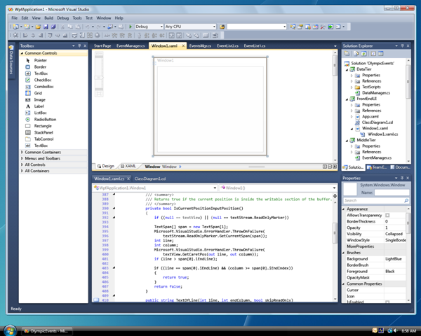
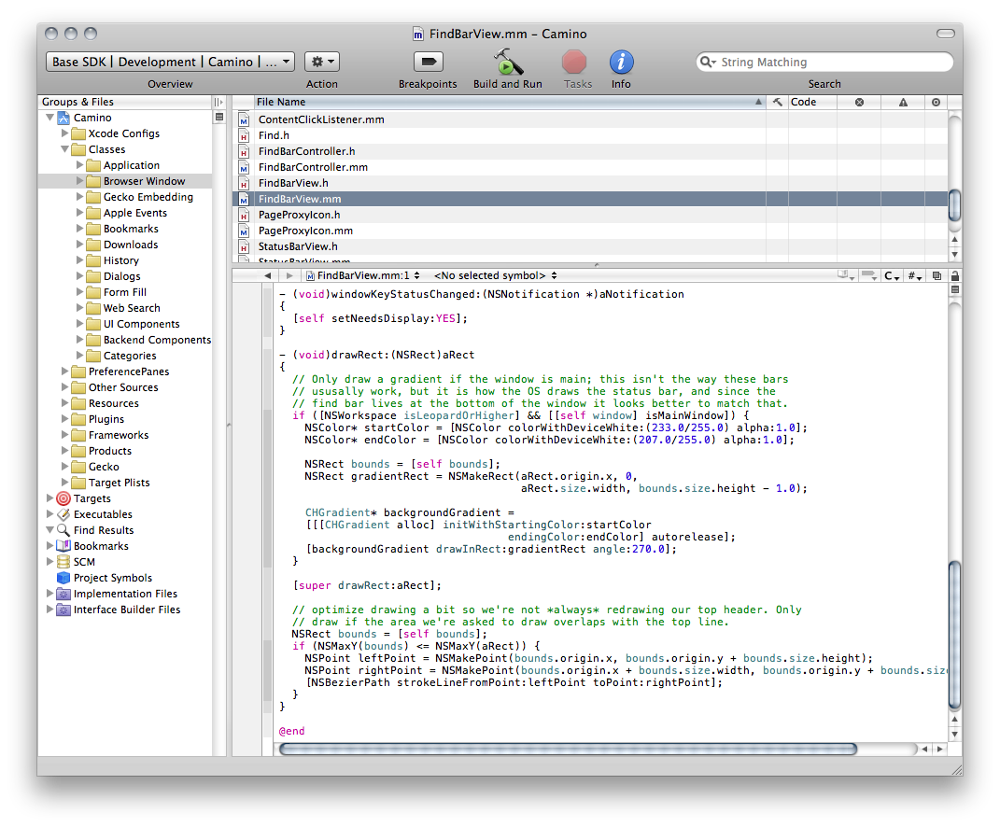
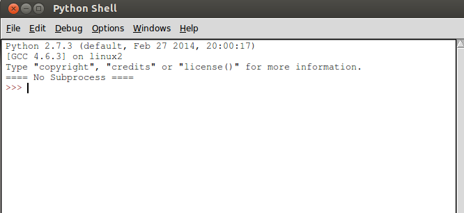

>"But I say to you that listen, Love your enemies, do good to those who hate you, bless those who curse you, pray for those who abuse you. If anyone strikes you on the cheek, offer the other also; and from anyone who takes away your coat do no withhold even your shirt. Give to everyone who begs from you; and if anyone takes away your goods, do not ask for them again. Do to others as you would have them do to you....Be merciful, just as your Father is merciful."

#集成开发环境(IDE)

当安装好python之后，其实就已经可以进行开发了。下面我们开始写第一行python代码。

##值得纪念的时刻：Hello world

不管你使用的是什么操作系统，总之肯定能够找到一个地方，运行python，进入到交互模式。

像下面一样：

    Python 2.7.6 (default, Nov 13 2013, 19:24:16) 
    [GCC 4.6.3] on linux2
    Type "help", "copyright", "credits" or "license" for more information.
    >>>

在`>>>`后面输入下面内容，并按回车。这就是见证奇迹的时刻。从这一刻开始，一个从来不懂编程的你，就跨入了程序员行列，不管你的工作是不是编程，你都已经是程序员了，其标志就是你已经用代码向这个世界打招呼了。

    >>> print "Hello, World"
    Hello, World

每个程序员，都曾经经历过这个伟大时刻，不经历这个伟大时刻的程序员不是伟大的程序员。为了纪念这个伟大时刻，理解其伟大之所在，下面执行分解动作：

>说明：在下面的分解动作中，用到了一个符号：#，就是键盘上数字３上面的那个井号。这个符号，在python编程中，表示注释。所谓注释，就是在计算机不执行，只是为了说明某行语句表达什么意思。

    #看到“>>>”符号，表示python做好了准备，当代你向她发出指令，让她做什么事情
    
    >>>

    #print，意思是打印。在这里也是这个意思，是要求python打印什么东西
    
    >>> print

    #"Hello,World"是打印的内容，注意，量变的双引号，都是英文状态下的。引号不是打印内容，它相当于一个包裹，把打印的内容包起来，统一交给python。
    
    >>> print "Hello, World"  
    
    #上面命令执行的结果。python接收到你要求她所做的事情：打印Hello,World，于是她就老老实实地执行这个命令，丝毫不走样。
    
    Hello, World
    
祝贺，伟大的程序员。

>笑一笑：有一个程序员，自己感觉书法太烂了，于是立志继承光荣文化传统，购买了笔墨纸砚。在某天，开始练字。将纸铺好，拿起笔蘸足墨水，挥毫在纸上写下了两个打字：Hello World

从此，进入了程序员行列，但是，看官有没有感觉，程序员用的这个工具，就是刚才打印Hello,World的那个cmd或者shell，是不是太简陋了？你看美工妹妹用的Photoshop，行政妹妹用的word，出纳妹妹用的Excle，就连坐在老板桌后面的那个家伙还用一个PPT播放自己都不相信的新理念呢，难道我们伟大的程序员，就用这么简陋的工具写出旷世代码吗？

当然不是。软件是谁开发的？程序员。程序员肯定会先为自己打造好用的工具，这也叫做近水楼台先得月。

IDE就是程序员的工具。

##集成开发环境

IDE的全称是：Integrated Development Environment，简称IDE，也称为Integration Design Environment、Integration Debugging Environment，翻译成中文叫做“集成开发环境”，在台湾那边叫做“整合開發環境”。它是一种辅助程序员开发用的应用软。

下面就直接抄[维基百科上的说明了](http://zh.wikipedia.org/zh/%E9%9B%86%E6%88%90%E5%BC%80%E5%8F%91%E7%8E%AF%E5%A2%83)：

>>IDE通常包括程式語言編輯器、自動建立工具、通常還包括除錯器。有些IDE包含編譯器／直譯器，如微软的Microsoft Visual Studio，有些则不包含，如Eclipse、SharpDevelop等，这些IDE是通过调用第三方编译器来实现代码的编译工作的。有時IDE還會包含版本控制系統和一些可以設計圖形用戶界面的工具。許多支援物件導向的現代化IDE還包括了類別瀏覽器、物件檢視器、物件結構圖。雖然目前有一些IDE支援多種程式語言（例如Eclipse、NetBeans、Microsoft Visual Studio），但是一般而言，IDE主要還是針對特定的程式語言而量身打造（例如Visual Basic）。

看不懂，没关系，看图，认识一下，混个脸熟就好了。所谓有图有真相。

上面的图显示的是微软的提供的名字叫做Microsoft Visual Studio的IDE。用C#进行编程的程序员都用它。

上图是在苹果电脑中出现的名叫XCode的IDE。

要想了解更多IDE的信息，推荐阅读维基百科中的词条

- 英文词条：[Integrated development environment](http://en.wikipedia.org/wiki/Integrated_development_environment)
- 中文词条：[集成开发环境](http://zh.wikipedia.org/zh/%E9%9B%86%E6%88%90%E5%BC%80%E5%8F%91%E7%8E%AF%E5%A2%83)

##Python的IDE

google一下：python IDE，会发现，能够进行python编程的IDE还真的不少。东西一多，就开始无所适从了。所有，有不少人都问用哪个IDE好。可以看看[这个提问，还列出了众多IDE的比较](http://stackoverflow.com/questions/81584/what-ide-to-use-for-python)。

>顺便向列位看客推荐一个非常好的开发相关网站：[stackoverflow.com](http://stackoverflow.com/)

>在这里可以提问，可以查看答案。一般如果有问题，先在这里查找，多能找到非常满意的结果，至少有很大启发。

>在某国有时候有地方可能不能访问，需要科学上网。好东西，一定不会让你容易得到，也不会让任何人都得到。

那么做为零基础的学习者，用什么好呢？

既然是零基础，就别瞎折腾了，就用Python自带的IDLE。原因就是：简单。

Windows的朋友操作：“开始”菜单->“所有程序”->“Python 2.x”->“IDLE（Python GUI）”来启动IDLE。启动之后，大概看到这样一个图

注意：看官所看到的界面中显示版本跟这个图不同，因为安装的版本区别。大致模样差不多。

其它操作系统的用户，也都能在找到idle这个程序，启动之后，跟上面一样的图。

后面我们所有的编程，就在这里完成了。这就是伟大程序员用的第一个IDE。

磨刀不误砍柴工。IDE已经有了，伟大程序员就要开始从事伟大的编程工作了。且看下回分解。

[首页](./index.md)&nbsp;&nbsp;&nbsp;|&nbsp;&nbsp;&nbsp;[上一讲](./101.md)&nbsp;&nbsp;&nbsp;|&nbsp;&nbsp;&nbsp;[下一讲](./103.md)
