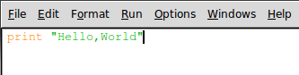
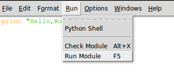
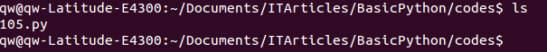
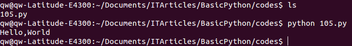
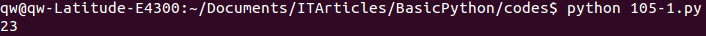

#开始真正编程

通过对四则运算的学习，已经初步接触了Python中内容，如果看官是零基础的学习者，可能有点迷惑了。难道在IDE里面敲几个命令，然后看到结果，就算编程了？这也不是那些能够自动运行的程序呀？

的确。到目前位置，还不能算编程，只能算会用一些指令（或者叫做命令）来做点简单的工作。并且看官所在的那个IDE界面，也是输入指令用的。

列位稍安勿躁，下面我们就学习如何编写一个真正的程序。工具还是那个IDLE，但是，请大家谨记，对于一个真正的程序来讲，用什么工具是无所谓的，只要能够把指令写进去，比如用记事本也可以。

我去倒杯茶，列位先认真读一读下面一段，关于程序的概念，内容来自维基百科：

- 先阅读一段英文的：[computer program and source code](http://en.wikipedia.org/wiki/Computer_program)，看不懂不要紧，可以跳过去，直接看下一条。

>A computer program, or just a program, is a sequence of instructions, written to perform a specified task with a computer.[1] A computer requires programs to function, typically executing the program's instructions in a central processor.[2] The program has an executable form that the computer can use directly to execute the instructions. The same program in its human-readable source code form, from which executable programs are derived (e.g., compiled), enables a programmer to study and develop its algorithms. A collection of computer programs and related data is referred to as the software.

>Computer source code is typically written by computer programmers.[3] Source code is written in a programming language that usually follows one of two main paradigms: imperative or declarative programming. Source code may be converted into an executable file (sometimes called an executable program or a binary) by a compiler and later executed by a central processing unit. Alternatively, computer programs may be executed with the aid of an interpreter, or may be embedded directly into hardware.

>Computer programs may be ranked along functional lines: system software and application software. Two or more computer programs may run simultaneously on one computer from the perspective of the user, this process being known as multitasking.

- [计算机程序](http://zh.wikipedia.org/wiki/%E8%AE%A1%E7%AE%97%E6%9C%BA%E7%A8%8B%E5%BA%8F)

>计算机程序（Computer Program）是指一组指示计算机或其他具有信息处理能力装置每一步动作的指令，通常用某种程序设计语言编写，运行于某种目标体系结构上。打个比方，一个程序就像一个用汉语（程序设计语言）写下的红烧肉菜谱（程序），用于指导懂汉语和烹饪手法的人（体系结构）来做这个菜。 通常，计算机程序要经过编译和链接而成为一种人们不易看清而计算机可解读的格式，然后运行。未经编译就可运行的程序，通常称之为脚本程序（script）。

碧螺春，是我最喜欢的了。有人要送礼给我，请别忘记了。难道我期望列位看官会送吗？哈哈哈

废话少说，开始说程序。程序，简而言之，就是指令的集合。但是，有的程序需要编译，有的不需要。python编写的程序就不需要，因此她也被称之为脚本程序。特别提醒列位，不要认为编译的就好，不编译的就不好；也不要认为编译的就“高端”，不编译的就属于“低端”。有一些做了很多年程序的程序员或者其它什么人，可能会有这样的想法，这是毫无根据的。

不争论。用得妙就是好。

##用IDLE的编程环境

操作：File->New window

这样，就出现了一个新的操作界面，在这个界面里面，看不到用于输入指令的提示符：>>>，这个界面有点像记事本。说对了，本质上就是一个记事本，只能输入文本，不能直接在里面贴图片。

##写两个大字：Hello,World

Hello,World.是面向世界的标志，所以，写任何程序，第一句一定要写这个，因为程序员是面向世界的，绝对不畏缩在某个局域网内，所以，所以看官要会科学上网，才能真正与世界Hello。

直接上代码，就这么一行即可。

    print "Hello,World"

如下图的样式

前面说过了，程序就是指令的集合，现在，这个程序里面，就一条指令。一条指令也可以成为集合。

注意观察，菜单上有一个RUN，点击这个菜单，在下拉的里面选择Run Moudle

会弹出对话框，要求把这个文件保存，这就比较简单了，保存到一个位置，看官一定要记住这个位置，并且取个文件名，文件名是以.py为扩展名的。

都做好之后，点击确定按钮，就会发现在另外一个带有>>>的界面中，就自动出来了Hello,World两个大字。

成功了吗？成功了也别兴奋，因为还没有到庆祝的时候。

在这种情况系，我们依然是在IDLE的环境中实现了刚才那段程序的自动执行，如果脱离这个环境呢？

下面就关闭IDLE，打开shell(如果看官在使用苹果的 Mac OS 操作系统或者某种linux发行版的操作系统，比如我使用的是ubuntu)，或者打开cmd(windows操作系统的用户，特别提醒用windows的用户，使用windows不是你的错，错就错在你只会使用鼠标点来点去，而不想也不会使用命令，更不想也不会使用linux的命令，还梦想成为优秀程序员。)，通过命令的方式，进入到你保存刚才的文件目录。

下图是我保存那个文件的地址，我把那个文件命名为105.py，并保存在一个文件夹中。

然后在这个shell里面，输入：python 105.py

上面这句话的含义就是告诉计算机，给我运行一个python语言编写的程序，那个程序文件的名称是105.py

我的计算机我做主。于是它给我乖乖地执行了这条命令。如下图：

还在沉默？可以欢呼了，德国队7:1胜巴西对，列看官中，不管是德国队还是巴西队的粉丝，都可以欢呼，因为你在程序员道路上迈出了伟大的第二步。顺便预测一下，本届世界杯最终冠军应该是：中国队。（还有这么扯的吗？）

##解一道题目

请计算：19+2*4-8/2

代码如下：

    #coding:utf-8
    
    """
    请计算：19+2*4-8/2
    """
    
    a = 19+2*4-8/2
    print a

提醒初学者，别复制这段代码，而是要一个字一个字的敲进去。然后保存(我保存的文件名是:105-1.py)。

在shell或者cmd中，执行：python (文件名.py)

执行结果如下图：

上面代码中，第一行，不能少，本文件是能够输入汉字的，否则汉字无法输入。

好像还是比较简单。

别着急。复杂的在后面呢。

[首页](./index.md)&nbsp;&nbsp;&nbsp;|&nbsp;&nbsp;&nbsp;[上一讲](./104.md)&nbsp;&nbsp;&nbsp;|&nbsp;&nbsp;&nbsp;[下一讲](./106.md)
