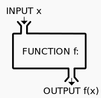

#永远强大的函数

函数，对于人类来讲，能够发展到这个数学思维层次，是一个飞跃。可以说，它的提出，直接加快了现代科技和社会的发展，不论是现代的任何科技门类，乃至于经济学、政治学、社会学等，都已经普遍使用函数。

下面一段来自维基百科（在本教程中，大量的定义来自维基百科，因为它真的很百科）：[函数词条](http://zh.wikipedia.org/zh/%E5%87%BD%E6%95%B0)

>函数这个数学名词是莱布尼兹在1694年开始使用的，以描述曲线的一个相关量，如曲线的斜率或者曲线上的某一点。莱布尼兹所指的函数现在被称作可导函数，数学家之外的普通人一般接触到的函数即属此类。对于可导函数可以讨论它的极限和导数。此两者描述了函数输出值的变化同输入值变化的关系，是微积分学的基础。
>中文的“函数”一词由清朝数学家李善兰译出。其《代数学》书中解释：“凡此變數中函（包含）彼變數者，則此為彼之函數”。

函数，从简单到复杂，各式各样。前面提供的维基百科中的函数词条，里面可以做一个概览。但不管什么样子的函数，都可以用下图概括：

有初中数学水平都能理解一个大概了。这里不赘述。

本讲重点说明用python怎么来做一个函数用一用。

##深入理解函数

在中学数学中，可以用这样的方式定义函数：y=4x+3，这就是一个一次函数，当然，也可以写成：f(x)=4x+3。其中x是变量，它可以代表任何数。

    当x=2时，代入到上面的函数表达式：
    f(2) = 4*2+3 = 11
    所以：f(2) = 11

以上对函数的理解，是一般初中生都能打到的。但是，如果看官已经初中毕业了，或者是一个有追求的初中生，还不能局限在上面的理解，还要将函数的理解拓展。

##变量不仅仅是数

变量x只能是任意数吗？其实，一个函数，就是一个对应关系。看官尝试着将上面表达式的x理解为馅饼，4x+3,就是4个馅饼在加上3（单位是什么，就不重要了），这个结果对应着另外一个东西，那个东西比如说是iphone。或者说可以理解为4个馅饼加3就对应一个iphone。这就是所谓映射关系。

所以，x，不仅仅是数，可以是你认为的任何东西。

##变量本质——占位符

函数中为什么变量用x？这是一个有趣的问题，自己google一下，看能不能找到答案。

我也不清楚原因。不过，我清楚地知道，变量可以用x，也可以用别的符号，比如y,z,k,i,j...，甚至用alpha,beta,qiwei,qiwsir这样的字母组合也可以。

**变量在本质上就是一个占位符。**这是一针见血的理解。什么是占位符？就是先把那个位置用变量占上，表示这里有一个东西，至于这个位置放什么东西，以后再说，反正先用一个符号占着这个位置（占位符）。

其实在高级语言编程中，变量比我们在初中数学中学习的要复杂。但是，现在我们先不管那些，复杂东西放在以后再说了。现在，就按照初中数学来研究python中的变量

通常使小写字母来命名python中的变量，也可以在其中加上下划线什么的，表示区别。

比如：alpha,x,j,p_beta，这些都可以做为python的变量。

#给变量赋值

打开IDLE，实验操作如下：

    >>> a = 2   #注1
    >>> a       #注2
    2
    >>> b = 3   #注3
    >>> c = 3
    >>> b
    3
    >>> c
    3
    >>> 

说明：

- 注1：a=2的含义是将一个变量a指向了2这个数，就好比叫做a是的钓鱼的人，通过鱼线，跟一条叫做2的鱼连接者，a通过鱼线就可以导到2
- 注2：相当于要a这个钓鱼的人，顺着鱼线导出那条鱼，看看连接的是哪一条，发现是叫做2的那条傻鱼
- 注3：b=3，理解同上。那么c=3呢？就是这条叫做3的鱼被两个人同时钓到了。

#建立简单函数

    >>> a = 2
    >>> y=3*a+2
    >>> y
    8

这种方式建立的函数，跟在初中数学中学习的没有什么区别。当然，这种方式的函数，在编程实践中的用途不大，一般是在学习阶段理解函数来使用的。

别急躁，你在输入a=3,然后输入y，看看得到什么结果呢？

    >>> a=2
    >>> y=3*a+2
    >>> y
    8
    >>> a=3
    >>> y
    8

是不是很奇怪？为什么后面已经让a等于3了，结果y还是8。

用前面的钓鱼理论就可以解释了。a和2相连，经过计算，y和8相连了。后面a的连接对象修改了，但是y的连接对象还没有变，所以，还是8。再计算一次，y的连接对象就变了：

    >>> a=3
    >>> y
    8
    >>> y=3*a+2
    >>> y
    11

特别注意，如果没有先a=2，就直接下函数表达式了，像这样，就会报错。

    >>> y=3*a+2
    Traceback (most recent call last):
      File "<stdin>", line 1, in <module>
      NameError: name 'a' is not defined

注意看错误提示，a是一个变量，提示中告诉我们这个变量没有定义。显然，如果函数中要使用某个变量，不得不提前定义出来。定义方法就是给这个变量赋值。

#建立实用的函数

上面用命令方式建立函数，还不够“正规化”，那么就来写一个.py文件吧。

在IDLE中，File->New window

然后输入如下代码：
    
    #coding:utf-8

    def add_function(a,b):
        c = a+b
        print c

    if __name__=="__main__":
        add_function(2,3)

然后将文件保存，我把她命名为106-1.py，你根据自己的喜好取个名字。

然后我就进入到那个文件夹，运行这个文件，出现下面的结果，如图：

你运行的结果是什么？如果没有得到上面的结果，你就非常认真地检查代码，是否跟我写的完全一样，注意，包括冒号和空格，都得一样。**冒号和空格很重要。**

下面开始庖丁解牛：

- #coding:utf-8     声明本文件中代码的字符集类型是utf-8格式。初学者如果还不理解，一方面可以去google，另外还可放一放，就先这么抄写下来，以后会讲解。
- def add_function(a,b):    这里是函数的开始。在声明要建立一个函数的时候，一定要使用def（def 就是英文define的前三个字母），意思就是告知计算机，这里要声明一个函数；add_function是这个函数名称，取名字是有讲究的，就好比你的名字一样。在python中取名字的讲究就是要有一定意义，能够从名字中看出这个函数是用来干什么的。从add_function这个名字中，是不是看出她是用来计算加法的呢？(a,b)这个括号里面的是这个函数的参数，也就是函数变量。冒号，这个冒号非常非常重要，如果少了，就报错了。冒号的意思就是下面好开始真正的函数内容了。
- c=a+b     特别注意，这一行比上一行要缩进四个空格。这是python的规定，要牢记，不可丢掉，丢了就报错。然后这句话就是将两个参数(变量)相加，结果赋值与另外一个变量c。
- print c   还是提醒看官注意，缩进四个空格。将得到的结果c的值打印出来。
- if __name__=="__main__":  这句话先照抄，不解释。注意就是不缩进了。
- add_function(2,3)     这才是真正调用前面建立的函数，并且传入两个参数：a=2,b=3。仔细观察传入参数的方法，就是把2放在a那个位置，3放在b那个位置（所以说，变量就是占位符).

解牛完毕，做个总结：

##声明函数的格式为：

    def 函数名(参数1，参数2，...，参数n)：

        函数体

是不是样式很简单呢？

#取名字的学问

有的大师，会通过某个人的名字来预测他/她的吉凶祸福等。看来名字这玩意太重要了。取个好名字，就有好兆头呀。所以孔丘先生说“名不正，言不顺”，歪解：名字不正规化，就不顺。这是歪解，希望不要影响看官正确理解。不知道大师们是不是能够通过外国人名字预测外国人大的吉凶祸福呢？

不管怎样，某国人是很在意名字的，旁边有个国家似乎就不在乎。

python也很在乎名字问题，其实，所有高级语言对名字都有要求。为什么呢？因为如果命名乱了，计算机就有点不知所措了。看python对命名的一般要求。

- 文件名:全小写,可使用下划线

- 函数名:小写，可以用下划线风格单词以增加可读性。如：myfunction，my_example_function。*注意*：混合大小写仅被允许用于这种风格已经占据优势的时候，以便保持向后兼容。

- 函数的参数:如果一个函数的参数名称和保留的关键字(所谓保留关键字，就是python语言已经占用的名称，通常被用来做为已经有的函数等的命名了，你如果还用，就不行了。)冲突，通常使用一个后缀下划线好于使用缩写或奇怪的拼写。

- 变量:变量名全部小写，由下划线连接各个单词。如color = WHITE，this_is_a_variable = 1。

其实，关于命名的问题，还有不少争论呢？最典型的是所谓匈牙利命名法、驼峰命名等。如果你喜欢，可以google一下。以下内容供参考：

- [匈牙利命名法](http://zh.wikipedia.org/zh/%E5%8C%88%E7%89%99%E5%88%A9%E5%91%BD%E5%90%8D%E6%B3%95)
- [驼峰式大小写](http://zh.wikipedia.org/wiki/%E9%A7%9D%E5%B3%B0%E5%BC%8F%E5%A4%A7%E5%B0%8F%E5%AF%AB)
- [帕斯卡命名法](http://zh.wikipedia.org/w/index.php?title=%E5%B8%95%E6%96%AF%E5%8D%A1%E5%91%BD%E5%90%8D%E6%B3%95&variant=zh-cn)
- [python命名的官方要求](http://legacy.python.org/dev/peps/pep-0008/#prescriptive-naming-conventions)，如果看官的英文可以，一定要阅读。如果英文稍逊，可以来阅读[中文](http://wiki.jiayun.org/PEP_8_--_Style_Guide_for_Python_Code#.E5.91.BD.E5.90.8D.E6.85.A3.E4.BE.8B),不用梯子能行吗？看你命了。

[首页](./index.md)&nbsp;&nbsp;&nbsp;|&nbsp;&nbsp;&nbsp;[上一讲](./105.md)&nbsp;&nbsp;&nbsp;|&nbsp;&nbsp;&nbsp;[下一讲](./107.md)
