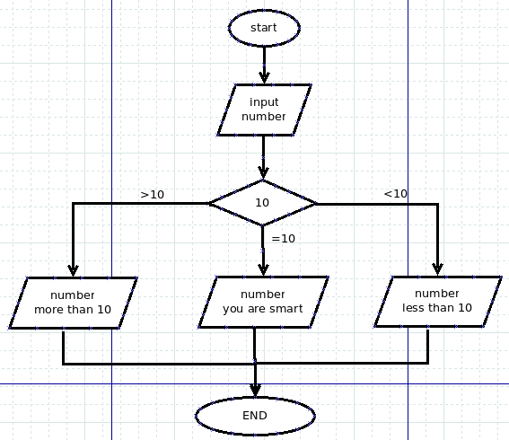

#从if开始语句的征程

一般编程的教材，都是要把所有的变量类型讲完，然后才讲语句。这种讲法，其实不符合学习的特点。学习，就是要循序渐进的。在这点上，我可以很吹一通了，因为我做过教师，研究教育教学，算是有一点心得的。所以，我在这里就开始讲授语句。

##什么是语句

在前面，我们已经写了一些.py的文件，这些文件可以用python来运行。那些文件，就是由语句组成的程序。

为了能够严谨地阐述这个概念，我还是要抄一段[维基百科中的词条：命令式编程](http://zh.wikipedia.org/wiki/%E6%8C%87%E4%BB%A4%E5%BC%8F%E7%B7%A8%E7%A8%8B)

>命令式编程（英语：Imperative programming），是一种描述电脑所需作出的行为的编程范型。几乎所有电脑的硬件工作都是指令式的；几乎所有电脑的硬件都是设计来运行机器码，使用指令式的风格来写的。较高级的指令式编程语言使用变量和更复杂的语句，但仍依从相同的范型。

>运算语句一般来说都表现了在存储器内的数据进行运算的行为，然后将结果存入存储器中以便日后使用。高级命令式编程语言更能处理复杂的表达式，可能会产生四则运算和函数计算的结合。

一般所有高级语言，都包含如下语句，Python也不例外：

- 循环语句:容许一些语句反复运行数次。循环可依据一个默认的数目来决定运行这些语句的次数；或反复运行它们，直至某些条件改变。
- 条件语句:容许仅当某些条件成立时才运行某个区块。否则，这个区块中的语句会略去，然后按区块后的语句继续运行。
- 无条件分支语句容许运行顺序转移到程序的其他部分之中。包括跳跃（在很多语言中称为Goto）、副程序和Procedure等。

循环、条件分支和无条件分支都是控制流程。

##if语句

谈到语句，不要被吓住。看下面的例子先：

    if a==4:
        print "it is four"
    else:
        print "it is no four"

逐句解释一番，注意看注释。在这里给列为看官提醒，在写程序的是由，一定要写必要的注释，同时在阅读程序的时候，也要注意看注释。

    if a==4:                #如果变量a==4是真的，a==4为True，就
        print "it is four"  #打印“it is four”。
    else:                   #否则，即a==4是假的，a==4为False，就
        print "it is not four" #打印“it is not four”。

以上几句话，就完成了一个条件判断，在不同条件下做不同的事情。因此，if语句，常被翻译成“条件语句”。

条件语句的基本样式结构：

    if 条件1:
        执行的内容1
    elif 条件2:
        执行的内容2
    elif 条件3：
        执行的内容3
    else:
        执行的内容4

执行的内容1、内容2，等，称之为语句块。elif用于多个条件时使用，可以没有。另外，也可以只有if，而没有else。

**提醒：**每个执行的内容，均以缩进四个空格方式。

例1：输入一个数字，并输出输入的结果，如果这个数字大于10，那么同时输出大于10,如果小于是，同时输出提示小于10,如果等于10,就输出表扬的一句话。

从这里开始，我们的代码就要越来越接近于一个复杂的判断过程了。为了让我们的思维能够更明确上述问题的解决流程，在程序开发过程中，常常要画流程图。什么是流程图，我从另外一个角度讲，就是要让思维过程可视化，简称“思维可视化”。顺便自吹自擂一下，我从2004年就开始在我朝推广思维导图，这就是一种思维可视化工具。自吹到此结束。看这个问题的流程图：

理解了流程图中的含义，就开始写代码，代码实例如下：
    
	#! /usr/bin/env python
	#coding:utf-8
	
	print "请输入任意一个整数数字："
	
	number = int(raw_input())   #通过raw_input()输入的数字是字符串
	                            #用int()将该字符串转化为整数
	
	if number == 10:
	    print "您输入的数字是：%d"%number
	    print "You are SMART."
	elif number > 10:
	    print "您输入的数字是：%d"%number
	    print "This number is more than 10."
	elif number < 10:
	    print "您输入的数字是：%d"%number
	    print "This number is less than 10."
	else:
	    print "Are you a human?"    
    
特别提醒看官注意，前面我们已经用过raw_input()函数了，这个是获得用户在界面上输入的信息，而通过它得到的是字符串类型的数据。可以在IDLE中这样检验一下：

    >>> a=raw_input()
    10
    >>> a   
    '10'
    >>> type(a)
    <type 'str'>
    >>> a=int(a)
    >>> a
    10
    >>> type(a)
    <type 'int'>

刚刚得到的那个a就是str类型，如果用int()转换一下，就变成int类型了。

看来**int()可以将字str类型的数字转换为int类型**，类似，是不是有这样的结论呢：**str()可以将int类型的数字转化为str类型**.建议看官实验一下。

上述程序的后面，就是依据条件进行判断，不同条件下做不同的事情了。需要提醒的是在条件中：number == 10，为了阅读方便，在number和==之间有一个空格最好了，同理，后面也有一个。这里的10,是int类型，number也是int类型.

上面的程序不知道是不是搞懂了？如果没有，可以通过QQ跟我联系，我的QQ公布一下：26066913，或者登录我的微博，通过微博跟我联系，当然还可以发邮件啦。我看到您的问题，会答复的。在github上跟我互动，是我最欢迎的。

最后，给看官留一个练习题目：

课后练习：开发一个猜数字游戏的程序。即程序在某个范围内指定一个数字，比如在0到9范围内指定一个数字，用户猜测程序所指定的数字大小。

请看官自己编写。我们会在后面讨论这个问题。

##小知识

不知道各位是否注意到，上面的那段代码，开始有一行：

	#! /usr/bin/env python

这是什么意思呢？

这句话以#开头，表示本来不在程序中运行。这句话的用途是告诉机器寻找到该设备上的python解释器，操作系统使用它找到的解释器来运行文件中的程序代码。有的程序里写的是/usr/bin python，表示python解释器在/usr/bin里面。但是，如果写成/usr/bin/env，则表示要通过系统搜索路径寻找python解释器。不同系统，可能解释器的位置不同，所以这种方式能够让代码更将拥有可移植性。对了，以上是对Unix系列操作系统而言。对与windows系统，这句话就当不存在。

[首页](./index.md)&nbsp;&nbsp;&nbsp;|&nbsp;&nbsp;&nbsp;[上一讲](./110.md)&nbsp;&nbsp;&nbsp;|&nbsp;&nbsp;&nbsp;[下一讲](./112.md)
