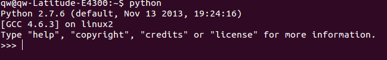

#一个免费的实验室

在学生时代，就羡慕实验室，老师在里面可以鼓捣各种有意思的东西。上大学的时候，终于有机会在实验室做大量实验了，因为我是物理系，并且，遇到了一位非常令我尊敬的老师——高老师，让我在他的实验室里面，把所有已经破旧损坏的实验仪器修理装配好，并且按照要求做好实验样例。经过一番折腾，才明白，要做好实验，不仅仅花费精力，还有不菲的设备成本呢。后来工作的时候，更感觉到实验设备费用之高昂，因此做实验的时候总要小心翼翼。

再后来，终于发现原来计算机是一个最好的实验室。在这里做实验成本真的很低呀。

扯的远了吧。不远，现在就扯回来。学习Python，也要做实验，也就是尝试性地看看某个命令到底什么含义。通过实验，研究清楚了，才能在编程实践中使用。

怎么做Python实验呢？

##走进Python实验室

在[《集成开发环境(IDE)》](./102.md)一章中，我们介绍了Python的IDE时，给大家推荐了IDLE，进入到IDLE中，看到>>>符号，可以在后面输入一行指令。其实，这就是一个非常好的实验室。

另外一个实验室就是UNIX操作系统（包含各种Linux和Mac OSx）的shell，在打开shell之后，输入python，出现如下图所示：

如果看官是用windows的，也能够通过cmd来获得上图类似的界面，依然是输入python，之后得到界面。

在上述任何一个环境中，都可以输入指令，敲回车键运行并输出结果。

在这里你可以随心所欲实验。

##交互模式下进行实验

前面的各讲中，其实都使用了交互模式。本着循序渐进、循环上升的原则，本讲应该对交互模式进行一番深入和系统化了。

###通过变量直接显示其内容

从例子开始：

    >>> a="http://qiwsir.github.io"
    >>> a
    'http://qiwsir.github.io'
    >>> print a
    http://qiwsir.github.io

当给一个变量a赋值于一个字符串之后，输入变量名称，就能够打印出字符串，和print a具有同样的效果。这是交互模式下的一个特点，如果在文件模式中，则不能，只有通过print才能打印变量内容。

###缩进

    >>> if bool(a):
    ...     print "I like python"
    ... 
    I like python

对于if语句，在上一讲[《从if开始语句的征程》](./111.md)中，已经注意到，if下面的执行语句要缩进四个空格。在有的python教材中，说在交互模式下不需要缩进，可能是针对python3或者其它版本，我使用的是python2.7，的确需要缩进。上面的例子就看出来了。

看官在自己的机器上测试一下，是不是需要缩进？

###报错

在一个广告中看到过这样一句话：程序员的格言，“不求最好，只求报错”。报错，对编程不是坏事。如何对待报错呢？

**一定要认真阅读所提示的错误信息。**

还是上面那个例子，我如果这样写：

    >>> if bool(a):
    ... print "I like python"
      File "<stdin>", line 2
          print "I like python"
                  ^
    IndentationError: expected an indented block
    
从错误信息中，我们可以知道，第二行错了。错在什么地方呢？python非常人性化就在这里，告诉你错误在什么地方：

IndentationError: expected an indented block

意思就是说需要一个缩进块。也就是我没有对第二行进行缩进，需要缩进。

另外，顺便还要提醒，>>>表示后面可以输入指令，...表示当前指令没有结束。要结束并执行，需要敲击两次回车键。

###探索

如果看官对某个指令不了解，或者想试试某种操作是否可行，可以在交互模式下进行探索，这种探索的损失成本非常小，充其量就是报错。而且从报错信息中，我们还能得到更多有价值的内容。

例如，在[《眼花缭乱的运算符》](./110.md)中，提到了布尔运算，其实，在变量的类型中，除了前面提到的整数型、字符串型，布尔型也是一种，那么布尔型的变量有什么特点呢？下面就探索一下：

    >>> a
    'http://qiwsir.github.io'
    >>> bool(a)     #布尔型,用bool()表示，就类似int(),str()，是一个内置函数
    True
    >>> b=""
    >>> bool(b)
    False
    >>> bool(4>3)
    True
    >>> bool(4<3)
    False
    >>> m=bool(b)
    >>> m
    False
    >>> type(m)
    <type 'bool'>
    >>> 

从上面的实验可以看出，如果对象是空，返回False，如果不是，则返回True；如果对象是False，返回False。上面探索，还可以扩展到其它情况。看官能不能通过探索，总结出bool()的特点呢？

