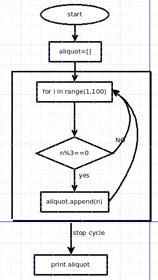

#画圈还不简单吗？

画圈？换一个说法就是循环。循环，是高级语言编程中重要的工作。现实生活中，很多事情都是在循环，日月更迭，斗转星移，无不是循环；王朝更迭，寻常百姓，也都是循环。

在python中，循环有一个语句：for语句。

##简单的for循环例子

    >>> hello = "world"
    >>> for i in hello:
    ...     print i
    ... 
    w
    o
    r
    l
    d

上面这个for循环是怎么工作的呢？

1. hello这个变量引用的是"world"这个str类型的数据
2. 变量 i 通过hello找到它所引用的"world",然后从第一字符开始，依次获得该字符的引用。
3. 当 i="w"的时候，执行print i，打印出了字母w，结束之后循环第二次，让 i="e"，然后执行print i,打印出字母e，如此循环下去，一直到最后一个字符被打印出来，循环自动结束

顺便补充一个print的技巧，上面的打印结果是竖着排列，也就是每打印一个之后，就自动换行。如果要让打印的在一行，可以用下面的方法，在打印的后面加一个逗号（英文）

    >>> for i in hello:
    ...     print i,
    ...  
    w o r l d

    >>> for i in hello:
    ...     print i+",",    #为了美观，可以在每个字符后面加一个逗号分割
    ... 
    w, o, r, l, d,
    >>> 

因为可以通过使用索引编号（偏移量）做为下表，得到某个字符。所以，还可以通过下面的循环方式实现上面代码中同样功能：

    >>> for i in range(len(hello)):
    ...     print hello[i]
    ... 
    w
    o
    r
    l
    d

其工作方式是：

1. len(hello)得到hello引用的字符串的长度，为5
2. range(len(hello),就是range(5),也就是[0, 1, 2, 3, 4],对应这"world"每个字母的编号，即偏移量。
3. for i in range(len(hello)),就相当于for i in [0,1,2,3,4],让i依次等于list中的各个值。当i=0时，打印hello[0]，也就是第一个字符。然后顺序循环下去，直到最后一个i=4为止。

以上的循环举例中，显示了对字str的字符依次获取，也涉及了list，感觉不过瘾呀。那好，看下面对list的循环：

    >>> ls_line
    ['Hello', 'I am qiwsir', 'Welcome you', '']
    >>> for word in ls_line:
    ...     print word
    ... 
    Hello
    I am qiwsir
    Welcome you

    >>> for i in range(len(ls_line)):
    ...     print ls_line[i]
    ... 
    Hello
    I am qiwsir
    Welcome you

##上一个台阶

我们已经理解了for语句的基本工作流程，如果写一个一般化的公式，可以这么表示：

    for 循环规则：
        操作语句

用for语句来解决一个实际问题。

**例：**找出100以内的能够被3整除的正整数。

**分析：**这个问题有两个限制条件，第一是100以内的正整数，根据前面所学，可以用range(1,100)来实现；第二个是要解决被3整除的问题，假设某个正整数n，这个数如果能够被3整除，也就是n%3(%是取余数)为0.那么如何得到n呢，就是要用for循环。

以上做了简单分析，要实现流程，还需要细化一下。按照前面曾经讲授过的一种方法，要画出问题解决的流程图。

下面写代码就是按图索骥了。

代码：

	#! /usr/bin/env python
	#coding:utf-8
	
	aliquot = []
	
	for n in range(1,100):
	    if n%3 == 0:
	        aliquot.append(n)
	
	print aliquot

代码运行结果：

    [3, 6, 9, 12, 15, 18, 21, 24, 27, 30, 33, 36, 39, 42, 45, 48, 51, 54, 57, 60, 63, 66, 69, 72, 75, 78, 81, 84, 87, 90, 93, 96, 99]

这里仅仅列举一个简单的例子，看官可以在这个例子基础上深入：打印某范围内的偶数/奇数等。

如果要对list的循环进行深入了解的，可以到我专门撰写的[python and algorithm](https://github.com/qiwsir/algorithm/blob/master/README.md)里面阅读有关文章
