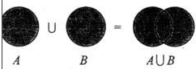
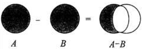
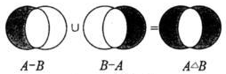

#集合的关系

##冻结的集合

前面[一节讲述了集合的基本概念](./123.md)，注意，那里所涉及到的集合都是可原处修改的集合。还有一种集合，不能在原处修改。这种集合的创建方法是：

    >>> f_set = frozenset("qiwsir")     #看这个名字就知道了frozen，冻结的set
    >>> f_set
    frozenset(['q', 'i', 's', 'r', 'w'])
    >>> f_set.add("python")             #报错
    Traceback (most recent call last):
      File "<stdin>", line 1, in <module>
    AttributeError: 'frozenset' object has no attribute 'add'
    
    >>> a_set = set("github")           #对比看一看，这是一个可以原处修改的set
    >>> a_set
    set(['b', 'g', 'i', 'h', 'u', 't'])
    >>> a_set.add("python")
    >>> a_set
    set(['b', 'g', 'i', 'h', 'python', 'u', 't'])

##集合运算

先复习一下中学数学（准确说是高中数学中的一点知识）中关于集合的一点知识，主要是唤起那痛苦而青涩美丽的回忆吧，至少对我是。

###元素与集合的关系

元素是否属于某个集合。

    >>> aset
    set(['h', 'o', 'n', 'p', 't', 'y'])
    >>> "a" in aset
    False
    >>> "h" in aset
    True

###集合与集合的纠结

假设两个集合A、B

- A是否等于B，即两个集合的元素完全一样

在交互模式下实验

    >>> a           
    set(['q', 'i', 's', 'r', 'w'])
    >>> b
    set(['a', 'q', 'i', 'l', 'o'])
    >>> a == b
    False
    >>> a != b
    True

- A是否是B的子集，或者反过来，B是否是A的超集。即A的元素也都是B的元素，但是B的元素比A的元素数量多。

实验一下

    >>> a
    set(['q', 'i', 's', 'r', 'w'])
    >>> c
    set(['q', 'i'])
    >>> c<a     #c是a的子集
    True
    >>> c.issubset(a)   #或者用这种方法，判断c是否是a的子集
    True
    >>> a.issuperset(c) #判断a是否是c的超集
    True
    
    >>> b
    set(['a', 'q', 'i', 'l', 'o'])
    >>> a<b     #a不是b的子集
    False
    >>> a.issubset(b)   #或者这样做
    False

- A、B的并集，即A、B所有元素，如下图所示

    >>> a
    set(['q', 'i', 's', 'r', 'w'])
    >>> b
    set(['a', 'q', 'i', 'l', 'o'])
    >>> a | b                       #可以有两种方式，结果一样
    set(['a', 'i', 'l', 'o', 'q', 's', 'r', 'w'])
    >>> a.union(b)
    set(['a', 'i', 'l', 'o', 'q', 's', 'r', 'w'])

- A、B的交集，即A、B所公有的元素，如下图所示

    >>> a
    set(['q', 'i', 's', 'r', 'w'])
    >>> b
    set(['a', 'q', 'i', 'l', 'o'])
    >>> a & b       #两种方式，等价
    set(['q', 'i'])
    >>> a.intersection(b)
    set(['q', 'i'])

我在实验的时候，顺手敲了下面的代码，出现的结果如下，看官能解释一下吗？（思考题）

    >>> a and b
    set(['a', 'q', 'i', 'l', 'o'])

- A相对B的差（补），即A相对B不同的部分元素，如下图所示

    >>> a
    set(['q', 'i', 's', 'r', 'w'])
    >>> b
    set(['a', 'q', 'i', 'l', 'o'])
    >>> a - b
    set(['s', 'r', 'w'])
    >>> a.difference(b)
    set(['s', 'r', 'w'])

-A、B的对称差集，如下图所示

    >>> a
    set(['q', 'i', 's', 'r', 'w'])
    >>> b
    set(['a', 'q', 'i', 'l', 'o'])
    >>> a.symmetric_difference(b)
    set(['a', 'l', 'o', 's', 'r', 'w'])

以上是集合的基本运算。在编程中，如果用到，可以用前面说的方法查找。不用死记硬背。

[首页](./index.md)&nbsp;&nbsp;&nbsp;|&nbsp;&nbsp;&nbsp;[上一讲](./123.md)&nbsp;&nbsp;&nbsp;|&nbsp;&nbsp;&nbsp;[下一讲](./125.md)
