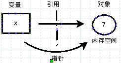
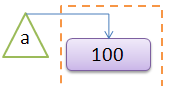
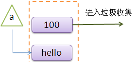

#深入变量和引用对象

今天是2014年8月4日，这段时间灾祸接连发生，显示不久前昆山的工厂爆炸，死伤不少，然后是云南地震，也有死伤。为所有在灾难中受伤害的人们献上祷告。

在[《永远强大的函数》](./106.md)那一讲中，老齐我（http://qiwsir.github.io）已经向看官们简述了一下变量，之后我们就一直在使用变量，每次使用变量，都要有一个操作，就是赋值。本讲再次提及这个两个事情，就是要让看官对变量和赋值有一个知其然和知其所以然的认识。当然，最后能不能达到此目的，主要看我是不是说的通俗易懂了。如果您没有明白，就说明我说的还不够好，可以联系我，我再为您效劳。

##变量和对象

在[《learning python》](http://shop.oreilly.com/product/0636920028154.do)那本书里面，作者对变量、对象和引用的关系阐述的非常明了。我这里在很大程度上是受他的启发。感谢作者Mark Lutz先生的巨著。

应用《learning python》中的一个观点：**变量无类型，对象有类型**

在python中，如果要使用一个变量，不需要提前声明，只需要在用的时候，给这个变量赋值即可。这里特别强调，只要用一个变量，就要给这个变量赋值。

所以，像这样是不行的。

    >>> x
    Traceback (most recent call last):
      File "<stdin>", line 1, in <module>
    NameError: name 'x' is not defined

反复提醒：一定要注意看报错信息。如果光光地写一个变量，而没有赋值，那么python认为这个变量没有定义。赋值，不仅仅是给一个非空的值，也可以给一个空值，如下，都是允许的

    >>> x = 3
    >>> lst = []
    >>> word = ""
    >>> my_dict = {}

在前面讲述中，我提出了一个类比，就是变量通过一根线，连着对象（具体就可能是一个int/list等），这个类比被很多人接受了，算是我老齐的首创呀。那么，如果要用一种严格的语言来描述，变量可以理解为一个系统表的元素，它拥有过指向对象的命名空间。太严肃了，不好理解，就理解我那个类比吧。变量就是存在系统中的一个东西，这个东西有一种能力，能够用一根线与某对象连接，它能够钓鱼。

对象呢？展开想象。在机器的内存中，系统分配一个空间，这里面就放着所谓的对象，有时候放数字，有时候放字符串。如果放数字，就是int类型，如果放字符串，就是str类型。

接下来的事情，就是前面说的变量用自己所拥有的能力，把对象和自己连接起来（指针连接对象空间），这就是引用。引用完成，就实现了赋值。

看到上面的图了吧，从图中就比较鲜明的表示了变量和对象的关系。所以，严格地将，只有放在内存空间中的对象（也就是数据）才有类型，而变量是没有类型的。这么说如果还没有彻底明白，就再打一个比喻：变量就好比钓鱼的人，湖水里就好像内存，里面有好多鱼，有各种各样的鱼，它们就是对象。钓鱼的人（变量）的任务就是用某种方式（鱼儿引诱）把自己和鱼通过鱼线连接起来。那么，鱼是有类型的，有鲢鱼、鲫鱼、带鱼（带鱼也跑到湖水了了，难道是淡水带鱼？呵呵，就这么扯淡吧，别较真），钓鱼的人（变量）没有这种类型，他钓到不同类型的鱼。

这个比喻太烂了。凑合着理解吧。看官有好的比喻，别忘记分享。

同一个变量可以同时指向两个对象吗？绝对不能脚踩两只船。如果这样呢？

    >>> x = 4
    >>> x = 5
    >>> x
    5

变量x先指向了对象4，然后指向对象5，当后者放生的时候，自动跟第一个对象4接触关系。再看x，引用的对象就是5了。那么4呢？一旦没有变量引用它了，它就变成了孤魂野鬼。python是很吝啬的，它绝对不允许在内存中存在孤魂野鬼。凡是这些东西都被看做垃圾，而对垃圾，python有一个自动的收回机制。

在网上找了一个图示说明，很好，引用过来（来源：http://www.linuxidc.com/Linux/2012-09/69523.htm）

    >>> a = 100         #完成了变量a对内存空间中的对象100的引用

如下图所示：

然后，又操作了：

    >>> a = "hello"

如下图所示：

原来内存中的那个100就做为垃圾被收集了。而且，这个收集过程是python自动完成的，不用我们操心。

那么，python是怎么进行垃圾收集的呢？在[Quora](http://www.quora.com)上也有人问这个问题，我看那个回答很精彩，做个链接，有性趣的读一读吧。[Python (programming language): How does garbage collection in Python work?](http://www.quora.com/Python-programming-language-1/How-does-garbage-collection-in-Python-work)

##is和==的效果

以上过程的原理搞清楚了，下面就可以深入一步了。

    >>> l1 = [1,2,3]
    >>> l2 = l1 

这个操作中，l1和l2两个变量，引用的是一个对象，都是[1,2,3]。何以见得？如果通过l1来修改[1,2,3]，l2引用对象也修改了，那么就证实这个观点了。

    >>> l1[0] = 99      #把对象变为[99,2,3]
    >>> l1              #变了
    [99, 2, 3]
    >>> l2　            #真的变了吔
    [99, 2, 3]

再换一个方式：

    >>> l1 = [1,2,3]
    >>> l2 = [1,2,3]
    >>> l1[0] = 99
    >>> l1
    [99, 2, 3]
    >>> l2
    [1, 2, 3]

l1和l2貌似指向了同样的一个对象[1,2,3]，其实，在内存中，这是两块东西，互不相关。只是在内容上一样。就好像是水里长的一样的两条鱼，两个人都钓到了，当不是同一条。所以，当通过l1修改引用对象的后，l2没有变化。

进一步还能这么检验：

    >>> l1
    [1, 2, 3]
    >>> l2
    [1, 2, 3]
    >>> l1 == l2    #两个相等，是指内容一样
    True
    >>> l1 is l2    #is 是比较两个引用对象在内存中的地址是不是一样
    False　         #前面的检验已经说明，这是两个东东

    >>> l3 = l1　　 #顺便看看如果这样，l3和l1应用同一个对象
    >>> l3
    [1, 2, 3]
    >>> l3 == l1
    True
    >>> l3 is l1    #is的结果是True
    True

某些对象，有copy函数，通过这个函数得到的对象，是一个新的还是引用到同一个对象呢？看官也可以做一下类似上面的实验，就晓得了。比如：

    >>> l1
    [1, 2, 3]
    >>> l2 = l1[:]
    >>> l2
    [1, 2, 3]
    >>> l1[0] = 22
    >>> l1
    [22, 2, 3]
    >>> l2
    [1, 2, 3]

    >>> adict = {"name":"qiwsir","web":"qiwsir.github.io"}
    >>> bdict = adict.copy()
    >>> bdict
    {'web': 'qiwsir.github.io', 'name': 'qiwsir'}
    >>> adict["email"] = "qiwsir@gmail.com"
    >>> adict
    {'web': 'qiwsir.github.io', 'name': 'qiwsir', 'email': 'qiwsir@gmail.com'}
    >>> bdict
    {'web': 'qiwsir.github.io', 'name': 'qiwsir'}

不过，看官还有小心有点，python不总按照前面说的方式出牌，比如小数字的时候

    >>> x = 2
    >>> y = 2
    >>> x is y
    True
    >>> x = 200000
    >>> y = 200000
    >>> x is y      #什么道理呀，小数字的时候，就用缓存中的.
    False

    >>> x = 'hello'
    >>> y = 'hello'
    >>> x is y
    True
    >>> x = "what is you name?"
    >>> y = "what is you name?"
    >>> x is y      #不光小的数字，短的字符串也是
    False

赋值是不是简单地就是等号呢？从上面得出来，=的作用就是让变量指针指向某个对象。不过，还可以再深入一些。走着瞧吧。
