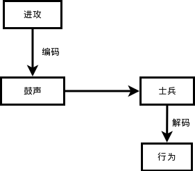
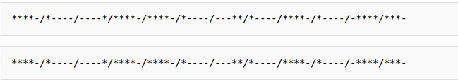

#坑爹的字符编码

字符编码，在编程中，是一个让学习者比较郁闷的东西，比如一个str，如果都是英文，好说多了。但恰恰不是如此，中文是我们不得不用的。所以，哪怕是初学者，都要了解并能够解决字符编码问题。

    >>> name = '老齐'
    >>> name
    '\xe8\x80\x81\xe9\xbd\x90'

在你的编程中，你遇到过上面的情形吗？认识最下面一行打印出来的东西吗？看人家英文，就好多了

    >>> name = "qiwsir"
    >>> name
    'qiwsir'

难道这是中文的错吗？看来投胎真的是一个技术活。是的，投胎是技术活，但上面的问题不是中文的错。

##编码

什么是编码？这是一个比较玄乎的问题。也不好下一个普通定义。我看到有的教材中有定义，不敢说他的定义不对，至少可以说不容易理解。

古代打仗，击鼓进攻、鸣金收兵，这就是编码。把要传达给士兵的命令对应为一定的其它形式，比如命令“进攻”，经过如此的信息传递：

1. 长官下达进攻命令，传令员将这个命令编码为鼓声（如果复杂点，是不是有几声鼓响，如何进攻呢？）。
2. 鼓声在空气中传播，比传令员的嗓子吼出来的声音传播的更远，士兵听到后也不会引起歧义，一般不会有士兵把鼓声当做打呼噜的声音。这就是“进攻”命令被编码成鼓声之后的优势所在。
3. 士兵听到鼓声，就是接收到信息之后，如果接受过训练或者有人告诉过他们，他们就知道这是让我进攻。这个过程就是解码。所以，编码方案要有两套。一套在信息发出者那里，另外一套在信息接受者这里。经过解码之后，士兵明白了，才行动。

以上过程比较简单。其实，真实的编码和解码过程，要复杂了。不过，原理都差不多的。

举一个似乎遥远，其实不久前人们都在使用的东西做例子：[电报](http://zh.wikipedia.org/wiki/%E7%94%B5%E6%8A%A5)

>电报是通信业务的一种，在19世纪初发明，是最早使用电进行通信的方法。电报大为加快了消息的流通，是工业社会的其中一项重要发明。早期的电报只能在陆地上通讯，后来使用了海底电缆，开展了越洋服务。到了20世纪初，开始使用无线电拨发电报，电报业务基本上已能抵达地球上大部份地区。电报主要是用作传递文字讯息，使用电报技术用作传送图片称为传真。

>中国首条出现电报线路是1871年，由英国、俄国及丹麦敷设，从香港经上海至日本长崎的海底电缆。由于清政府的反对，电缆被禁止在上海登陆。后来丹麦公司不理清政府的禁令，将线路引至上海公共租界，并在6月3日起开始收发电报。至于首条自主敷设的线路，是由福建巡抚丁日昌在台湾所建，1877年10月完工，连接台南及高雄。1879年，北洋大臣李鸿章在天津、大沽及北塘之间架设电报线路，用作军事通讯。1880年，李鸿章奏准开办电报总局，由盛宣怀任总办。并在1881年12月开通天津至上海的电报服务。李鸿章説：“五年来，我国创设沿江沿海各省电线，总计一万多里，国家所费无多，巨款来自民间。当时正值法人挑衅，将帅报告军情，朝廷传达指示，均相机而动，无丝毫阻碍。中国自古用兵，从未如此神速。出使大臣往来问答，朝发夕至，相隔万里好似同居庭院。举设电报一举三得，既防止外敌侵略，又加强国防，亦有利于商务。”天津官电局于庚子遭乱全毁。1887年，台湾巡抚刘铭传敷设了福州至台湾的海底电缆，是中国首条海底电缆。1884年，北京电报开始建设，采用"安设双线，由通州展至京城，以一端引入署中，专递官信，以一端择地安置用便商民"，同年8月5日，电报线路开始建设，所有电线杆一律漆成红色。8月22日，位于北京崇文门外大街西的喜鹊胡同的外城商用电报局开业。同年8月30日，位于崇文门内泡子和以西的吕公堂开局，专门收发官方电报。

>为了传达汉字，电报部门准备由4位数字或3位罗马字构成的代码，即中文电码，采用发送前将汉字改写成电码发出，收电报后再将电码改写成汉字的方法。

列位看官注意了，这里出现了电报中用的“[中文电码](http://zh.wikipedia.org/wiki/%E4%B8%AD%E6%96%87%E9%9B%BB%E7%A2%BC)”，这就是一种编码，将汉字对应成阿拉伯数字，从而能够用电报发送汉字。

>1873年,法国驻华人员威基杰参照《康熙字典》的部首排列方法,挑选了常用汉字6800多个,编成了第一部汉字电码本《电报新书》。

电报中的编码被称为[摩尔斯电码，英文是Morse Code](http://zh.wikipedia.org/wiki/%E6%91%A9%E6%96%AF%E7%94%B5%E7%A0%81)

>摩尔斯电码（英语：Morse Code）是一种时通时断的信号代码，通过不同的排列顺序来表达不同的英文字母、数字和标点符号。是由美国人萨缪尔·摩尔斯在1836年发明。

>摩尔斯电码是一种早期的数字化通信形式，但是它不同于现代只使用0和1两种状态的二进制代码，它的代码包括五种：点（.）、划（-）、每个字符间短的停顿（在点和划之间的停顿）、每个词之间中等的停顿、以及句子之间长的停顿

看来电报员是一个技术活，不同长短的停顿都代表了不同意思。哦，对了，有一个老片子《永不消逝的电波》，看完之后保证你才知道，里面根本就没有讲电报是怎么编码的。

>摩尔斯电码在海事通讯中被作为国际标准一直使用到1999年。1997年，当法国海军停止使用摩尔斯电码时，发送的最后一条消息是：“所有人注意，这是我们在永远沉寂之前最后的一声呐喊！”

我瞪着眼看了老长时间，这两行不是一样的吗？

不管这个了，总之，这就是编码。

##计算机中的字符编码

先抄一段[维基百科对字符编码](http://zh.wikipedia.org/wiki/%E5%AD%97%E7%AC%A6%E7%BC%96%E7%A0%81)的解释：

>字符编码（英语：Character encoding）、字集码是把字符集中的字符编码为指定集合中某一对象（例如：比特模式、自然数串行、8位组或者电脉冲），以便文本在计算机中存储和通过通信网络的传递。常见的例子包括将拉丁字母表编码成摩斯电码和ASCII。其中，ASCII将字母、数字和其它符号编号，并用7比特的二进制来表示这个整数。通常会额外使用一个扩充的比特，以便于以1个字节的方式存储。

>在计算机技术发展的早期，如ASCII（1963年）和EBCDIC（1964年）这样的字符集逐渐成为标准。但这些字符集的局限很快就变得明显，于是人们开发了许多方法来扩展它们。对于支持包括东亚CJK字符家族在内的写作系统的要求能支持更大量的字符，并且需要一种系统而不是临时的方法实现这些字符的编码。

在这个世界上，有好多不同的字符编码。但是，它们不是自己随便搞搞的。而是要有一定的基础，往往是以名叫[ASCII](http://zh.wikipedia.org/wiki/ASCII)的编码为基础，这里边也应该包括北朝鲜吧（不知道他们用什么字符编码，瞎想的，别当真，不代表本教材立场，只代表瞎想）。

>ASCII（pronunciation: 英语发音：/ˈæski/ ASS-kee[1]，American Standard Code for Information Interchange，美国信息交换标准代码）是基于拉丁字母的一套电脑编码系统。它主要用于显示现代英语，而其扩展版本EASCII则可以部分支持其他西欧语言，并等同于国际标准ISO/IEC 646。由于万维网使得ASCII广为通用，直到2007年12月，逐渐被Unicode取代。

上面的引文中已经说了，现在我们用的编码标准，已经不是ASCII了，我上大学那时候老师讲的还是ASCII呢(最坑爹的是贵国的大学教育，前几天面试一个大学毕业生，计算机专业的，他告诉我他的老师给他们讲的就是ASCII为编码标准呢，我说你别埋汰老师了，你去看看教材，今天这哥们真给我发短信了，告诉我教材上就是这么说的。)，时代变迁，现在已经变成了Unicode了，那么什么是Unicode编码呢？还是抄一段来自[维基百科](http://zh.wikipedia.org/wiki/Unicode)的说明（需要说明一下，本讲不是我qiwsir在讲，是维基百科在讲，我只是一个配角，哈哈）

>Unicode（中文：万国码、国际码、统一码、单一码）是计算机科学领域里的一项业界标准。它对世界上大部分的文字系统进行了整理、编码，使得电脑可以用更为简单的方式来呈现和处理文字。

>Unicode伴随着通用字符集的标准而发展，同时也以书本的形式对外发表。Unicode至今仍在不断增修，每个新版本都加入更多新的字符。目前最新的版本为7.0.0，已收入超过十万个字符（第十万个字符在2005年获采纳）。Unicode涵盖的数据除了视觉上的字形、编码方法、标准的字符编码外，还包含了字符特性，如大小写字母。

听这名字：万国码，那就一定包含了中文喽。的确是。但是，光有一个Unicode还不行，因为....（此处省略若干字，看官可以到上面给出的维基百科链接中看），还要有其它的一些编码实现方式，Unicode的实现方式称为Unicode转换格式（Unicode Transformation Format，简称为UTF），于是乎有了一个我们在很多时候都会看到的utf-8。

什么是utf-8，还是看[维基百科](http://zh.wikipedia.org/wiki/UTF-8)上怎么说的吧

>UTF-8（8-bit Unicode Transformation Format）是一种针对Unicode的可变长度字符编码，也是一种前缀码。它可以用来表示Unicode标准中的任何字符，且其编码中的第一个字节仍与ASCII兼容，这使得原来处理ASCII字符的软件无须或只须做少部份修改，即可继续使用。因此，它逐渐成为电子邮件、网页及其他存储或发送文字的应用中，优先采用的编码。

不再多引用了，如果要看更多，请到[原文](http://zh.wikipedia.org/wiki/Unicode)。

看官现在是不是就理解了，前面写程序的时候，曾经出现过：coding:utf-8的字样。就是在告诉python我们要用什么字符编码呢。

##encode和decode

历史部分说完了，接下怎么讲？比较麻烦了。因为不管怎么讲，都不是三言两语说清楚的。姑且从encode()和decode()两个内置函数起吧。

>codecs.encode(obj[, encoding[, errors]]):Encodes obj using the codec registered for encoding.
>codecs.decode(obj[, encoding[, errors]]):Decodes obj using the codec registered for encoding.

python2默认的编码是ascii，通过encode可以将对象的编码转换为指定编码格式，而decode是这个过程的逆过程。

做一个实验，才能理解：

    >>> a = "中"
    >>> type(a)
    <type 'str'>
    >>> a
    '\xe4\xb8\xad'
    >>> len(a)
    3
    
    >>> b = a.decode()
    >>> b
    u'\u4e2d'
    >>> type(b)
    <type 'unicode'>
    >>> len(b)
    1

这个实验不做之前，或许看官还不是很迷茫（因为不知道，知道的越多越迷茫），实验做完了，自己也迷茫了。别急躁，对编码问题的理解，要慢慢来，如果一时理解不了，也肯定理解不了，就先注意按照要求做，做着做着就豁然开朗了。

上面试验中，变量a引用了一个字符串，所谓字符串(str)，严格地将是字节串，它是经过编码后的字节组成的序列。也就是你在上面的实验中，看到的是“中”这个字在计算机中编码之后的字节表示。（关于字节，看官可以google一下）。用len(a)来度量它的长度，它是由三个字节组成的。

然后通过decode函数，将**字节串**转变为**字符串**，并且这个字符串是按照unicode编码的。在unicode编码中，一个汉字对应一个字符，这时候度量它的长度就是1.

反过来，一个unicode编码的字符串，也可以转换为字节串。

    >>> c = b.encode('utf-8')
    >>> c
    '\xe4\xb8\xad'
    >>> type(c)
    <type 'str'>
    >>> c == a
    True

关于编码问题，先到这里，点到为止吧。因为再扯，还会扯出问题来。看官肯定感到不满意，因为还没有知其所以然。没关系，请尽情google，即可解决。

##python中如何避免中文是乱码

这个问题是一个具有很强操作性的问题。我这里有一个经验总结，分享一下，供参考：

首先，提倡使用utf-8编码方案，因为它跨平台不错。

经验一：在开头声明：

    # -*- coding: utf-8 -*-

有朋友问我-*-有什么作用，那个就是为了好看，爱美之心人皆有，更何况程序员？当然，也可以写成：

    # coding:utf-8

经验二：遇到字符（节）串，立刻转化为unicode，不要用str()，直接使用unicode()

    unicode_str = unicode('中文', encoding='utf-8')
    print unicode_str.encode('utf-8')

经验三：如果对文件操作，打开文件的时候，最好用codecs.open，替代open(这个后面会讲到，先放在这里)

    import codecs
    codecs.open('filename', encoding='utf8')

我还收集了网上的一篇文章，也挺好的，推荐给看官：[Python2.x的中文显示方法](https://github.com/qiwsir/ITArticles/blob/master/Python/Python%E7%9A%84%E4%B8%AD%E6%96%87%E6%98%BE%E7%A4%BA%E6%96%B9%E6%B3%95.md)

最后告诉给我，如果用python3，坑爹的编码问题就不烦恼了。

