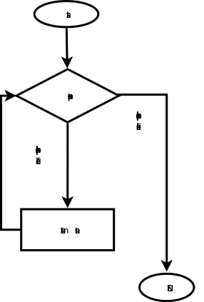

#用while来循环

while，翻译成中文是“当...的时候”，这个单词在英语中，常常用来做为时间状语，while ... someone do somthing，这种类型的说法是有的。在python中，它也有这个含义，不过有点区别的是，“当...时候”这个条件成立在一段范围或者时间间隔内，从而在这段时间间隔内让python做好多事情。就好比这样一段情景：

    while 年龄大于60岁：-------->当年龄大于60岁的时候
        退休            -------->凡是符合上述条件就执行的动作

展开想象，如果制作一道门，这道门就是用上述的条件调控开关的，假设有很多人经过这个们，报上年龄，只要年龄大于60,就退休（门打开，人可以出去），一个接一个地这样循环下去，突然有一个人年龄是50,那么这个循环在他这里就停止，也就是这时候他不满足条件了。

这就是while循环。写一个严肃点的流程，可以看下图：

##再做猜数字游戏

本教程有一讲，是跟看官一同[做一个小游戏](../129.md),在里面做了一个猜数的游戏，当时遇到了一个问题，就是只能猜一两次，如果猜不到，程序就不能继续运行了。

前不久，有一个在校的大学生朋友（他叫李航），给我发邮件，让我看了他做的游戏，能够实现多次猜数，直到猜中为止。这是一个多么喜欢学习的大学生呀。

我在这里将他写的程序恭录于此，单元李航同学不要见怪，如果李航同学认为此举侵犯了自己的知识产权，可以告知我，我马上撤下此代码。

    #! /usr/bin/env python
    #coding:UTF-8           
    
    import random
    
    i=0
    while i < 4:
        print'********************************'
        num = input('请您输入0到9任一个数：')       #李同学用的是python3
    
        xnum = random.randint(0,9)
     
        x = 3 - i
         
        if num == xnum:
            print'运气真好，您猜对了！'
            break
        elif num > xnum:
            print'''您猜大了!\n哈哈,正确答案是:%s\n您还有%s次机会！''' %(xnum,x)
        elif num < xnum:
            print'''您猜小了!\n哈哈,正确答案是:%s\n您还有%s次机会！''' %(xnum,x)
        print'********************************'
        
        i += 1
        
我们就用这段程序来分析一下，首先看while i<4，这是程序中为猜测限制了次数，最大是三次，请看官注意，在while的循环体中的最后一句：i +=1，这就是说每次循环到最后，就给i增加1,当bool(i<4)=False的时候，就不再循环了。

当bool(i<4)=True的时候，就执行循环体内的语句。在循环体内，让用户输入一个整数，然后程序随机选择一个整数，最后判断随机生成的数和用户输入的数是否相等，并且用if语句判断三种不同情况。

根据上述代码，看官看看是否可以修改？

为了让用户的体验更爽，不妨把输入的整数范围扩大，在1到100之间吧。

    num_input = raw_input("please input one integer that is in 1 to 100:")    #我用的是python2.7，在输入指令上区别于李同学

程序用num_input变量接收了输入的内容。但是，请列位看官一定要注意，看到这里想睡觉的要打起精神了，我要分享一个多年编程经验，请牢记：**任何用户输入的内容都是不可靠的。**这句话含义深刻，但是，这里不做过多的解释，需要各位在随后的编程生涯中体验了。为此，我们要检验用户输入的是否符合我们的要求，我们要求用户输入的是1到100之间的整数，那么就要做如下检验：

1. 输入的是否是整数
2. 如果是整数，是否在1到100之间。

为此，要做：
    
    if not num_input.isdigit():     #str.isdigit()是用来判断字符串是否纯粹由数字组成
        print "Please input interger."
    elif int(num_input)<0 and int(num_input)>=100:
        print "The number should be in 1 to 100."
    else:
        pass       #这里用pass，意思是暂时省略，如果满足了前面提出的要求，就该执行此处语句

再看看李航同学的程序，在循环体内产生一个随机的数字，这样用户每次输入，面对的都是一个新的随机数字。这样的猜数字游戏难度太大了。我希望是程序产生一个数字，直到猜中，都是这个数字。所以，要把产生随机数字这个指令移动到循环之前。

    import random

    number = random.randint(1,100)
    
    while True:             #不限制用户的次数了
        ...

观察李同学的程序，还有一点需要向列位显明的，那就是在条件表达式中，两边最好是同种类型数据，上面的程序中有：num>xnum样式的条件表达式，而一边是程序生成的int类型数据，一边是通过输入函数得到的str类型数据。在某些情况下可以运行，为什么？看官能理解吗？都是数字的时候，是可以的。但是，这样不好。

那么，按照这种思路，把这个猜数字程序重写一下：
    
	#!/usr/bin/env python
	#coding:utf-8
	
	import random
	
	number = random.randint(1,101)
	
	guess = 0
	
	while True:
	
	    num_input = raw_input("please input one integer that is in 1 to 100:")
	    guess +=1
	
	    if not num_input.isdigit():
	        print "Please input interger."
	    elif int(num_input)<0 or int(num_input)>=100:
	        print "The number should be in 1 to 100."
	    else:
	        if number==int(num_input):
	            print "OK, you are good.It is only %d, then you successed."%guess
	            break
	        elif number>int(num_input):
	            print "your number is more less."
	        elif number<int(num_input):
	            print "your number is bigger."
	        else:
	            print "There is something bad, I will not work"

以上供参考，看官还可改进。

##break和continue

break,在上面的例子中已经出现了，其含义就是要在这个地方中断循环，跳出循环体。下面这个简要的例子更明显：

    #!/usr/bin/env python
    #coding:utf-8

    a = 8
    while a:
        if a%2==0:
            break
        else:
            print "%d is odd number"%a
            a = 0 
    print "%d is even number"%a

a=8的时候，执行循环体中的break，跳出循环，执行最后的打印语句，得到结果：

    8 is even number

如果a=9，则要执行else里面的的print，然后a=0，循环就在执行一次，又break了，得到结果：

    9 is odd number
    0 is even number

而continue则是要从当前位置（即continue所在的位置）跳到循环体的最后一行的后面（不执行最后一行），对一个循环体来讲，就如同首尾衔接一样，最后一行的后面是哪里呢？当然是开始了。

	#!/usr/bin/env python
	#coding:utf-8
	
	a = 9
	while a:
	    if a%2==0:
	        a -=1
	        continue    #如果是偶数，就返回循环的开始
	    else:
	        print "%d is odd number"%a #如果是奇数，就打印出来
	        a -=1

其实，对于这两东西，我个人在编程中很少用到。我有一个固执的观念，尽量将条件在循环之前做足，不要在循环中跳来跳去，不仅可读性下降，有时候自己也糊涂了。

##while...else

这两个的配合有点类似if ... else，只需要一个例子列为就理解了，当然，一遇到else了，就意味着已经不在while循环内了。

    #!/usr/bin/env python

    count = 0
    while count < 5:
        print count, " is  less than 5"
        count = count + 1
    else:
        print count, " is not less than 5"

执行结果：

    0 is less than 5
    1 is less than 5
    2 is less than 5
    3 is less than 5
    4 is less than 5
    5 is not less than 5

