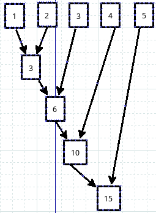

#大话题小函数(2)

上一讲和本讲的标题是“大话题小函数”，所谓大话题，就是这些函数如果溯源，都会找到听起来更高大上的东西。这种思维方式绝对我坚定地继承了中华民族的优良传统的。自从天朝的臣民看到英国人开始踢足球，一直到现在所谓某国勃起了，都一直在试图论证足球起源于该朝的前前前朝的某国时代，并且还搬出了那时候的一个叫做高俅的球星来论证，当然了，勃起的某国是挡不住该国家队在世界杯征程上的阳痿，只能用高俅来意淫一番了。这种思维方式，我是坚定地继承，因为在我成长过程中，它一直被奉为优良传统。阿Q本来是姓赵的，和赵老爷是本家，比秀才要长三辈，虽然被赵老爷打了嘴。

废话少说，书接前文，已经研究了map，下面来看reduce。

忍不住还得来点废话。不知道看官是不是听说过MapReduc，如果没有，那么Hadoop呢？如果还没有，就google一下。下面是我从[维基百科](http://zh.wikipedia.org/wiki/MapReduce)上抄下来的，共赏之。

>MapReduce是Google提出的一个软件架构，用于大规模数据集（大于1TB）的并行运算。概念“Map（映射）”和“Reduce（化简）”，及他们的主要思想，都是从函数式编程语言借来的，还有从矢量编程语言借来的特性。

不用管是不是看懂，总之又可以用开头的思想意淫一下了，原来今天要鼓捣的这个reduce还跟大数据有关呀。不管怎么样，你有梦一般的感觉就行。

##reduce

回到现实，清醒一下，继续敲代码：

    >>> reduce(lambda x,y: x+y,[1,2,3,4,5])
    15

请看官仔细观察，是否能够看出是如何运算的呢？画一个图：

还记得map是怎么运算的吗？忘了？看代码：

    >>> list1 = [1,2,3,4,5,6,7,8,9]
    >>> list2 = [9,8,7,6,5,4,3,2,1]
    >>> map(lambda x,y: x+y, list1,list2)
    [10, 10, 10, 10, 10, 10, 10, 10, 10]

看官对比一下，就知道两个的区别了。原来map是上下运算，reduce是横着逐个元素进行运算。

权威的解释来自官网：

>reduce(function, iterable[, initializer])

>Apply function of two arguments cumulatively to the items of iterable, from left to right, so as to reduce the iterable to a single value. For example, reduce(lambda x, y: x+y, [1, 2, 3, 4, 5]) calculates ((((1+2)+3)+4)+5). The left argument, x, is the accumulated value and the right argument, y, is the update value from the iterable. If the optional initializer is present, it is placed before the items of the iterable in the calculation, and serves as a default when the iterable is empty. If initializer is not given and iterable contains only one item, the first item is returned. Roughly equivalent to:

    def reduce(function, iterable, initializer=None):
        it = iter(iterable)
        if initializer is None:
            try:
                initializer = next(it)
            except StopIteration:    
                raise TypeError('reduce() of empty sequence with no initial value')    
        accum_value = initializer                                                                   
        for x in it:
            accum_value = function(accum_value, x)    
        return accum_value
                                                                                                                            
如果用我们熟悉的for循环来做上面reduce的事情，可以这样来做：

    >>> lst = range(1,6)
    >>> lst
    [1, 2, 3, 4, 5]
    >>> r = 0
    >>> for i in range(len(lst)):
    ...     r += lst[i]
    ... 
    >>> r
    15

for普世的，reduce是简洁的。

为了锻炼思维，看这么一个问题，有两个list，a = [3,9,8,5,2],b=[1,4,9,2,6],计算：a[0]*b[0]+a[1]*b[1]+...的结果。

    >>> a
    [3, 9, 8, 5, 2]
    >>> b
    [1, 4, 9, 2, 6]
    
    >>> zip(a,b)        #复习一下zip，下面的方法中要用到
    [(3, 1), (9, 4), (8, 9), (5, 2), (2, 6)]
    
    >>> sum(x*y for x,y in zip(a,b))    #解析后直接求和
    133

    >>> new_list = [x*y for x,y in zip(a,b)]    #可以看做是上面方法的分布实施
    >>> #这样解析也可以：new_tuple = (x*y for x,y in zip(a,b))
    >>> new_list
    [3, 36, 72, 10, 12]
    >>> sum(new_list)     #或者:sum(new_tuple)
    133

    >>> reduce(lambda sum,(x,y): sum+x*y,zip(a,b),0)    #这个方法是在耍酷呢吗？
    133

    >>> from operator import add,mul            #耍酷的方法也不止一个
    >>> reduce(add,map(mul,a,b))
    133

    >>> reduce(lambda x,y: x+y, map(lambda x,y: x*y, a,b))  #map,reduce,lambda都齐全了，更酷吗？
    133

##filter

filter的中文含义是“过滤器”，在python中，它就是起到了过滤器的作用。首先看官方说明：

>filter(function, iterable)

>Construct a list from those elements of iterable for which function returns true. iterable may be either a sequence, a container which supports iteration, or an iterator. If iterable is a string or a tuple, the result also has that type; otherwise it is always a list. If function is None, the identity function is assumed, that is, all elements of iterable that are false are removed.

>Note that filter(function, iterable) is equivalent to [item for item in iterable if function(item)] if function is not None and [item for item in iterable if item] if function is None.

这次真的不翻译了（好像以往也没有怎么翻译呀），而且也不解释要点了。请列位务必自己阅读上面的文字，并且理解其含义。英语，无论怎么强调都是不过分的，哪怕是做乞丐，说两句英语，没准还可以讨到英镑美元呢。

通过下面代码体会：

    >>> numbers = range(-5,5)
    >>> numbers
    [-5, -4, -3, -2, -1, 0, 1, 2, 3, 4]
    
    >>> filter(lambda x: x>0, numbers) 
    [1, 2, 3, 4]

    >>> [x for x in numbers if x>0]     #与上面那句等效
    [1, 2, 3, 4]
    
    >>> filter(lambda c: c!='i', 'qiwsir')  #能不能对应上面文档说明那句话呢？
    'qwsr'                                  #“If iterable is a string or a tuple, the result also has that type;”

至此，用两此介绍了几个小函数，这些函数在对程序的性能提高上，并没有显著或者稳定预期，但是，在代码的简洁上，是有目共睹的。有时候是可以用来秀一秀，彰显python的优雅和自己耍酷。
