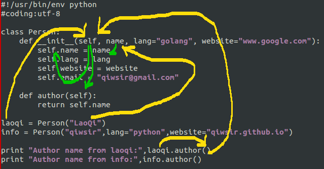

#编写类之二方法

[上一讲](./217.md)中创建了类，并且重点讲述了构造函数以及类实例，特别是对那个self，描述了不少。在讲述构造函数的时候特别提到，__init__()是一个函数，只不过在类中有一点特殊的作用罢了，每个类，首先要运行它，它规定了类的基本结构。

##数据流转过程

除了在类中可以写这种函数之外，在类中还可以写别的函数，延续上一讲的例子：

	#!/usr/bin/env python
	#coding:utf-8
	
	class Person:
	    def __init__(self, name, lang="golang", website="www.google.com"):
	        self.name = name
	        self.lang = lang
	        self.website = website
	        self.email = "qiwsir@gmail.com"
	    
	    def author(self):
	        return self.name
	
	laoqi = Person("LaoQi")
	info = Person("qiwsir",lang="python",website="qiwsir.github.io")
	
	print "Author name from laoqi:",laoqi.author()
	print "Author name from info:",info.author()
	
    #运行结果

	Author name from laoqi: LaoQi
	Author name from info: qiwsir

看官可能已经注意了，这段代码比上一讲多了一个函数author(self)，这个我们先不管，稍后会详细分解。首先看看数据是如何在这个代码中流转的。为了能够清楚，画一张图，所谓一图胜千言万语，有图有真相。

定义类Person，然后创建实例laoqi=Person("LaoQi"),看官注意观察图上的箭头方向。laoqi这个实例和Person类中的self对应，它们都是引用了实例对象（很多时候简化说成是实例对象）。"LaoQi"是一个具体的数据，通过构造函数中的name参数，传给实例的属性self.name，在类Person中的另外一个方法author的参数列表中第一个就是self，表示要承接self对象，return self.name，就是在类内部通过self对象，把它的属性self.name的数据传导如author。

当运行laoqi.author()的时候，就是告诉上面的代码，调用laoqi实例对象，并得到author()方法的结果，laoqi这个实例就自动被告诉了author()（注意，self参数在这里不用写，这个告诉过程是python自动完成的，不用我们操心了），author方法就返回laoqi实例的属性，因为前面已经完成了laoqi与self的对应过程，所以这时候author里面的self就是laoqi，自然self.name=laoqi.name。

看官可以跟随我在做一个实验，那就是在author中，return laoqi.name，看看什么效果。因为既然laoqi和self是同一个实例对象，直接写成laoqi.name是不是也可以呢？

    #!/usr/bin/env python
    #coding:utf-8

    class Person:
        def __init__(self, name, lang="golang", website="www.google.com"):
            self.name = name
            self.lang = lang
            self.website = website
            self.email = "qiwsir@gmail.com"
    
        def author(self):
            #return self.name
            return laoqi.name       #返回

    laoqi = Person("LaoQi")
    info = Person("qiwsir",lang="python",website="qiwsir.github.io")

    print "Author name from laoqi:",laoqi.author()
    print "Author name from info:",info.author()

    #输出结果
    Author name from laoqi: LaoQi   #laoqi实例输出结果
    Author name from info: LaoQi    #info实例输出结果

从结果中可以看出，没有报错。但是，info这个实例输出的结果和laoqi实例输出的结果一样。原来，当调用了info实例之后，运行到author(),返回的是laoqi.name。所以，这里一定要用self实例。在调用不同的实例时，self会自动的进行匹配，当然，匹配过程是python完成，仍然不用我们操心。

OK，数据流转过程，看官是否理解了呢？下面进入方法编写的环节

##为什么要用到方法

在类里面，可以用def语句来编写函数，但是，通常这个函数的样子是这样的：

    class ClassName:
        def __init__(self,*args):
            ...
        def method(self,*args):     #是一个在类里面的函数
            ...

在类ClassName里面，除了前面那个具有初始化功能的构造函数之外，还有一个函数method，这个函数和以前学习过的函数一样，函数里面要写什么，也没有特别的规定。但是，这个函数的第一个参数必须是self，或者说，可以没有别的参数，但是self是必须写上并且是第一个。这个self参数的作用前面已经说过了。

这样看来，类里面的这个函数还有点跟以前函数不同的地方。

类里面的这个函数，我们就称之为**方法**。

之所以用方法，也是用类的原因，也是用函数的原因，都是为了减少代码的冗余，提高代码的重用性，这也是OOP的原因。

方法怎样被重用呢？看本最开始的那段代码，里面有一个author方法，不管是laoqi还是info实例，都用这个方法返回实例导入的名字。这就是体现了重用。

##编写和操作方法

编写方法的过程和编写一个函数的过程一样，需要注意的就是要在参数列表中第一个写上self，即使没有其它的参数。

	#!/usr/bin/env python
	#coding:utf-8
	
	class Person:
	    def __init__(self, name, lang="golang", website="www.google.com"):
	        self.name = name
	        self.lang = lang
	        self.website = website
	        self.email = "qiwsir@gmail.com"
	    
	    def author(self, address):
	        #return self.name
	        return laoqi.name+" in "+address
	
	laoqi = Person("LaoQi")
	info = Person("qiwsir",lang="python",website="qiwsir.github.io")
	
	print "Author name from laoqi:",laoqi.author("China")
	print "Author name from info:",info.author("Suzhou")
	
    #运行结果
	
    Author name from laoqi: LaoQi in China
	Author name from info: LaoQi in Suzhou

这段代码中，对author方法增加了一个参数address,当调用这个方法的时候：laoqi.author("China")，要对这个参数赋值，看官特别注意，在类中，这个方法显示是有两个参数(self,address)，但是在调用的时候，第一个参数是自动将实例laoqi与之对应起来，不需要显化赋值，可以理解成是隐含完成的（其实，也可以将laoqi看做隐藏的主体，偷偷地跟self勾搭上了）。

通过上面的讲述，看官可以试试类了。提醒，一定要对类的数据流通过程清晰。
