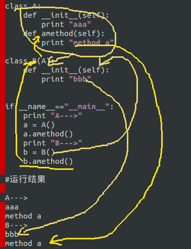

#编写类之四再论继承

在上一讲代码的基础上，做进一步修改，成为了如下程序，请看官研习这个程序：

	#!/usr/bin/env python
	#coding:utf-8
	
	class Person:
	    def __init__(self, name, email):
	        self.name = name
	        self.email = email
	    
	class Programmer(Person):
	    def __init__(self, name,email,lang, system, website):
	        Person.__init__(self,name,email)
	        self.lang = lang
	        self.system = system
	        self.website = website
	
	class Pythoner(Programmer):
	    def __init__(self,name,email):
	        Programmer.__init__(self,name,email,"python","Ubuntu","qiwsir.github.io")
	
	if __name__=="__main__":
	    writer = Pythoner("qiwsir","qiwsir@gmail.com")
	    print "name=",writer.name
	    print "lang=",writer.lang
	    print "email=",writer.email
	    print "system=",writer.system
	    print "website=",writer.website

    #运行结果
    
    name= qiwsir
    lang= python
    email= qiwsir@gmail.com
    system= Ubuntu
    website= qiwsir.github.io

对结果很满意，再看程序中的继承关系：Pythoner <-- Programmer <-- Person，从上面的过程中不难看出，继承能够减少代码重复，是的代码更简练。另外，在继承的时候，也可以在函数中对参数进行默认赋值。

为了能够突出继承问题的探究，还是用那种简单的类来做实验。

##多余的B

    #!/usr/bin/env python
    #coding:utf-8
    
    class A:
        def __init__(self):
            print "aaa"

    class B(A):
        pass

    if __name__=="__main__":
        a = A()
        b = B()

    #运行结果
    
    aaa
    aaa

B继承A，没有任何修改地继承，B就可以不用写任何东西了，或者说B本质上就是一个多余。在真实的编程过程中，没有这样写的，这里仅仅是为了向看官展示一下继承的含义罢了。

	##首个继承有效
	
	#!/usr/bin/env python
	#coding:utf-8
	
	class A:
	    def __init__(self):
	        print "aaa"
	
	class B:
	    def __init__(self):
	        print "bbb"
	
	class C1(A,B):
	    pass
	
	class C2(B,A):
	    pass
	
	if __name__=="__main__":
	    print "A--->",
	    a = A()
	    print "B--->",
	    b = B()
	    print "C1(A,B)--->",
	    c1 = C1()
	    print "C2(B,A)--->",
	    c2 = C2()
	
	#运行结果
	
	A---> aaa
	B---> bbb
	C1(A,B)---> aaa
	C2(B,A)---> bbb

列位看官是否注意了，类C1继承了两个类A，B；类C2也继承了两个类，只不过书写顺序有点区别(B,A)。从运行结果可以看出，当子类继承多个父类的时候，对于构造函数"__init__()"，只有第一个能够被继承，第二个就等掉了。所以，一般情况下，不会在程序中做关于构造函数的同时多个继承，不过可以接力继承，就如同前面那个比较真实的代码一样。

##其它方法的继承

	#!/usr/bin/env python
	#coding:utf-8
	
	class A:
	    def __init__(self):
	        print "aaa"
	    def amethod(self):
	        print "method a"
	
	class B(A):
	    def __init__(self):
	        print "bbb"
	
	
	if __name__=="__main__":
	    print "A--->"
	    a = A()
	    a.amethod()
	    print "B--->"
	    b = B()
	    b.amethod()
	
    #运行结果
	
    A--->
	aaa
	method a
	B--->
	bbb
	method a

为了说明白上面的情况，还是画了一张图，不过，我画完之后，就后悔了，看这张图好像更糊涂了。怎么着也画了，还是贴出来，如果能够协助理解更好了。

A的实例和调用，就不多说了。重点看B，类B继承了A，同时，B在构造函数中自己做了规定，也就是B的构造函数是按照B的意愿执行，不执行A的内容，但是，A还有一个amethod(self)方法，B则继承了这个方法。当通过类B的实例调用这个方法的时候，就能够成功了：b.amethod()

这就是方法的继承和调用方法。

所谓继承，就是从下到上一级一级地找相应的继承对象，找到了就继承之。如果有同名的怎么办？按照什么顺序找呢？

应用网上的一段：

[在Python中，可以進行多重繼承，這個時候要注意搜尋的順序，是從子類別開始，接著是同一階層父類別由左至右搜尋，再至更上層同一階層父類別由左至右搜尋，直到達到頂層為止。](http://openhome.cc/Gossip/Python/Inheritance.html)

代码举例：

    class A(object):
        def method1(self):
            print('A.method1')
                        
        def method2(self):
            print('A.method2')
                                            
    class B(A):
        def method3(self):
            print('B.method3')
                                                                
    class C(A):
        def method2(self):
            print('C.method2')
        
        def method3(self):
            print('C.method3')
                                                                                                        
    class D(B, C):
        def method4(self):
            print('C.method4')

    d = D()
    d.method4() # 在 D 找到，C.method4
    d.method3() # 以 D->B 順序找到，B.method3
    d.method2() # 以 D->B->C 順序找到，C.method2
    d.method1() # 以 D->B->C->A 順序找到，A.method1

务必请真正的学习者要对照每个类的每个方法，依次找到相应的输出结果。从而理解继承的顺序。学习，就要点滴积累。
