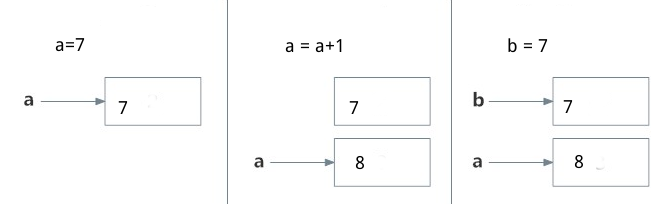
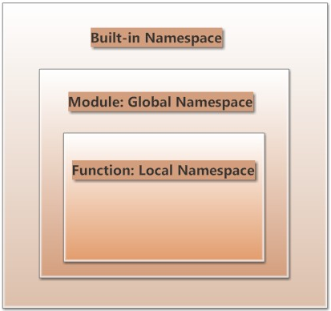

#命名空间

命名空间，英文名字：namespaces

在研习命名空间以前，请打开在python的交互模式下，输入：import this

    >>> import this
    The Zen of Python, by Tim Peters

    Beautiful is better than ugly.
    Explicit is better than implicit.
    Simple is better than complex.
    Complex is better than complicated.
    Flat is better than nested.
    Sparse is better than dense.
    Readability counts.
    Special cases aren't special enough to break the rules.
    Although practicality beats purity.
    Errors should never pass silently.
    Unless explicitly silenced.
    In the face of ambiguity, refuse the temptation to guess.
    There should be one-- and preferably only one --obvious way to do it.
    Although that way may not be obvious at first unless you're Dutch.
    Now is better than never.
    Although never is often better than *right* now.
    If the implementation is hard to explain, it's a bad idea.
    If the implementation is easy to explain, it may be a good idea.
    Namespaces are one honking great idea -- let's do more of those!

这里列位看到的就是所谓《python之禅》，在本教程的[第零部分：唠叨一些关于Python的事情](./001.md)有专门的翻译，这里再次列出，是要引用其中的一句话。请看官看最后一句： Namespaces are one honking great idea -- let's do more of those!

这是为了向看官说明Namespaces、命名空间值重要性。

##什么是命名空间

从“一切皆为对象”开始说起吧。对象，很多时候我们直接使用它并不方便，因此要给它取一个名字。打个比方，有这样一个物种，它是哺乳纲灵长目人科人属智人种，这就是所谓的对象，但是，在平时提及这个对象的时候，总是要说“哺乳纲灵长目人科人属智人种”，是不是太麻烦了？于是聪明的这个物种就为这个世界上的各种对象命名，例如将“哺乳纲灵长目人科人属智人种”这个对象命名为“人”。

在编程中也是如此，前面在讲述变量相关知识的时候已经说明了变量和引用对象的关系。

    >>> a = 7
    >>> id(7)
    137589400
    >>> id(a)
    137589400
    >>> id(7)==id(a)
    True

看这个例子。7就是一个计算机内存中存在的对象，用id()这个内置函数可以查看7在内存（在RAM）中的地址。a 就是为这个对象预备的名字，如前面所讲的，它与内存中的一个编号为137589400的对象关联，或者说引用了这个对象，这个对象就是7.

如果做了下面的操作：

    >>> a = a+1
    >>> id(a)
    137589388
    >>> a
    8
    >>> id(8)
    137589388

其实，上面操作中的a+1完成的是a引用的对象7+1，只不过是顺着对象7的命名a导入了对象7罢了，这样就在内存中建立了一个新的对象8，同样通过id()函数查看到内存中的地址，通过地址可以看到，这时候的a又自动引用对象8了.

    >>> id(7)   #对象7在内存中的地址没变
    137589400
    >>> b = 7   #b引用此对象
    >>> id(b)   
    137589400

上面a转换引用对象的过程，是自动完成的。而当b=7的时候，并不是在内存中从新建立一个对象7,而是b引用了已有的对象。这就是python的所谓动态语言的特点。

当然，可以给任何对象取名字，或者说为任何对象都可以建立一个所引用的变量。比如函数、类都可以，此处不赘述，前面已经多次用到了。

现在已经又一次明确了，每个名称（命名）——英文中的NAME有动词和名字两种，所以，由于中文的特点，似乎怎么说都可以，只要明白所指，因为中文是强调语境的语言——都与某个对象有对应关系。那么所谓的命名空间，就是这些命名（名称）的集合，它们分别与相应的对象有对应关系。

用一句比较学术化的语言说：

**命名空间是从所定义的命名到对象的映射集合。**

不同的命名空间，可以同时存在，当彼此相互独立互不干扰。

命名空间因为对象的不同，也有所区别，可以分为如下几种：

- 内置命名空间(Built-in Namespaces)：Python运行起来，它们就存在了。内置函数的命名空间都属于内置命名空间，所以，我们可以在任何程序中直接运行它们，比如前面的id(),不需要做什么操作，拿过来就直接使用了。
- 全局命名空间(Module:Global Namespaces)：每个模块创建它自己所拥有的全局命名空间，不同模块的全局命名空间彼此独立，不同模块中相同名称的命名空间，也会因为模块的不同而不相互干扰。
- 本地命名空间(Function&Class: Local Namespaces)：模块中有函数或者类，每个函数或者类所定义的命名空间就是本地命名空间。如果函数返回了结果或者抛出异常，则本地命名空间也结束了。

从网上盗取了一张图，展示一下上述三种命名空间的关系

那么程序在查询上述三种命名空间的时候，就按照从里到外的顺序，即：Local Namespaces --> Global Namesspaces --> Built-in Namesspaces

还要补充说一下，既然命名空间中存在着命名和对象的映射，不知道看官看到这句话能想到什么？启发一下，回忆以往学过的那种类型数据也存在对应关系呢？字典，就是那个dictionary，是“键值”对应的，例如：{"name":"qiwsir","lang":"python"}

    >>> def foo(num,str):
    ...     name = "qiwsir"
    ...     print locals()
    ... 
    >>> foo(221,"qiwsir.github.io")
    {'num': 221, 'name': 'qiwsir', 'str': 'qiwsir.github.io'}
    >>> 

这是一个访问本地命名空间的方法，用print locals() 完成，从这个结果中不难看出，所谓的命名空间中的数据存储结构和dictionary是一样的。

根据习惯，看官估计已经猜测到了，如果访问全局命名空间，可以使用 print globals()。

##作用域

作用域是指 Python 程序可以直接访问到的命名空间。“直接访问”在这里意味着访问命名空间中的命名时无需加入附加的修饰符。（这句话是从网上抄来的）

程序也是按照搜索命名空间的顺序，搜索相应空间的能够访问到的作用域。

    def outer_foo():
        b = 20
        def inner_foo():
            c = 30
    a = 10

加入我现在位于inner_foo()函数内，那么c对我来讲就在本地作用域，而b和a就不是。如果我在inner_foo()内再做：b=50，这其实是在本地命名空间内新创建了对象，和上一层中的b=20毫不相干。可以看下面的例子：

    #!/usr/bin/env python
    #coding:utf-8

    def outer_foo():
        a = 10
        def inner_foo():
            a = 20
            print "inner_foo,a=",a      #a=20
    
        inner_foo()
        print "outer_foo,a=",a          #a=10

    a = 30
    outer_foo()
    print "a=",a                #a=30
    
    #运行结果

    inner_foo,a= 20
    outer_foo,a= 10
    a= 30

如果要将某个变量在任何地方都使用，且能够关联，那么在函数内就使用global 声明，其实就是曾经讲过的全局变量。请参考[《变量和参数》](./213.md)

