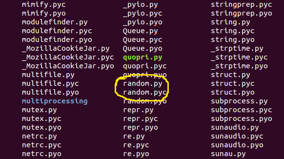
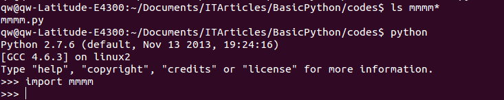

#Import 模块

##认识模块

对于模块，在前面的一些举例中，已经涉及到了，比如曾经有过：import random (获取随机数模块)。为了能够对模块有一个清晰的了解，首先要看看什么模块，这里选取[官方文档中](https://docs.python.org/2/tutorial/modules.html)对它的定义：

>A module is a file containing Python definitions and statements. The file name is the module name with the suffix .py appended. Within a module, the module’s name (as a string) is available as the value of the global variable __name__. 

都是洋码子，翻译一下不？不！还是只说要点：

- 模块就是一个含有python语句的文件
- 模块名就是文件名（不要扩展名.py）

那么，那个import random的文件在哪里呢？

用曾经讲过的那个法宝：help()函数看看：

    >>> help(random)

然后就出现：

    NAME
        random - Random variable generators.

    FILE
        /usr/local/lib/python2.7/random.py

    MODULE DOCS
        http://docs.python.org/library/random

    DESCRIPTION
        ...

这里非常明显的告诉我们，random模块的文件就是： /usr/local/lib/python2.7/random.py（注意：这个地址是我的计算机中的地址，可能跟看官的不一样，特别是如果看官用的是windows，肯定跟我这个不一样了。）

看官这时候可能有疑问了，import是怎么找到那个文件的？类似文件怎么写？不用着急，这些我都会一一道来。

##标准库

看了前面的random这个例子，看官可能立刻想到一个问题：是不是已经有人把很多常用的功能都写成模块了？然后使用者只需要用类似方法调用即可。的确是，比如上面显示的，就不是某个程序员在使用的时候自己编写的，而是在安装python的时候，就被安装在了计算机里面。观察那个文件存储地址，就知道了。

我根据上面得到的地址，列出/usr/local/lib/python2.7/里面的文件，这些文件就是类似random的模块，由于是python安装就有的，算是标配吧，给它们一个名字“标准模块库”，简称“标准库”。

这张图列出了很少一部分存在这个目录中的模块文件。

Python的标准库(standard library)是Python的一个组成部分，也是Python为的利器，可以让编程事半功倍。

如果看官有时间，请经常访问：[https://docs.python.org/2/library/](https://docs.python.org/2/library)，这里列出了所有标准库的使用方法。

有一点，请看官特别注意，对于标准库而言，由于内容太多，恐怕是记不住的。也不用可以的去记忆，只需要知道有这么一个东西。如果在编写程序的时候，一定要想到，对于某个东西，是不是会有标准库支持呢？然后就到google或者上面给出的地址上搜索。

举例：

    >>> import sys  #导入了标准库sys
    >>> dir(sys)    #如果不到网页上看，用这种方法可以查看这个标准库提供的各种方法（函数）
    ['__displayhook__', '__doc__', '__egginsert', '__excepthook__', '__name__', '__package__', '__plen', '__stderr__', '__stdin__', '__stdout__', '_clear_type_cache', '_current_frames', '_getframe', '_mercurial', 'api_version', 'argv', 'builtin_module_names', 'byteorder', 'call_tracing', 'callstats', 'copyright', 'displayhook', 'dont_write_bytecode', 'exc_clear', 'exc_info', 'exc_type', 'excepthook', 'exec_prefix', 'executable', 'exit', 'flags', 'float_info', 'float_repr_style', 'getcheckinterval', 'getdefaultencoding', 'getdlopenflags', 'getfilesystemencoding', 'getprofile', 'getrecursionlimit', 'getrefcount', 'getsizeof', 'gettrace', 'hexversion', 'last_traceback', 'last_type', 'last_value', 'long_info', 'maxint', 'maxsize', 'maxunicode', 'meta_path', 'modules', 'path', 'path_hooks', 'path_importer_cache', 'platform', 'prefix', 'ps1', 'ps2', 'py3kwarning', 'setcheckinterval', 'setdlopenflags', 'setprofile', 'setrecursionlimit', 'settrace', 'stderr', 'stdin', 'stdout', 'subversion', 'version', 'version_info', 'warnoptions']
    >>> sys.platform    #比如这个
    'linux2'
    >>> sys.version     #还有这个
    '2.7.6 (default, Nov 13 2013, 19:24:16) \n[GCC 4.6.3]'

    >>> help(sys.stdin)     #这是查看某个模块方法具体内容的方式

标准库，在编程中经常用到。这里不赘述。只要看官能够知道在哪里找、如何找所需要的标准库即可。

##自己编写模块

看官可能比较喜欢“自己动手，丰衣足食”（虽然真的不一定是丰衣足食），在某些必要的时候，还真得自己动手写一些模块。那么怎么编写模块呢？

前面已经交代，模块就是.py文件，所以，只要将某些语句写到一个.py文件中，它就是一个模块了。没有什么太多的秘密。

在某个目录下面建立了一个文件，名称是:mmmm.py，如下图所示，然后编辑这个文件内容。编辑好后保存。

代码是文件内容：

    #!/usr/bin/env python
    #coding:utf-8

    web = "https://qiwsir.github.io"

    def my_name(name):
        print name

    class pythoner:
        def __init__(self,lang):
            self.lang = lang
        def programmer(self):
            print "python programmer language is: ",self.lang
    
图示是文件所在目录，并且在该目录下打开了python的交互模式（我这是在ubuntu下，看官是别的操作系统的化，注意路径，如果遇到问题，可以暂时搁置，看下文）。

从图中可以看出，当前目录中有这个文件：mmmm.py

在交互模式下，仿照对标准库模块的操作方式：
    
    >>> import mmmm
    >>> dir(mmmm)
    ['__builtins__', '__doc__', '__file__', '__name__', '__package__', 'my_name', 'pythoner', 'web']
    >>> mmmm.__doc__    #这个是空的，正是，因为我未曾写过任何文档说明
    >>> mmmm.__name__   #名字
    'mmmm'
    >>> mmmm.__file__   #文件
    'mmmm.py'

再看后面的：my_name,pythoner,web，都是我在内容中自己写的。

    >>> mmmm.web
    'https://qiwsir.github.io'

web是模块mmmm中的一个通过赋值语句建立的变量，在这里，它编程了mmmm的属性，能够通过点号运算访问，其实不仅仅是这类型的赋值，其它通过def，class等，都能做为mmmm模块的属性。

    >>> mmmm.my_name
    <function my_name at 0xb74ceb54>
    >>> mmmm.pythoner
    <class mmmm.pythoner at 0xb73e6bcc>

当然，跟操作标准库一样，一样能够使用help()来看看这些属性的具体内容：

    >>> help(mmmm.my_name)

    Help on function my_name in module mmmm:

    my_name(name)

    >>> help(mmmm.pythoner)

    Help on class pythoner in module mmmm:

    class pythoner
     |  Methods defined here:
     |  
     |  __init__(self, lang)
     |  
     |  programmer(self)

怎么调用呢？这样即可：

    >>> mmmm.my_name("qiwsir")
    qiwsir

当调用模块中的函数的时候，用模块的名称（import mmmm）+点号+函数（注意，函数后面要有括号，如果有参数，括号里面跟参数），即 module_name.funciton(*args)

    >>> py = mmmm.pythoner("c++")   
    >>> py.programmer()
    python programmer language is:  c++

上面两行，则是演示用绑定的方法调用模块中的类以及类的实例方法。跟以往的相比较，似乎都是在前面多了一个mmmm.

如果感觉这个mmmm比较麻烦，可以用from，具体是这样的：

    >>> from mmmm import *
    >>> my_name('qiwsir')
    qiwsir
    >>> web
    'https://qiwsir.github.io'
    >>> py = pythoner("c++")
    >>> py.programmer()
    python programmer language is:  c++

这次不用总写那么mmmm了。两种方式，哪个更好呢？没有定论。看官在以后的实践中体会，什么时候用什么方式。

上面用from mmmm import *，其中*符号，表示将所有的都import进来，用这个方法，也可以只import一部分，如同：

    >>> from mmmm import my_name    #如果看官前面运行了上述操作，需要关闭交互模式，
                                    #再重启，才能看到下面过程
    >>> my_name("qiwsir")
    qiwsir
    >>> web                         #没有import这个，所以报错。
    Traceback (most recent call last):
      File "<stdin>", line 1, in <module>
    NameError: name 'web' is not defined

这就是基本的import模块方法。看官的疑问，还要存着。且听下回分解。
