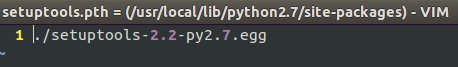
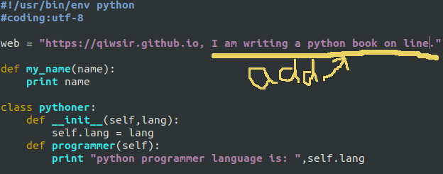

#模块的加载

不管是用import还是用from mmmm import *的方式导入模块，当程序运行之后，回头在看那个存储着mmmm.py文件的目录中（关于[mmmm.py文件可以看上一讲](./223.md)），多了一个文件:

    qw@qw-Latitude-E4300:~/Documents/ITArticles/BasicPython/codes$ ls mmm*
    mmmm.py  mmmm.pyc

在这个目录下面，除了原来的那个mmmm.py之外，又多了一个mmmm.pyc文件，这个文件不是我写的，是哪里来的呢？

要破开此迷，需要用import的过程说起。

##import的工作流程

import mmmm，并不是仅仅将mmmm.py这个文件装载到当前位置（文件内），其实是首先进行了一次运算。当mmmm.py被第一次导入的时候，python首先要对其进行编译，生成扩展名为.pyc的同名文件，然后才执行mmmm模块的代码，创建相应的对象等。就如同把大象装进冰箱，有三步要执行：

1. **搜索**。就是python要能够找到import的模块。怎么找到，后面讲述。
2. **编译**。找到模块文件之后，将其编译成字节码，就是那个.pyc文件里面的（关于字节码，下面会介绍，请继续阅读）。注意，不是什么时候都编译的，只有第一次运行时候才编译，如果mmmm.py文件改变了，相当于又一个新文件，也会从新编译。其实就是.pyc文件中有一个时间戳，python会自动检查这个时间戳，如果它比同名的.py文件时间戳旧，就会从新编译。否则跳过。当然，如果根本就没有找到同名的.py源文件，只有字节码文件.pyc，那么就只能运行这个了。
3. **运行**。这就没什么好说的了，生米已经淘干净了，并且放到锅里，开始加热了，最后就只能熟饭了。执行就是前面已经编译的模块字节码文件，顺理成章要执行了。

##搜索模块

一般情况下，python会自动的完成模块搜索过程。但是，在某些情况下，或许会要求程序员来设定搜索路径。当import一个模块后，python会按照下面的顺序来找那个将要导入的模块文件

1. 程序的主目录。上一讲中，在codes这个目录中运行交互模式，这时候的主目录就是codes，当在那个交互模式中运行import mmmm的时候，就首先在codes这个目录中搜索相应的文件（找到.py之后编译成为.pyc）。当然，后面在网页编程中，看官会看到，所谓主目录是可以通过顶层文件设置的目录。
2. PYTHONPATH目录。这是一个环境变量设置，如果没有设置则滤去。如何进行环境变量设置，请看官google啦。
3. 标准库目录。已经随着Python的安装进入到计算机中的那个。
4. 任何.pth文件的内容。如果有这类文件，最后要在这类文件中搜索一下。这是一个简单的方法，在.pth文件中，加入有效目录，使之成为搜索路径。下图就是我的计算机上，存放.pth文件的位置以及里面放着的.pth文件

看官也可以自己编写.pth文件，里面是有关搜索目录，保存到这里。比如，打开目录中的easy-install.pth文件，发现的内容：

搜索就是这么一个过程。这里建议看官了解即可，不一定非要进行什么设置，在很多情况下，python都是会自动完成的。特别是初学者，暂且不要轻举妄动。

##重载模块

以mmmm模块为例（在这里要特别提醒看官：我这样命名是相当不好滴，只不过是为了恶搞才这样命名的）。

在一个shell里面，运行了python，并且做了如下操作：

    >>> import mmmm
    >>> mmmm.web
    'https://qiwsir.github.io'

下面我再打开一个shell，编辑mmmm.py这个文件，进行适当修改：

保存之后，切换到原来的那个导入了模块的交互模式:

    >>> mmmm.web
    'https://qiwsir.github.io'
    
输出的跟前面的一样，没有任何变化，这是为什么呢？

原来，当导入模块的时候，只会在第一次导入时加载和执行模块代码，之后就不会重新加载或重新执行了，如果模块代码修改了，但是这里执行的还是修改之前的。

怎么实现代码修改之后，执行新的呢？一种方式就是退出原来的交互模式，再重新进入，再import mmmm。呵呵，这种方法有点麻烦。Python提供了另外一个函数——reload函数，能够实现模块的重新加载（简称重载），重载后模块代码重新执行。如下继续：

    >>> reload(mmmm)
    <module 'mmmm' from 'mmmm.py'>
    >>> mmmm.web
    'https://qiwsir.github.io, I am writing a python book on line.'

这下就显示修改之后的内容了。

特别提醒注意：

- reload是内置函数
- reload(module),module是一个已经存在的模块，不是变量名。
