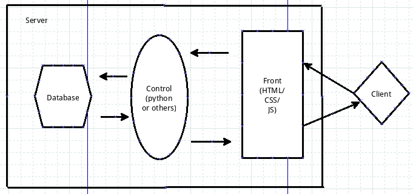

#网站的结构

很早很早的时候，computer这个东西习惯于被称之为计算机，因为它的主要功能是完成一些科学计算的东西，我记得自己鼓捣它的时候，就是计算，根本就没有想到它有早一日还可以用来做别的。后来另外一个名字“电脑”逐渐被人们接收了，特别是网络发展起来之后，computer这个东西，如果要不上网，简直就不知道干什么。而且，现在似乎还有一个趋势，越来越强化网络的作用，而本机的功能虽然硬件在提升，可以做的事情感觉不多了。

不管怎么，网络是离不开了。上网，连上网之后干什么呢？就是要登录某某网站。不是联网之后自动的网上内容就涌进自己的计算机，而是要操作一下那个浏览器，输入网址，打开某个网站的页面，才能得到我们要看的内容。所以，网络上，必须有网站，才能让别人来看。上网——看网页，这是发生频率非常高的动作。

那么这里就涉及到网站。网站是谁做的呢？这是废话，人做的。只不过这里的人可能是给某个公司打工的，也可能是类似个体户的。

网站怎么做呢？做法很多啦。有直接用html网页写的，有用别的什么开源系统做的，等等。

从本讲开始，我和列位看官就来看看，用python怎么做一个网站。

[维基百科对网站有如下描述：](http://zh.wikipedia.org/wiki/%E7%B6%B2%E7%AB%99)

>网站（英文：Website）是指在互联网上，根据一定的规则，使用HTML等工具制作的用于展示特定内容的相关网页的集合。简单地说，网站是一种通信工具，就像布告栏一样，人们可以通过网站来发布自己想要公开的信息，或者利用网站来提供相关的网络服务。人们可以通过网页浏览器来访问网站，获取自己需要的信息或者享受网络服务。世界上第一个网站由蒂姆·伯纳斯-李创建于1991年8月6日。

##网站组成

网站是由两大部分组成，一是服务器，二是程序。

服务器，是硬件部分。如果看官有条件，可以自己购买服务器，然后自己建立机房或者托管到什么信的机房等等，这样拥有了自己的服务器啦。当然，要不少银两的。如果银两不足，就可以用省钱的方法，购买某公司所提供的服务器空间，因为市场经济带来的好处，总有人会想到不是人人都自己买得起服务器的，也不是人人都有必要自己买服务器的。但是，如果还要做网站，自己又不拥有服务器怎么办？所以，有人就做这个生意，出租他自己的服务器的一部分空间给我们这些穷人，这样就双赢了，穷人只要有技术，就可以很低的代价在网上拥有自己的网站，富人（出租服务器的）也能够通过出租收租金啦。就好比租房子的人和房东的关系一样。当然，这样做的结果就是必须要跟别人共同租用一个服务器，如果自己单独租一个，价格就又贵了。

如果，我是说如果，如果你做的网站不打算放到网上让别人随时看（有这样的吗？那不是白做了吗？有！而且很多，比如我的网站还没有做好，我就不让别人看），这时候还可以将自己的电脑当做一个服务器，在自己的电脑上发布自己的网站，自我欣赏，必要时把把旁边人拉到显示器前面看看吧。很自恋啦。（在自己的电脑发布的网站，其实也能够通过互联网被人看到，就是需要一点小小的技术来发布了，这个不是重点，本教程不讲，需要者可以google或者联系我。）

看官和我在后续的学习中，用的服务器就是自己的电脑啦。我们都是喜欢自恋的。

另外一部分就是服务器里面装的软件部分，通常所说的网站，更多的是指这个部分。一般来讲，这个部分是比较复杂的，因为网站不同，而有很多不同的程序。但是，不管什么网站，都得有一个让别人看的界面，这就是一个网页，或者说，只要有一个网页了，它就可以做为一个网站发布出去。

那么就出现了一种比较简单的网站，就是由一些网页组成，而且，这些网页仅仅是用html代码写成的（或者用html网页编辑工具，有图文形式的，就可以编辑网页），回想我最早做的那个网页，就是纯粹用html代码写的。这样写出来的网页，用行话说是“静态的”。意思就是指它不允许用户和网站有什么交互，只是让别人看。比如看客手欠，非要搜索什么东西，对不起，网站不提供此功能。这种网站现在比较少了。

如果要增加交互功能，怎么办？那就要有处理用户向网站提交的信息的程序了。这样，网站就多了一部分，行话常说是“后端”，对应前面说的那个直接展示给看客的叫做“前端”。“后端”所做的事情就是处理“前端”用户提交的信息，然后给用户一个反馈。这样就交互起来了。

此外，为了将网站上的数据保存起来，通常会用到一个叫做“数据库”的东西（这个不是必须的，有的网站就没有数据库，有的网站用别的方式存储数据，比如文本等），数据库主要是存储某些数据，让网站的后端和前端从这里将某些数据读出来，显示给看官，或者将看官提交的某些数据存进去，以便以后使用。

数据库是计算机行业中的一个专业门来，看官有兴趣，可以在这个行业中深入，公司里面有个职位：DBA，就是干这个的。

>数据库，简单来说是本身可视为电子化的文件柜——存储电子文件的处所，使用者可以对文件中的数据运行新增、截取、更新、删除等操作。

>数据库管理员 (英语：Database administrator，简称DBA)，是负责管理数据库的人。数据库管理员负责在系统上运行数据库，执行备份，执行安全策略和保持数据库的完整性。因为管理数据库是个很庞大的职务，每个公司或组织的数据库管理员的需要也是很不同。一个大公司可能有很多数据库管理员，但是一个小公司可能也没有数据库管理员，而让系统管理员管理数据库。

综合以下，一般来讲，网站应该是这样的：

为了写一个漂亮的前端，一般都要用CSS和JavaScript，但是，本教程中，因为不是专门讲授这些，所以，涉及到前端的时候，就不用CSS和JavaScript了，这样的一个恶果就是界面相当丑陋。请看官忍受吧。

在控制端，就是前面说的后端，仅适用一种语言：Python。这是本教程的终极目的，如何用Python做网站。

数据库，我选用MySQL，关于这个数据库有很多传说。例如[维基百科上这么说：](http://zh.wikipedia.org/wiki/MySQL)

>MySQL（官方发音为英语发音：/maɪ ˌɛskjuːˈɛl/ "My S-Q-L",[1]，但也经常读作英语发音：/maɪ ˈsiːkwəl/ "My Sequel"）原本是一个开放源代码的关系数据库管理系统，原开发者为瑞典的MySQL AB公司，该公司于2008年被升阳微系统（Sun Microsystems）收购。2009年，甲骨文公司（Oracle）收购升阳微系统公司，MySQL成为Oracle旗下产品。

>MySQL在过去由于性能高、成本低、可靠性好，已经成为最流行的开源数据库，因此被广泛地应用在Internet上的中小型网站中。随着MySQL的不断成熟，它也逐渐用于更多大规模网站和应用，比如维基百科、Google和Facebook等网站。非常流行的开源软件组合LAMP中的“M”指的就是MySQL。

>但被甲骨文公司收购后，Oracle大幅调涨MySQL商业版的售价，且甲骨文公司不再支持另一个自由软件项目OpenSolaris的发展，因此导致自由软件社区们对于Oracle是否还会持续支持MySQL社区版（MySQL之中唯一的免费版本）有所隐忧，因此原先一些使用MySQL的开源软件逐渐转向其它的数据库。例如维基百科已于2013年正式宣布将从MySQL迁移到MariaDB数据库。

不管怎么着，MySQL依然是一个不错的数据库选择，足够支持看官完成一个相当不小的网站。

至于服务器空间，就放在自己的电脑上吧。

##从数据库开始

数据库是我们要做的网站的一个基础，我在这里不演示不用数据库的情况，因为那种玩具网站，虽然讲授简单，但是看官总是有点晕乎，距离真实的环境差距太大了，既然学，就学点真的。

从现在开始，就进入网站建设的进程。

###安装MySQL

你的电脑不会天生就有MySQL，它本质上也是一个程序，需要安装到电脑中。

如果看官跟我一样，用的是ubuntu操作系统，可以用下面的方法（我相信，用ubuntu的一定很少，不过，如果看官要成为一个优秀的程序员，我还是推荐使用这个操作系统，或者别的LINUX发行版。哈哈）。

第一步，在shell端运行如下命令：

    sudo apt-get install mysql-server

这样，看官的电脑上就已经安装好了这个数据库。当然，当然，还要进行配置。

第二步，配置MySQL

安装之后，运行：

    service mysqld start
    
启动mysql数据库。然后进行下面的操作，对其进行配置。（启动数据库这步是后来补充的，网友[王孝先](http://weibo.com/274644556?from=feed&loc=nickname)告诉我，这个不能丢掉。谢谢王先生。）

默认的MySQL安装之后根用户是没有密码的，看官注意，这里有一个名词“根用户”，其用户名是：root。运行：

    $mysql -u root

在这里之所以用-u root是因为我现在是一般用户（firehare），如果不加-u root的话，mysql会以为是firehare在登录。注意，我在这里没有进入根用户模式，因为没必要。一般来说，对mysql中的数据库进行操作，根本没必要进入根用户模式，只有在设置时才有这种可能。

进入mysql之后，会看到>符号开头，这就是mysql的命令操作界面了。

下面设置Mysql中的root用户密码了，否则，Mysql服务无安全可言了。

    mysql> GRANT ALL PRIVILEGES ON *.* TO root@localhost IDENTIFIED BY "123456";

注意，我这儿用的是123456做为root用户的密码，但是该密码是不安全的，请大家最好使用大小写字母与数字混合的密码，且不少于8位。

以后如果在登录数据库，就可以用刚才设置的密码了。

除了上面的安装过程，看官如果用的是别的操作系统，可以在google上搜索相应的安装方法，恕我不在这里演示，因为我只能演示在ubuntu上的安装流程。不过，google会帮你解决安装遇到的问题。

###运行mysql

安装之后，就要运行它，并操作这个数据库，建立一个做网站的基础。我这样来运行数据库：

    qw@qw-Latitude-E4300:~$ mysql -u root -p
    Enter password: 
    
输入数据库的密码，之后出现：

    Welcome to the MySQL monitor.  Commands end with ; or \g.
    Your MySQL connection id is 373
    Server version: 5.5.38-0ubuntu0.14.04.1 (Ubuntu)

    Copyright (c) 2000, 2014, Oracle and/or its affiliates. All rights reserved.

    Oracle is a registered trademark of Oracle Corporation and/or its
    affiliates. Other names may be trademarks of their respective
    owners.

    Type 'help;' or '\h' for help. Type '\c' to clear the current input statement.

    mysql> 

看到这个界面内容，就说明你已经进入到数据里面了。接下来就可以对这个数据进行操作。例如：

    mysql> show databases;
    +--------------------+
    | Database           |
    +--------------------+
    | information_schema |
    | carstore           |
    | cutvideo           |
    | itdiffer           |
    | mysql              |
    | performance_schema |
    | phpcms             |
    | phpcms2            |
    | pushsystem         |
    | sipras             |
    | test               |
    +--------------------+

用这个命令，就列出了当前mysql已经有的数据库。

除了这种用命令行形式对数据库进行操作之外，还有不少可视化方式操作数据库的工具。这里也不作介绍，有兴趣的请google。不过，我喜欢命令行。

