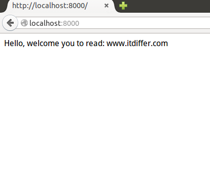
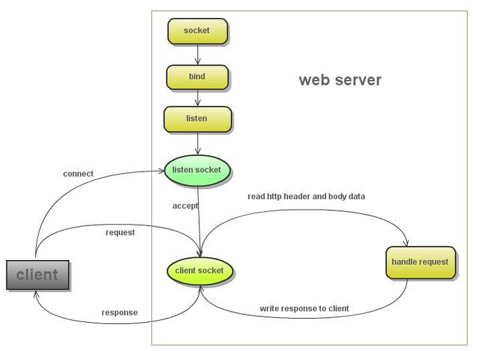

>As he walked by the sea of Galilee, he saw two brothers, Simon, who is called Peter, and Andrew his brother, casting a net into the sea--for they were fishermen. And he said to them,"Follow me, and I will make you fish for people." Immediately they left their nets and followed him.(MATTHEW 5:18-20)

#Hello,第一个网页分析

打开文本编辑器。这里要说一下啦，理论上讲，所有的文本编辑器都可以做为编写程序的工具。前面已经提到的那个python IDE，是一个很好的工具，再有别的也行，比如我就用vim（好像我的计算机只能用vim了，上次运行Libre Office都很慢，敲一个键之后喝口水，才看到那个字母出来，等有人资助我了，也搞一个苹果的什么机器玩玩。）。用什么编辑工具，全是自己的喜欢罢了，不用争论那个好，这个差，只要自己顺手即可。

把下面的代码原封不动地复制过去，并且保存为文件名是hello.py的文件，存到那个目录中，自己选好了。

	#!/usr/bin/env python
	#coding:utf-8
	
	import tornado.httpserver
	import tornado.ioloop
	import tornado.options
	import tornado.web
	
	from tornado.options import define, options
	define("port", default=8000, help="run on the given port", type=int)
	
	class IndexHandler(tornado.web.RequestHandler):
	    def get(self):
	        greeting = self.get_argument('greeting', 'Hello')
	        self.write(greeting + ', welcome you to read: www.itdiffer.com')
	
	if __name__ == "__main__":
	    tornado.options.parse_command_line()
	    app = tornado.web.Application(handlers=[(r"/", IndexHandler)])
	    http_server = tornado.httpserver.HTTPServer(app)
	    http_server.listen(options.port)
	    tornado.ioloop.IOLoop.instance().start()

进入到保存hello.py文件的目录，在shell或者命令输入框（windows可以用cmd）中，输入：

    qw@qw-Latitude-E4300:~/codes$ python hello.py

用python运行这个文件，其实就已经发布了一个网站，只不过这个网站太简单了。

接下来，打开浏览器，在浏览器中输入：http://localhost:8000，得到如下界面：

当然，如果还可以在shell中用下面方式运行：

    qw@qw-Latitude-E4300:~$ curl http://localhost:8000/
    Hello, welcome you to read: www.itdiffer.com 
    
    qw@qw-Latitude-E4300:~$ curl http://localhost:8000/?greeting=Qiwsir
    Qiwsir, welcome you to read: www.itdiffer.com 

如果你的所有操作都正确，一定能够看到上面的结果。

恭喜你，迈出了决定性一步，已经可以用Tornado发布网站了。在这里似乎没有做什么部署，只是安装了Tornado。是的，不需要如同部署Nginx或者Apache那样，做各种设置了，因为Tornado就是一个很好的server，也是一个开发框架。

上面代码虽然跑起来了，但是每行都什么意思呢？下面就逐行解释，也就理解了Tornado这个框架的基本结构和用法。

##WEB服务器工作流程

任何一个网站都离不开Web服务器，这里所说的不是指那个更计算机一样的硬件设备，是指里面安装的软件，有时候初次接触的看官容易搞混。就来伟大的[维基百科都这么说](http://zh.wikipedia.org/wiki/%E6%9C%8D%E5%8A%A1%E5%99%A8)：

>有时，这两种定义会引起混淆，如Web服务器。它可能是指用于网站的计算机，也可能是指像Apache这样的软件，运行在这样的计算机上以管理网页组件和回应网页浏览器的请求。

在具体的语境中，看官要注意分析，到底指的是什么。

关于Web服务器比较好的解释，推荐看看百度百科的内容，我这里就不复制粘贴了，具体可以点击连接查阅：[WEB服务器](http://baike.baidu.com/view/460250.htm)

在WEB上，用的最多的就是输入网址，访问某个网站。全世界那么多网站网页，如果去访问他们，怎么能够做到彼此互通互联呢。为了协调彼此，就制定了很多通用的协议，其中http协议，就是网络协议中的一种。关于这个协议的介绍，网上随处就能找到，请看官自己google.

网上偷来的[一张图](http://kenby.iteye.com/blog/1159621)（从哪里偷来的，我都告诉你了，多实在呀。哈哈。），显示在下面，简要说明web服务器的工作过程

偷个彻底，把原文中的说明也贴上：

1. 创建listen socket, 在指定的监听端口, 等待客户端请求的到来
2. listen socket接受客户端的请求, 得到client socket, 接下来通过client socket与客户端通信
3. 处理客户端的请求, 首先从client socket读取http请求的协议头, 如果是post协议, 还可能要读取客户端上传的数据, 然后处理请求, 准备好客户端需要的数据, 通过client socket写给客户端

剽窃就此结束，下面就自己写了。

##引入模块

	import tornado.httpserver
	import tornado.ioloop
	import tornado.options
	import tornado.web

这四个都是Tornado的模块，在本例中都是必须的。它们四个在一般的网站开发中，都要用到，基本作用分别是：

- tornado.httpserver：这个模块就是用来解决web服务器的http协议问题，它提供了不少属性方法，实现客户端和服务器端的互通。Tornado的非阻塞、单线程的特点在这个模块中体现。
- tornado.ioloop：这个也非常重要，能够实现非阻塞socket循环，不能互通一次就结束呀。
- tornado.options：这是命令行解析模块，也常用到。
- tornado.web：这是必不可少的模块，它提供了一个简单的Web框架与异步功能，从而使其扩展到大量打开的连接，使其成为理想的长轮询。

还有一个模块引入，是用from...import完成的

	from tornado.options import define, options
	define("port", default=8000, help="run on the given port", type=int)

这两句就显示了所谓“命令行解析模块”的用途了。在这里通过`tornado.options.define()`定义了访问本服务器的端口，就是当在浏览器地址栏中输入`http:localhost:8000`的时候，才能访问本网站，因为http协议默认的端口是80，为了区分，我在这里设置为8000,为什么要区分呢？因为我的计算机或许你的也是，已经部署了别的注入Nginx服务器了，它的端口是80,所以要区分开，并且，后面我们还会将tornado和Nginx联合起来工作，这样两个服务器在同一台计算机上，就要分开喽。

##定义请求-处理程序类

	class IndexHandler(tornado.web.RequestHandler):
	    def get(self):
	        greeting = self.get_argument('greeting', 'Hello')
	        self.write(greeting + ', welcome you to read: www.itdiffer.com')

所谓“请求处理”程序类，就是要定义一个类，专门应付客户端向服务器提出请求（这个请求也许是要读取某个网页，也许是要将某些信息存到服务器上），服务器要有相应的程序来接收并处理这个请求，并且反馈某些信息（或者是针对请求反馈所要的信息，或者返回其它的错误信息等）。

于是，就定义了一个类，名字是IndexHandler，当然，名字可以随便取了，但是，按照习惯，类的名字中的单词首字母都是大写的，并且如果这个类是请求处理程序类，那么就最好用Handler结尾，这样在名称上很明确，是干什么的。

类IndexHandler的参数是`tornado.web.RequestHandler`,这个参数很重要，是专门用于完成请求处理程序的，通过它定义`get()`和`post()`两个在web中应用最多的方法的内容（关于这两个方法的详细解释，可以参考：[HTTP GET POST的本质区别详解](https://github.com/qiwsir/ITArticles/blob/master/Tornado/DifferenceHttpGetPost.md)，作者在这篇文章中，阐述了两个方法的本质）。

在本例中，只定义了一个`get()`方法。请看官注意，类中的方法可以没有别的参数，但是必须有`self`这个参数，关于这点请参与前面几篇关于类的讲授内容（返回[首页](https://github.com/qiwsir/ITArticles/blob/master/BasicPython/index.md)找相关文章）。

在`greeting = self.get_argument('greeting', 'Hello')`这句中，当实例化之后，`self`对应的就是`tornado.web.RequestHandler`，而`get_argument`则是`tornado.web.RequestHandler`的一个方法。官方文档对这个方法的描述如下：

>RequestHandler.get_argument(name, default=, []strip=True)

>>Returns the value of the argument with the given name.

>>If default is not provided, the argument is considered to be required, and we raise a MissingArgumentError if it is missing.

>>If the argument appears in the url more than once, we return the last value.

>>The returned value is always unicode.

这段描述已经很清晰了，此外，看完这段说明，看官是否明白我在前面运行的：

    qw@qw-Latitude-E4300:~$ curl http://localhost:8000/?greeting=Qiwsir
    Qiwsir, welcome you to read: www.itdiffer.com 
    
为什么通过`http://localhost:8000/?greeting=Qiwsir`，就可以实现对greeting的赋值。

接下来的那句`self.write(greeting + ',weblcome you to read: www.itdiffer.com)'`中，write也是`tornado.web.RequestHandler`的一个方法，这发方法主要功能是向客户端反馈参数中的信息。也浏览一下官方文档信息，对以后正确理解使用有帮助：

>RequestHandler.write(chunk)[source]

>>Writes the given chunk to the output buffer.

>>To write the output to the network, use the flush() method below.

>>If the given chunk is a dictionary, we write it as JSON and set the Content-Type of the response to be application/json. (if you want to send JSON as a different Content-Type, call set_header after calling write()).

##main()方法

`if __name__ == "__main__"`,从这句话开始执行编写的程序，前面相当于预备工作吧。这个方法跟以往执行python程序是一样的。

`tornado.options.parse_command_line()`,这是在执行tornado的解析命令行。在tornado的程序中，只要import模块之后，就会在运行的时候自动加载，不需要了解细节，但是，在main（）方法中如果有命令行解析，必须要提前将模块引入。

##Application类

下面这句是重点：

    app = tornado.web.Application(handlers=[(r"/", IndexHandler)])
    
将tornado.web.Application实例化。这个实例化，本质上是建立了整个网站程序的请求处理集合，然后它可以被HTTPServer做为参数调用，实现http协议服务器访问。Application类的`__init__`方法参数形式：

    def __init__(self, handlers=None, default_host="", transforms=None,**settings):
        pass

在一般情况下，handlers是不能为空的，因为Application类通过这个参数的值处理所得到的请求。例如在本例中，`handlers=[(r"/", IndexHandler)]`，就意味着如果通过浏览器的地址栏输入根路径（`http://localhost:8000`就是根路径，如果是`http://localhost:8000/qiwsir`，就不属于根，而是一个子路径或目录了），对应这就是让名字为IndexHandler类处理这个请求。

通过handlers传入的数值格式，一定要注意，在后面做复杂结构的网站是，这里就显得重要了。它一个list，list里面的参数是列表，列表的组成包括两部分，一部分是请求路径，另外一部分是处理程序的类名称。注意请求路径可以用正则表达式书写。举例说明：

    handlers = [
        (r"/", IndexHandlers),              #来自根路径的请求用IndesHandlers处理
        (r"/qiwsir/(.*)", QiwsirHandlers),  #来自/qiwsir/以及其下任何请求（正则表达式表示任何字符）都由QiwsirHandlers处理
    ]

**注意**

在这里我使用了`r"/"`的样式，意味着就不需要使用转义符，r后面的都表示该符号本来的含义。例如，\n，如果单纯这么来使用，就以为着换行，因为符号“\”具有转义功能（关于转义详细阅读[《玩转字符串(1)》](https://github.com/qiwsir/ITArticles/blob/master/BasicPython/107.md)），当写成`r"\n"`的形式是，就不再表示换行了，而是两个字符，\和n，不会转意。一般情况下，由于正则表达式和 \ 会有冲突，因此，当一个字符串使用了正则表达式后，最好在前面加上'r'。（关于正则表达式，看官姑且网上搜索，在后面的课程中，我也会介绍）

关于Application类的介绍，告一段落，但是并未完全讲述了，因为还有别的参数设置没有讲，看官有兴趣可以阅读官方的文档资料，地址是：http://tornado.readthedocs.org/en/latest/_modules/tornado/web.html#Application

##HTTPServer类

实例化之后，Application对象（用app做为标签的）就可以被另外一个类HTTPServer引用，形式为：

    http_server = tornado.httpserver.HTTPServer(app)

HTTPServer是tornado.httpserver里面定义的类。HTTPServer是一个单线程非阻塞HTTP服务器，执行HTTPServer一般要回调Application对象，并提供发送响应的接口,也就是下面的内容是跟随上面语句的（options.port的值在IndexHandler类前面通过from...import..设置的）。

    http_server.listen(options.port)

这种方法，就建立了单进程的http服务。

请看官牢记，如果在以后编码中，遇到需要多进程，请参考官方文档说明：http://tornado.readthedocs.org/en/latest/httpserver.html#http-server

##IOLoop类

剩下最后一句了：

    tornado.ioloop.IOLoop.instance().start()

这句话，总是在`__main()__`的最后一句。表示可以接收来自HTTP的请求了。

以上把一个简单的hello.py剖析。想必读者对Tornado编写网站的基本概念已经有了。

[首页](https://github.com/qiwsir/ITArticles/blob/master/BasicPython/index.md)&nbsp;&nbsp;&nbsp;|&nbsp;&nbsp;&nbsp;[上一讲：PYthon框架](https://github.com/qiwsir/ITArticles/blob/master/BasicPython/306.md)
