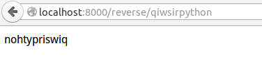

>"Do not store up for yourselves treasures on earth, where moth and rust consume and where thieves break in and steal; but store up for yourselves treasures in heaven, where neither moth and rust consumes and where thieves do not break in and steal. For where your treasure is, there your heart will be also." (MATTHEW6:19-21)

#探析get和post方法

在开发网站的过程中，post和get是常见常用的两个方法，关于这两个方法的详细解释，请列为阅读这篇文章：[《HTTP POST GET 本质区别详解》](https://github.com/qiwsir/ITArticles/blob/master/Tornado/DifferenceHttpGetPost.md)，这篇文章前面已经推荐阅读了，可以这么说，如果看官没有搞明白get和post，也可以写出web程序，但是，只要遇到“但是”，就说明另有乾坤，但是如果看官要对这方面有深入理解，并且将来能上一个档次，是必须了解的。这就如同你要练习辟邪剑谱中的剑法，不自宫，也可以练，但是无法突破某个极限，岳不群也不傻，最终他要成为超一流，就不惜按照剑谱中开篇所说“欲练神功，挥刀自宫”，“神功”是需要“自宫”为前提，否则，练出来的不是“神功”，无法问鼎江湖。

特别提醒，看官不要自宫，因为本教程不是辟邪剑谱，也不是葵花宝典，撰写本课程的人更是生理健全者。若看官自宫了，责任自负，与本作者无关。直到目前，科学上尚未有证实或证伪自宫和写程序之间是否存在某种因果关系。所以提醒看官慎重行事。

还是扯回来，看下面的代码先：

	#!/usr/bin/env python
	#coding:utf-8
	
	import textwrap
	
	import tornado.httpserver
	import tornado.ioloop
	import tornado.options
	import tornado.web
	
	from tornado.options import define, options
	define("port", default=8000, help="Please send email to me", type=int)
	
	class ReverseHandler(tornado.web.RequestHandler):
	    def get(self, input_word):
	        self.write(input_word[::-1])
	
	class WrapHandler(tornado.web.RequestHandler):
	    def post(self):
	        text = self.get_argument("text")
	        width = self.get_argument("width", 40)
	        self.write(textwrap.fill(text, width))
	
	if __name__ == "__main__":
	    tornado.options.parse_command_line()
	    app = tornado.web.Application(
	        handlers = [
	            (r"/reverse/(\w+)", ReverseHandler),
	            (r"/wrap", WrapHandler)
	        ]
	    )
	    http_server = tornado.httpserver.HTTPServer(app)
	    http_server.listen(options.port)
	    tornado.ioloop.IOLoop.instance().start()

这段代码跟上一讲的代码相比，基本结构是一样的，但是在程序主体中，这次写了两个类`ReverseHandler`和`WrapHandler`，这两个类中分别有两个方法get()和post()。在`tornado.web.Application()`实例化中，handlers的参数值分别设置了不同路径对应这两个类。

其它方面跟上一讲的代码一样。

把上述代码的文件，存到某个目录下，我给他取名为:request_url.py，名字看官也可以自己定。然后进入该目录，运行：`python request_url.py`，就将这个tornado框架的网站以端口8000发布了。

打开网页，在浏览器中输入：`http://localhost:8000/reverse/qiwsirpython`

界面上输出什么结果？

还可以在命令终端，用下面方式调试，跟在网页上输出是等同效果。

    qw@qw-Latitude-E4300:~$ curl http://localhost:8000/reverse/qiwsirpython
    nohtypriswiq

再看另外一个路径，看官运行的是否是下面的结果呢？

    qw@qw-Latitude-E4300:~$ curl http://localhost:8000/wrap -d text=I+love+Python+programming+and+I+am+writing+python+lessons+on+line
    I love Python programming and I am
    writing python lessons on line

调试通过，就开始分析其中的奥妙。

##get()

在ReverseHandler类中，定义了这个方法。

	class ReverseHandler(tornado.web.RequestHandler):
	    def get(self, input_word):
	        self.write(input_word[::-1])

这个get()方法要和下面Application实例化中的路径：

    (r"/reverse/(\w+)", ReverseHandler),

关联起来看。

首先看路径设置：`r"/reverse/(\w+)"`，这个路径的意思就是可以在浏览器的url中输入：http://localhost:8000/reverse/dddd，这个样子的地址，注意路径中的`(\w+)`，是正则表达式，在reverse/的后面可以输入一个或者多个包括下划线的任何单词字符。也就是dddd可以更换为任何其它字母或者下划线，一个或者多个均可以。

在URL中输入的这个地址，就被ReverseHandler类中的get()方法接收，这就是`(r"/reverse/(\w+)", ReverseHandler)`之含义了。那么，ReverseHandler中的get()方法如何接收url中传递过来的信息呢？

前文已经说过，在`def get(self, input_word)`中，self参数在类实例化后对应的是tornado.web.RequestHandler，另外一个参数input_word用来接收来自url的信息，但是它只接收所设置的路径尾部数据，也就是路径`r"/reverse/(\w+)"`中reverse后面的第一个分割符号“/”之后的内容，都被input_word接收过来，即正则表达式的内容。

input_word接收过来的对象，是什么类型呢？猜测一下，从前面程序的运行结果看，肯定是某种序列类型的对象。具体是哪种呢？可以实验。

将get方法修改为：

    def get(self, input_word):
        input_type = type(input_word)
        self.write("%s"%input_type)

再运行程序，打印出来的是：

    qw@qw-Latitude-E4300:~$ curl http://localhost:8000/reverse/qiwei
    <type 'unicode'>

这说明，get()方法通过URL接收到的数据类型是unicode编码的字符，即字符串。

原来类方法中的`self.write(input_word[::-1])`含义是，将原来的字符串倒置，并返回该数据到客户端（如页面）。

    >>> a = "python,laoqi"
    >>> a[::-1]
    'iqoal,nohtyp'
    >>> b = [1,2,3,4]
    >>> b[::-1]
    [4, 3, 2, 1]
    >>> c = ("a","b","c")
    >>> c[::-1]
    ('c', 'b', 'a')

这是一种将序列类型对象倒置的一种方法。

总结一下：get()通过第二个参数，获得已经设置的显示路径中最后一个/后面的数据，并且为unincode编码的字符。

这种方式通过URL得到有关数据，也就是说在URL中，只需要以`http://localhost/aaa/bbb/ccc`的形式来显示路径即可。看官是否注意到，有的网站是这么显示的：`http://localhost/aaa?name=Tom&&?age=25`，这其实是两种不同的规范也好、方法也罢的东西，前者更接近时下流行的REST规范，可能看官听说过MVC吧，我听不少的公司都强调网站要符合MVC规范，殊不知，更流行的是REST了。那么到底那个好呢？我的观点：It depends.如果有兴趣，请阅读：[《理解本真的REST架构风格》](https://github.com/qiwsir/ITArticles/blob/master/Tornado/understandREST.md)，对REST了解一二。

##post()方法

post()也是web上常用的方法，在本例中，该方法写在了WrapHandler类中：

	class WrapHandler(tornado.web.RequestHandler):
	    def post(self):
	        text = self.get_argument("text")
	        width = self.get_argument("width", 40)
	        self.write(textwrap.fill(text, width))

对应的Application类路径：

    (r"/wrap", WrapHandler)

但是，看官要注意，post()无法从URL中获得数据。这是跟get()方法非常不一样的。关于get和post之间的区别，请看官点击[《HTTP POST GET 本质区别详解》](https://github.com/qiwsir/ITArticles/blob/master/Tornado/DifferenceHttpGetPost.md)阅读。

客户端的数据通过post方法发送到服务器，这个内在过程就是由所谓HTTP协议完成，不用去管它，因为现在我们只是研究应用层，不去深入网络协议的层面。看官可以有这样的以为：怎么传的数据，但是我也可以不讲，就算我也不会吧。不过，如果看官非要了解，请问google大神。

我要解释的是，post()方法怎么接收到客户端传过来的数据。

因为post不能从URL中得到数据，所以就不能用类似的方式在网页的url中输入要传给它的数据了，只能这样来测试：

    qw@qw-Latitude-E4300:~$ curl http://localhost:8000/wrap -d text=I+love+Python+programming+and+I+am+writing+python+lessons+on+line
    I love Python programming and I am
    writing python lessons on line

请看官注意，URL依然是`http://localhost:8000/wrap`，后面的部分`-d text=...`，就是向这个地址对应的类WrapHandler中的post方法传送相应的数据，这个数据被`tornado.web.RequestHandler`中的get_arugment()方法获得，也就是通过`text=self.get_argument("text")`得到传过来的对象，并赋值给text。

这里需要提醒看官注意，`self.get_argument("text")`的参数中，是`"text"`，就意味着，传入数据的时候，需要用text这个变量，即必须写成`text=...`。如果`self.get_argument("word")`，那么就应该是`word=...`方式传入数据了。

看官此时是否已经晓得，get_argument()在post方法中，能够获得客户端传过来的数据，当然是unicode编码的。得到这个数据之后，就可以按照自己的需要进行操作了。

下一句`width = self.get_argumen("width", 40)`是要返回一个对象，这个对象约定变量为40，并将它用在下面的`textwrap.fill(text, width)`中。这里并没有什么特别支出，也可以写成`width = 40`，其实就是给textwrap.fill()提供参数罢了。关于textwrap模块中的fill方法，可以用help命令来看看。

    >>> import textwrap
    >>> help(textwrap.fill)
    
    Help on function fill in module textwrap:

    fill(text, width=70, **kwargs)
        Fill a single paragraph of text, returning a new string.
            
        Reformat the single paragraph in 'text' to fit in lines of no more
        than 'width' columns, and return a new string containing the entire
        wrapped paragraph.  As with wrap(), tabs are expanded and other
        whitespace characters converted to space.  See TextWrapper class for
        available keyword args to customize wrapping behaviour.

##简要总结RequestHandler

RequestHandler就是请求处理程序的方法，从上面的流程中，可以简要地初步地认为（深奥的东西还不少，这里只能是简要地初步地肤浅地，随着学习的深入会一点点深入地）：

- 通过`self.write()`向客户端返回数据
- get()中，以一个参数从URL路径末尾获取数据，特别提醒看官，这是在本讲的例子中，get()方法中，用第二个参数获得url数据。在[上一讲](./307.md)中，同样是get()方法，用到了`greeting = self.get_argument('greeting', 'Hello')`，于是不需要在get()中另外写参数，只需要通过"greeting"就可以得到URL中的数据，不过这时候的url应该写成`http://localhost:8000/?greeting=PYTHON`的样式，于是字符传'PYTHON'就能够让get()中的`self.get_argument('greeting','Hello')`获得，如果没有，就是'Hello'。
- post()中，以`self.argument("text")`的形式得到`text`为标签提交的数据。

get和post是http中用的最多的方法啦。此外，Tornado也还支持其它的HTTP请求，如：PUT、DELETE、HEAD、OPTIONS。在具体编程的时候，如果看官用到，可以搜索，一般用的不多。

最后交代一句，get和post方法，由于一个是通过URL得到数据，另外一个不是，所以，他们可以写到同一个类中，彼此互不干扰。

还要说明，我在这部分参考了一本书的讲授内容，特别是其中的代码例子，这本书就是[《Introduction to Tornado》](http://it-ebooks.info/book/687/)

[首页](https://github.com/qiwsir/ITArticles/blob/master/BasicPython/index.md)&nbsp;&nbsp;&nbsp;|&nbsp;&nbsp;&nbsp;[上一讲：Hello,第一个网页分析](https://github.com/qiwsir/ITArticles/blob/master/BasicPython/307.md)

