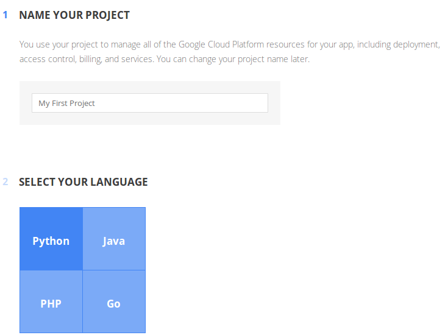
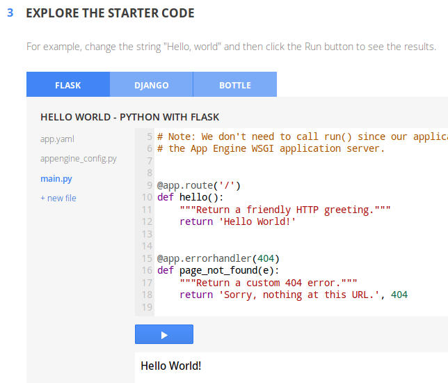
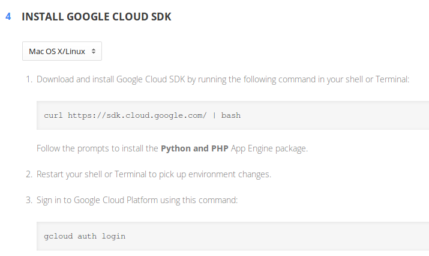
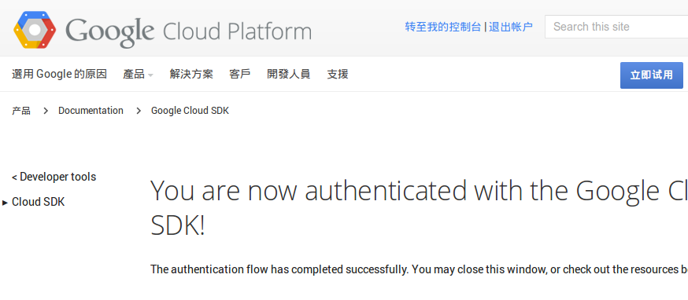
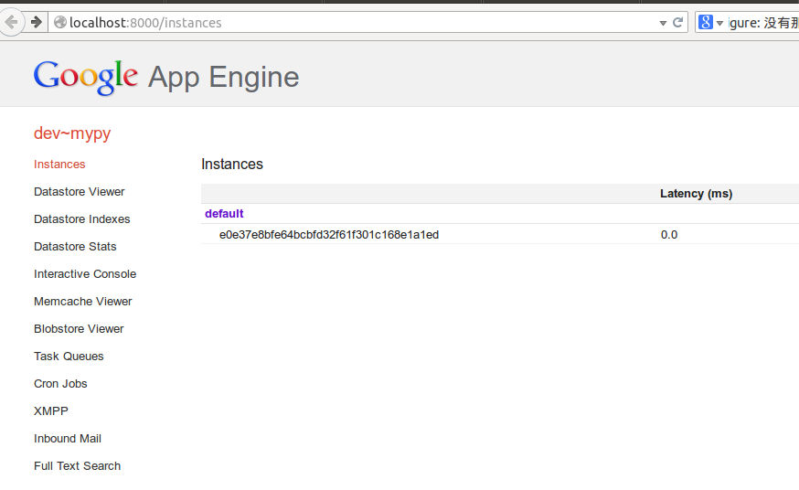

>"Do not judge, so that you may not be judged. For with the judgement you make you will be judged, and the measure you give will be the measure you get."  (MATTHEW 7:1-2)

#问候世界

按照作家韩寒的说法，这个世界存在两种逻辑，一种是逻辑，另外一种是中国逻辑。中国由于“特色”，跟世界是不同的。在网络上，也是如此，世界的网络和中国的网络有很大不同，不用多说，看官应该体会到了。那么，我这里的标题是“问候世界”，就当然不包括中国了。

已经用Tornado可以在自己的计算机上发布网站了，也就是能够在自己计算机的浏览器地址栏中输入`http://localhost:8000`，显示那个Hello，这仅仅是向自己问候了。如果要向世界问候，就需要把这个那个程序放到连接到互联网的服务器上。

在网上，有很多提供服务器租赁服务的公司，可以购买虚拟空间、VPS，现在比较时髦的就是购买云服务主机等，当然，有钱的就自己买服务器硬件设备，然后自己建立机房了。我这里演示给诸位的，不是上面这些，是按照穷人的思路来解决问题。

Google是伟大的，谁要不认同，我就跟谁急。除了因为它是一个好的搜索引擎之外，还因为它给我提供了免费的GAE。什么是GAE？GAE就是Google App Engine，维基百科上这样说的：

>Google App Engine是一个开发、托管网络应用程序的平台，使用Google管理的数据中心。它在2008年4月发布了第一个beta版本。

>Google App Engine使用了云计算技术。它跨越多个服务器和数据中心来虚拟化应用程序。[1] 其他基于云的平台还有Amazon Web Services和微软的Azure服务平台等。

>Google App Engine在用户使用一定的资源时是免费的。支付额外的费用可以获得应用程序所需的更多的存储空间、带宽或是CPU负载。

看官注意了，上面那诱人的“免费”，尽管有所限制，但是，已经足够一般用户使用了，下面是免费内容，看看是不是足够慷慨了呀。

|项目 |   配额|
|-----|-------|
|每天的Email数量 | 100封|
|每天的输入数据 | 无限|
|每天的输出数据 | 1 GB|
|每天可使用CPU |  28小时|
|每天调用Datastore API次数 |  50000次|
|数据存储  |  1 GB|
|每天调用URLFetch API次数 | 657000次|

如果你做一个网站，超过了上面的免费配额，说明你的网站已经不小了。也能够挣钱或者找风险投资了。中国的互联网上，尚未见到如此慷慨的，虽然也有自吹自擂的公司。

请看官注意，这个服务只能在世界范围内使用，由于你知道和不知道的原因，在中国不能使用。当然，要立志做一个优秀程序员的，一定要能够进入世界范围。

**欲进入世界，必科学上网**

否则，今天这一讲看官就无法学习。

##官方网站

在进入学习之前，请看官登录GAE官方网站浏览：https://cloud.google.com/appengine/docs?hl=zh-cn

目前GAE支持使用的语言有：Java,Python,PHP,Go

我在这里当然是使用python了。虽然，我也喜欢PHP。

如果看官自己有能力阅读文档，直接在该网站上阅读，就能够学会如何使用GAE了，不必看我下面的啰嗦。我认为GAE网站上讲的很好了。不过，就是有一点不足，缺少趣味性。如果要享受胡扯的东西，就看我的课程啦。

##注册

在上面的GAE官方文档中，看到下面图片中的`Try it now`按钮，点它，进入下一个界面。

进入的新页面中，开头有这样一段。

>Try Google App Engine Now

>Creating an App Engine app is easy, and it's free to start. Upload your app and share it with users right away, at no charge and with no commitment required.

看下面的图

首先给自己的网站取一个名字，当然这个名字以后还可以修改呢。

然后，在四种语言中选择一种，一定要选python，选别的不跟你玩了。

选好之后，看第三步，如下图。其实是一个例子罢了。不过，不是用tornado框架的。

##下载SDK

下载SDK，看操作系统，不同的操作系统有不同的下载安装方法。如下两图所示中，都说明了安装流程。

我的操作系统是ubuntu，就选择按照上面那张图的方式安装。特别提醒，一定要让你的计算机用VPN科学上网，才能实现上面的安装流程。

从新打开一个shell, 按照上面要求，输入`curl https://sdk.cloud.google.com/ | bash`，剩下的事情就是根据shell中提示的信息向下进行了。它要询问是否需要帮助的时候，就输入y，然后选择语言（2，是python and php，也就是按照这种方法安装的SDK是python和php两者都可以使用的），还要输入一个放置SDK文件的目录名称。之后，系统就自动将google-cloud-sdk中的很多东西，放到指定目录中了。在安装过程中，还会询问工作环境，不修改用自动设置的，简单地回车即可。

如果网络差点，需要等待一段时间。最终在你指定的目录中会有一个google-cloud-sdk目录，所要安装的内容全在里面了。

还可以到：https://cloud.google.com/appengine/downloads?hl=zh-cn

下载，这个页面也有安装帮助。安装方法可以是：

1. 将下载的文件解压，并存储到本地计算机中的某个目录内，比如我在前面安装的时候，就个放置google-cloud-sdk的目录命名为GAEPython，这里所说的目录，就跟前面的效能一样。
2. 设置本用户的工作环境，就是要在当前用户主目录下的.bashrc中设置路径。方法是：用户主目录下的.bashrc文件（有的linux是.profile文件），用vim打开该文件，并进入编辑模式，在文件最后加入PATH设置，参考格式`export PATH="$PATH:your path1/:your path2/ ..."`，然后保存，并退出该shell，则变量生效，本添加的变量只对当前用户有效。

这样两种方式折腾，就搞定了SDK

在上图中，官方给的安装流程中，接下来就是要用一个账号登录google云。关闭前面安装时使用的shell，然后新打开一个，输入命令`gcloud auth login`，会打开浏览器，出现下图

我也不用别的账号，就直接用“老齐”那个账号，点击之，进入一个授权界面，也不用怎么仔细看，要想用，就得点击网页最下面的“接受”，否则别用。网站都是这么忽悠人的。我不截图了，看官除了要科学上网，这里不会有问题的吧。然后看到下面的界面，就成功了。

在这个页面中，可以了解很多关于google云平台的内容以及操作方法。

因为我以前已经建立了一下项目，所以，我点击这个页面上“转至我的控制台”之后，会列出我已经存在的项目名称。当然，在这里可以新建项目。

不过，这里暂且搁置。先回到自己的计算机上。已经将gdk做好了。

##在本地建立项目

在自己的计算机上，任何认为合适的地方，建立一个目录，这个目录就是你要发布到GAE上的项目名称，例如我的操作：

    qw@qw-Latitude-E4300:~/Documents$ mkdir mypy        
    
我是在这里建立了一个名字是mypy的目录，也就意味着我要发布的项目名称是mypy，然后，要把tornado的东西放进这个目录。就是这么做：

先建立一个目录，叫做tornado_source

    qw@qw-Latitude-E4300:~/Documents$ cd tornado_source
    qw@qw-Latitude-E4300:~/Documents/tornado_source$ git clone https://github.com/facebook/tornado.git
    正克隆到 'tornado'...
    remote: Counting objects: 13952, done.
    remote: Total 13952 (delta 0), reused 0 (delta 0)
    接收对象中: 100% (13952/13952), 7.41 MiB | 107.00 KiB/s, done.
    处理 delta 中: 100% (8877/8877), done.
    检查连接... 完成。

然后将tornado_source中的tornado目录，移动到mypy里面去。

接下来在mypy目录里面新建一个文件，名称必须是：app.yaml，该文件的内容是：

    application: mypy
    version: 1
    runtime: python27
    api_version: 1
    threadsafe: no
     
    handlers:
     
    - url: /favicon\.ico
      static_files: favicon.ico
      upload: favicon\.ico
           
    - url: .*
      script: main.py

关于yaml，这里也引用[维基百科的内容](http://zh.wikipedia.org/wiki/YAML)，补充一下：

>YAML（IPA: /ˈjæməl/，尾音类似camel骆驼）是一个可读性高，用来表达资料序列的格式。YAML参考了其他多种语言，包括：XML、C语言、Python、Perl以及电子邮件格式RFC2822。Clark Evans在2001年首次发表了这种语言[1] ，另外Ingy döt Net与Oren Ben-Kiki也是这语言的共同设计者。目前已经有数种编程语言或脚本语言支援（或者说解析）这种语言。

>YAML是"YAML Ain't a Markup Language"（YAML不是一种置标语言）的递回缩写。在开发的这种语言时，YAML 的意思其实是："Yet Another Markup Language"（仍是一种置标语言），但为了强调这种语言以数据做为中心，而不是以置标语言为重点，而用返璞词重新命名。

YAML的官方网站：www.yaml.org

##编写main.py

本来根据我以前的经验，到这里就可以运行`dev_appserver.py mypy`了。可是发现错误了，说没有找到sqlite3模块。不知道为什么，python升级之后，这个模块没有装上，本来这个模块是标准库的。看官如果在操作过程中，也遇到类似情况。解决方法就是到该模块的官方网站下载源码，然后安装，一般流程是：

    tar -zxvf ***.gz
    cd ***     #进入解压缩后得到的目录
    ./configure      #如果不使用默认的，可以指定目录：--prefix=**/**/
    make
    make install    #若权限不足，可以前面加sudo，得到临时root权限。

然后，这个很重要，再将python源码中setup.py文件中该模块的路径从新设置，设置为该模块被安装的路径。一般情况可能是这里的模块路径错了。

接下来就从新安装python

搞定sqlite3模块，再尝试，我回到含有mypy项目的（/home/qw/Documents/mypy，即回到/home/qw/Documents）：

    dev_appserver.py mypy

结果显示：

    ......
    google.appengine.tools.devappserver2.wsgi_server.BindError: Unable to bind localhost:8080

原来，我科学上网，用的是8080端口，已经被占用了，google.appengine也打算用这个端口。那好，因为是在本地，就不用科学了，将科学上网端口停了，再试试。

    qw@qw-Latitude-E4300:~/Documents$ dev_appserver.py mypy
    INFO     2014-10-07 13:57:14,275 devappserver2.py:733] Skipping SDK update check.
    WARNING  2014-10-07 13:57:14,279 api_server.py:383] Could not initialize images API; you are likely missing the Python "PIL" module.
    INFO     2014-10-07 13:57:14,283 api_server.py:171] Starting API server at: http://localhost:40433
    INFO     2014-10-07 13:57:14,295 dispatcher.py:186] Starting module "default" running at: http://localhost:8080
    INFO     2014-10-07 13:57:14,298 admin_server.py:117] Starting admin server at: http://localhost:8000
  
    /usr/local/lib/python2.7/site-packages/setuptools-2.2-py2.7.egg/pkg_resources.py:991: UserWarning: /home/qw/.python-eggs is writable by group/others and vulnerable to attack when used with get_resource_filename. Consider a more secure location (set with .set_extraction_path or the PYTHON_EGG_CACHE environment variable).

看下图，如果在URL输入`http://localhost:8000`，打开的是本地App Engine

这个就是本地的server。

如果在URL输入`http://localhost:8080`，网页空白，什么提示没有。这就对了，因为我还没有编写那个最重要的文件，就是app.yaml里面设定的main.py

**特别提醒看官：我在上面操作的时候，出现了警告，但是当时没有引起我的注意。于是就编写main.py文件。结果，运行`http://localhost:8080`，不成功。而且告诉我无法找到tornado.wsgi模块。**

本讲有悬念了。
    
