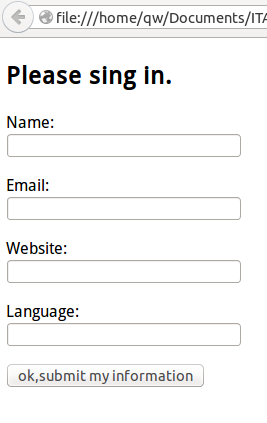
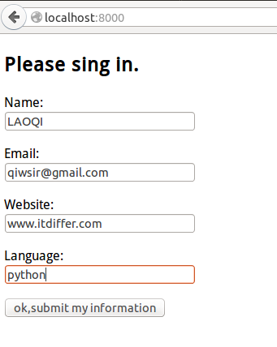
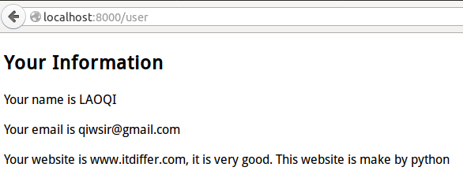

>But when he heard this, he said:"Those who are well have no need of a physician, but those who are sick. Go and learn what this means,'Idesire mercy, not sacrifice' For I have come to call not the righteous but sinners."(MATTHEW 9:12)

#使用表单和模板

如果像前面那么做网站，也太丑陋了。并且功能也不多。

在实际做网站中，现在都要使用一个模板，并且在用户直接看到的页面，用html语言来写页面（关于HTML，本教程默认为看官已经熟悉，如果不熟悉，可以到找有关教程来学习）。

在做网站的行业里面，常常将HTML+CSS+JS组成的网页，称作“前端”。它主要负责展示，或者让用户填写一些表格，通过JS提交给用python写的程序，让python程序来处理数据，那些处理数据的python程序称之为“后端”。我常常提醒做“后端”的，不要轻视“前端”。如果看官立志成为全栈工程师，就要从前到后都通。

在本讲中，为了突出模板和后端程序，我略去CSS+JS，虽然这样一来界面难看，而且用户的友好度也不怎么样（JS，javascript是使网页变得更友好的重要工具，如不用更换地址就能刷新页面等等，特别提醒看官，一定要学好javascript，虽然这个可能没有几个大学教的。请看维基百科对javascript简介：）。

>JavaScript，一种直译式脚本语言，是一种动态类型、弱类型、基于原型的语言，内置支持类。它的解释器被称为JavaScript引擎，为浏览器的一部分，广泛用于客户端的脚本语言，最早是在HTML网页上使用，用来给HTML网页增加动态功能。然而现在JavaScript也可被用于网络服务器，如Node.js。

>在1995年时，由网景公司的布兰登·艾克，在网景导航者浏览器上首次设计实作而成。因为网景公司与升阳公司合作，网景公司管理层次结构希望它外观看起来像Java，因此取名为JavaScript。但实际上它的语法风格与Self及Scheme较为接近。

>为了取得技术优势，微软推出了JScript，CEnvi推出ScriptEase，与JavaScript同样可在浏览器上运行。为了统一规格，1997年，在ECMA（欧洲计算机制造商协会）的协调下，由Netscape、Sun、微软、Borland组成的工作组确定统一标准：ECMA-262。因为JavaScript兼容于ECMA标准，因此也称为ECMAScript。

上面这段引文里面提到了一个非常著名的公司：网景，可能年青一代都忘却了。也建议有兴趣的看官到维基百科中了解这个传奇公司，它曾经有一个传奇产品，虽然名字不复存在，但是Firefox是秉承它衣钵的。

话题再转回来，还是关于本讲，主要是要演示一个用模板（HTML）写一个表单，然后提交给后端的python程序，再转到另外一个显示的前端页面显示。为了简化流程，这个过程中没有数据处理和CSS+Javascript的工作，所有界面会丑陋。但是，“我很丑，可是我很温柔”。

##一个表单

要做一个前端的页面，显示的内容就如同下图样式

相应代码是，并命名为index.html，存在一个名称是template的目录中。

	<!DOCTYPE html>
	<html>
	    <head>
	        <title>sign in your name</title>
	    </head>
	    <body>
	        <h2>Please sing in.</h2>
	        <form method="post" action="/user">
	            
Name: <input type="text" name="username">

	            
Email: <input type="text" name="email">

	            
Website: <input type="text" name="website">

	            
Language: <input type="text" name="language">

	            <input type="submit" value="ok,submit my information">
	        </form>
	    </body>
	</html>

上面的代码是比较简单，如果看官熟悉html的话，不熟悉也不要紧，网上搜索就能理解。注意，没有CSS+JS，所以简单。如果在真正开发中，这两个是不能少的。

有了这个表单之后，如果用户把相关信息都填写好了。点击下面的按钮，就应该提交给后端的python程序来处理。

##后端处理程序

做为tornado驱动的网站，首先要能够把前面的index.html显示出来，这个一般用get方法，显示的样式就按照上面的样子显示。

用户填写信息之后，点击按钮提交。注意观察上面的代码表单中，设定了`post`方法，所以，在python程序中，应该有一个post方法专门来接收所提交的数据，然后把提交的数据在另外一个网页显示出来。

在表单中还要注意，有一个`action=/user`，表示的是要将表单的内容提交给`/user`路径所对应的程序来处理。这里需要说明的是，在网站中，数据提交和显示，路径是非常重要的。

按照以上意图，编写如下代码，并命名为usercontroller.py，保存在template目录中

	#!/usr/bin/env python
	#coding:utf-8
	
	import os.path
	
	import tornado.httpserver
	import tornado.ioloop
	import tornado.options
	import tornado.web
	
	from tornado.options import define, options
	define("port", default=8000, help="run on the given port", type=int)
	
	class IndexHandler(tornado.web.RequestHandler):
	    def get(self):
	        self.render("index.html")
	
	class UserHandler(tornado.web.RequestHandler):
	    def post(self):
	        user_name = self.get_argument("username")
	        user_email = self.get_argument("email")
	        user_website = self.get_argument("website")
	        user_language = self.get_argument("language")
	        self.render("user.html",username=user_name,email=user_email,website=user_website,language=user_language)
	
	handlers = [
	    (r"/", IndexHandler),
	    (r"/user", UserHandler)
	]
	
	template_path = os.path.join(os.path.dirname(__file__),"template")
	
	if __name__ == "__main__":
	    tornado.options.parse_command_line()
	    app = tornado.web.Application(handlers, template_path)
	    http_server = tornado.httpserver.HTTPServer(app)
	    http_server.listen(options.port)
	    tornado.ioloop.IOLoop.instance().start()

这次代码量多一些。但是多数在前面讲述tornado基本结构的时候已经说过了，跟前面一样，这里仅仅把重点的和新出现的进行讲述，如果看官对某些内容还有疑问，可以参考前面的相关章节。

在引入的模块上，多了一个`import os.path`，这个模块主要用在：

	template_path = os.path.join(os.path.dirname(__file),"template")

这是要获取存放程序的目录`template`的路径。

重点看两个类中都有的`self.render()`，用这个方法引入相应的模板。

    self.render("index.html")

显示index.html模板，但是此时并没有向模板网页传递任何数据，仅仅显示罢了。下面一个：

	self.render("user.html",username=user_name,email=user_email,website=user_website,language=user_language)
    
与前面的不同在于，不仅仅是要引用模板网页user.html，还要向这个网页传递一些数据，例如username=user_name，含义就是，在模板中，某个地方是用username来标示得到的数据，而user_name是此方法中的一个变量，也就是对应一个数据，那么模板中的username也就对应了user_name的数据，这是通过username=user_name完成的（说的有点像外语了）。后面的变量同理。

那么，user_name的数据是哪里来的呢？就是在index.html页面的表单中提交上来的。注意观察路径的设置，`r"/user", UserHandler`，也就是在form中的`action='/user'`，就是要将数据提交给UserHandler处理，并且是通过post方法。所以，在UserHandler类中，有post()方法来处理这个问题。通过self.get_argument()来接收前端提交过来的数据，接收方法就是，self.get_argument()的参数与index.html表单form中的各项的name值相同，就会得到相应的数据。例如`user_name = self.get_argument("username")`，就能够得到index.html表单中name为"username"的元素的值，并赋给user_name变量。

还差一个网页。

##显示结果

在上面的代码中，又多了一个模板：`index.html`，对这个模板，跟前面那个模板有一点儿不一样的地方，就是要引入一些变量。它的代码是这样的：

    <!DOCTYPE html>
    <html>
        <head>
            <title>sign in your name</title>
        </head>
        <body>
            <h2>Your Information</h2>
            
Your name is {{username}}

            
Your email is {{email}}

            
Your website is {{website}}, it is very good. This website is make by {{language}}

        </body>
    </html>

请将上面的代码和这句话对照：
	
    self.render("user.html",username=user_name,email=user_email,website=user_website,language=user_language)

上面的模板代码存储为名为`user.html`的文件，并且和前面已经保存的在同一个目录中。

看HTML模板代码中，有类似`{{username}}`的变量，模板中用`{{}}`引入变量，这个变量就是在`self.render()`中规定的，两者变量名称一致，对应将相应的值对象引入到模板中。

##运行结果

进入到template目录，执行：

    qw@qw-Latitude-E4300:~/template$ python userscontroller.py

然后在浏览器的地址栏中输入

    http://localhost:8000

出现如下图的表单，并填写表单内容

点击“按钮”之后：

这样就实现了一个简单表单提交的网站。
