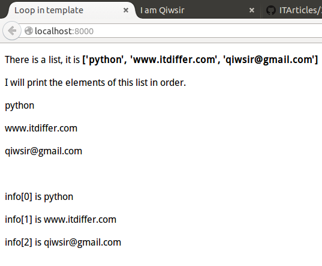
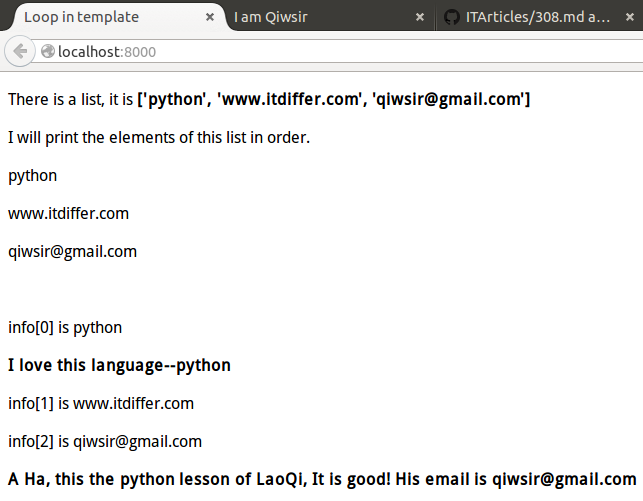
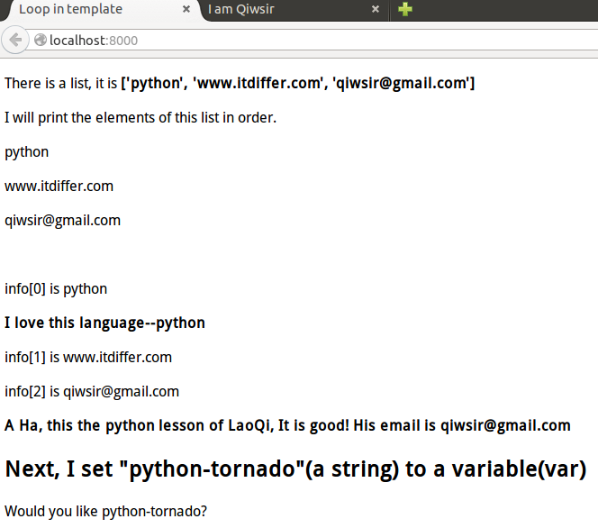

>"Come to me, all you that are weary and are carrying heavy burdens, and I will give you rest. Take my yoke upon you, and learn from me; for I am gentle and humble in heart, and you will find rest for your souls. For my yoke is easy, and my burden is light."(MATTHEW 12:28-30)

#模板中的语法

在[上一讲](./311.md)的练习中，列位已经晓得，模板中`{{placeholder}}`可以接收来自python文件（.py）中通过`self.render()`传过来的参数值，这样模板中就显示相应的结果。在这里，可以将`{{placeholder}}`理解为占位符，就如同变量一样啦。

这是一种最基本的模板显示方式了。但如果仅仅如此，模板的功能有点单调，无法完成比较复杂的数据传递。不仅仅是tornado，其它框架如Django等，模板都有比较“高级”的功能。在tornado的模板中，功能还是很不少的，本讲介绍模板语法先。

##模板中循环的例子

在模板中，也能像在python中一样，可以使用某些语法，比如常用的if、for、while等语句，使用方法如下：

先看例子

先写一个python文件（命名为index.py)，这个文件中有一个列表`["python", "www.itdiffer.com", "qiwsir@gmail.com"]`，要求是将这个列表通过`self.render()`传给模板。

然后在模板中，利用for语句，依次显示得到的列表中的元素。

	#! /usr/bin/env python
	#-*- coding:utf-8 -*-
	
	import os.path
	import tornado.httpserver
	import tornado.ioloop
	import tornado.web
	import tornado.options
	
	from tornado.options import define, options
	define("port", default=8000, help="run on the given port", type=int)
	
	class IndexHandler(tornado.web.RequestHandler):
	    def get(self):
	        lst = ["python","www.itdiffer.com","qiwsir@gmail.com"]  #定义一个list
	        self.render("index.html", info=lst)                     #将上述定义的list传给模板
	
	handlers = [(r"/", IndexHandler),]
	
	template_path = os.path.join(os.path.dirname(__file__), "temploop")  #模板路径
	
	if __name__ == "__main__":
	    tornado.options.parse_command_line()
	    app = tornado.web.Application(handlers,template_path)
	    http_server = tornado.httpserver.HTTPServer(app)
	    http_server.listen(options.port)
	    tornado.ioloop.IOLoop.instance().start()

模板文件，名称是index.html，在目录temploop中。代码如下：

	<DOCTYPE html>
	<html>
	    <head>
	        <title>Loop in template</title>
	    </head>
	    <body>
	    
There is a list, it is <b>{{info}}</b>

	    
I will print the elements of this list in order.

	        <!-- 循环开始，注意写法类似python中的for，但是最后没有冒号 -->
	        
{{element}}
       <!-- 显示element的内容 -->
	                        <!-- 结束标志 -->
	     
	    
	        
info[{{index}}] is {{element}} 
	    
	    </body>
	</html>

运行上面的程序：

    >>> python index.py

然后在浏览器地址栏中输入：`http://localhost:8000`，显示的页面如下图：

在上面的例子中，用如下样式，实现了模板中的for循环，这是在模板中常用到的，当然，从python程序中传过来的不一定是list类型数据，也可能是其它类型的序列数据。

    
        
info[{{index}}] is {{element}} 
    

特别提醒注意的是，语句要用``来结尾。在循环体中，用`{{ element }}`方式使用序列的元素。

##模板中的判断语句

除了循环之外，在模板中也可以有判断，在上面代码的基础上，改写一下，直接上代码，看官想必也能理解了。

index.py的代码不变，只修改模板index.html的代码，重点理解模板中的语句写法。

    <DOCTYPE html>
    <html>
        <head>
            <title>Loop in template</title>
        </head>
        <body>
        
There is a list, it is <b>{{info}}</b>

        
I will print the elements of this list in order.

        
            
{{element}}

        
         
        
            
info[{{index}}] is {{element}}
                        <!-- 增加了一个判断语句 -->
                
 <b>I love this language--{{element}}</b>

            
        

                 <!-- 还是判断一下 -->
            
<b>A Ha, this the python lesson of LaoQi, It is good! His email is {{info[2]}}</b>

        
        </body>
    </html>

上面的模板运行结果是下图样子，看官对比一下，是否能够理解呢？

##模板中设置变量

废话不说，直接上例子，因为例子是非常直观的：

	<DOCTYPE html>
	<html>
	    <head>
	        <title>Loop in template</title>
	    </head>
	    <body>
	    
There is a list, it is <b>{{info}}</b>

	    
I will print the elements of this list in order.

	    
	        
{{element}}

	    
	     
	    
	        
info[{{index}}] is {{element}}
	        
	            
 <b>I love this language--{{element}}</b>

	        
	    
	
	    
	        
<b>A Ha, this the python lesson of LaoQi, It is good! His email is {{info[2]}}</b>

	    
	    <h2>Next, I set "python-tornado"(a string) to a variable(var)</h2>
	    
	    
Would you like {{var}}?

	    </body>
	</html>

显示结果如下：

看官发现了吗？我用``的方式，将一个字符串赋给了变量`var`，在下面的代码中，就直接引用这个变量了。这样就是实现了模板中变量的使用。

Tornado的模板真的功能不少呢。不过远非这些，后面还有。敬请等待。

[首页](./index)&nbsp;&nbsp;&nbsp;|&nbsp;&nbsp;&nbsp;[上一讲：使用表单和模板](./311.md)
