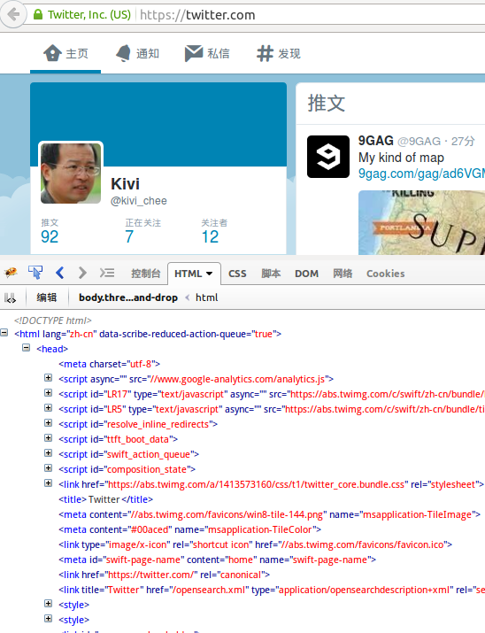
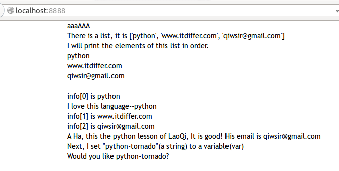

>"just as the Son of Man came not to be served but to serve, and to give his life a ransom for many."(MATTHEW:20:28)

#静态文件以及一个项目框架

在网上浏览网页，由于现在网速也快了，大概你很少注意网页中那些所谓的静态文件。怎么找出来静态文件呢？

如果使用firefox(我特别向列位推荐这个浏览器，它是我认为的最好的浏览器，没有之一。哈哈。“你信不信？反正我信了。”)，可以通过firebug组件，来研究网页的代码，当然，你直接看源码也行。

上图中，我打开了一个对天朝很多人来说不存在的网站，并且通过Firebug查看其源码，打开`<head>`，发现里面有不少`<script`和`<link`开始引入的文件，这些文件一部分是javascript文件，一部分是css文件。在一个网站中，这类文件一般是不会发生变化的，也就是它的内容稳定，直到下次文件管理员或者有权限的人修改时。而网站程序本身一般不会修改它们。因此将他们称之为**静态文件**。

此外，网站中的**静态文件**还包括一些图片，比如logo，以及做为边框的图片等。

在tornado中，有专门方法处理这些静态文件。

##静态路径

看官是否还记得在前面写过这个模样的代码：`template_path=os.path.join(os.path.dirname(__file__), "templates")`，这里是设置了模板的路径，放置模板的目录名称是`templates`。类似的方法，我们也可以设置好静态文件的路径。

    static_path=os.path.join(os.path.dirname(__file__), "static")
    
这里的设置，就是将所有的静态文件，放在了`static`目录中。

这样就设置了静态路径。

下面的代码是将[上一节](./312.md)的代码进行了改写，注意变化的地方

    #! /usr/bin/env python
    #-*- coding:utf-8 -*-

    import os.path
    import tornado.httpserver
    import tornado.ioloop
    import tornado.web
    import tornado.options

    from tornado.options import define, options
    define("port", default=8000, help="run on the given port", type=int)

    class IndexHandler(tornado.web.RequestHandler):
        def get(self):
            lst = ["python","www.itdiffer.com","qiwsir@gmail.com"]
            self.render("index.html", info=lst)

    handlers = [(r"/", IndexHandler),]

    template_path = os.path.join(os.path.dirname(__file__), "temploop")
    static_path = os.path.join(os.paht.dirname(__file__), "static")    #这里增加设置了静态路径

    if __name__ == "__main__":
        tornado.options.parse_command_line()
        app = tornado.web.Application(handlers, template_path, static_path, debug=True)   #这里也多了点
        http_server = tornado.httpserver.HTTPServer(app)
        http_server.listen(options.port)
        tornado.ioloop.IOLoop.instance().start()

上面的代码比前一讲中，多了两处，一处是定义了静态文件路径`static_path`，在这里将存储静态文件的目录命名为`static`。另外一个修改就是在实例化`tornado.web.Application()`的时候，在参数中，出了有静态路径参数`static_path`，还有一个参数设置`debug=True`，这个参数设置的含义是当前的tornado服务器可以不用重启，就能够体现已经修改的代码功能。回想一下，在前面进行调试的时候，是不是每次如果修改了代码，就得重启tornado服务器，才能看到修改效果。用了这个参数就不用这么麻烦了。

特别说着，`debug=True`仅仅用于开发的调试过程中，如果在生产部署的时候，就不要这么使用了。

##编写模板文件

我们设置静态路径的目的就是要在模板中引入css和js等类型的文件以及图片等等。那么如何引入呢，下面以css为例说明。

在一般网页的`<head>...</head>`部分，都会引入CSS，例如下面的写法不少网站都愿意引用google的字体库，样式如下：

    <link href='http://fonts.googleapis.com/css?family=Open+Sans:300,400,600&subset=latin,latin-ext' rel='stylesheet'>

这就是CSS的引入。

但是，如果看官在墙内也这么引入字体库，希望自己的网页上能使用，那就有点麻烦了，因为google的这个项目已经不行被墙，如果在网页中写了上面代码，会导致网页打开速度很慢，有的甚至出错。

怎么办？那就不用啦。不过，国内有好心网站做了整个谷歌字体的代理，可以用下面方式，墙里面就不怕了。

    <link href='http://fonts.useso.com/css?family=Open+Sans:300,400,600&subset=latin,latin-ext' rel='stylesheet'>

顺便提供一个墙内的常用前端库地址：http://libs.useso.com/，供看官参考使用。

那么如果我自己写CSS呢？并且按照前面的设定，已经将该CSS文件放在了static目录里面，命名为style.css，就可以这样引入

    <link href="/static/style.css" rel="stylesheet">

但是，这里往往会有一个不方便的地方，如果我手闲着无聊，或者因为别的充足理由，将存储静态文件的目录static换成了sta，并且假设我已经在好几个模板中都已经写了上面的代码。接下来我就要把这些文件全打开，一个一个更改`<link>`里面的地址。

请牢记，凡是遇到重复的事情，一定要找一个函数方法解决。tornado就提供了这么一个：`static_url()`,把上面的代码写成：

    <link href="{{ static_url("style.css") }}" rel="stylesheet" >

这样，就不管你如何修改静态路径，模板中的设置可以不用变。

按照这个引入再修改相应的模板文件。

##一个项目框架

以上以及此前，我们所有写过的，都是简单的技术方法演示，如果要真的写一个基于tornado框架的网站，一般是不用这样的直接把代码都写到一个文件index.py中的，一个重要原因，就是这样做不容易以后维护，也不便于多人协作写一个项目。

所以在真实的项目中，常常要将不同部件写在不同文件中。下面的例子就是一个项目的基本框架。当然，这还是一个比较小的项目，但是“麻雀虽小，五脏俱全”。

创建一个文件夹，我给它命名为project，在这个文件里面分别创建下面的文件和目录，文件和目录里面的内容可以先不用管，“把式把式，先看架势”，先搭起项目结构来。

- 文件`application.py`：这个文件的核心任务是完成`tornado.web.Application()`的实例化
- 文件`url.py`：在这个文件中记录项目中所有URL和映射的类，即完成前面代码中`handlers=[...]`的功能
- 文件`server.py`：这是项目的入口文件，里面包含`if __name__ == "__main__"`，从这里启动项目和服务
- 目录handler：存放`.py`文件，即所谓各种请求处理类（当然，如果更大一些的项目，可能还要分配给别的目录来存储这种东西）
- 目录optsql：存放操作数据库的文件，比如各种读取或者写入数据库的类或函数，都放在这里面的某些文件中
- 目录static：存放静态文件，就是上文说的比如CSS，JS，图片等，为了更清晰，在这个目录里面，还可建立子目录，比如我就建立了：css,js,img三个子目录，分别对应上面的三种。
- 目录template：存放`.html`的模板（在更大型的项目中，可能会设计多个目录来存放不同的模板，或者在里面再有子目录进行区分）

以上就是我规划的一个项目的基本框架了。不同开发者根据自己的习惯，有不同的规划，或者有不同的命名，这没有关系。不过需要说明的，尽量使用名词（英文）。我看到过有人做过单复数之争论。我个人认为，这个无所谓，只要在一个项目中一贯就好了。我还是用单数吧，因为总忘记那个复数后面的s

下面分别把不同部分文件的内容列出来，因为都是前面代码的重复，不过是做了一点从新部署，所以，就不解释了。个别地方有一点点说明。

文件application.py的代码如下：

	#!/usr/bin/env python
	#coding:utf-8
	
	from url import url 
	
	import tornado.web
	import os
	
	setting = dict(
	    template_path=os.path.join(os.path.dirname(__file__),"template"),
	    static_path=os.path.join(os.path.dirname(__file__),"static"),
	    )
	
	application = tornado.web.Application(
	    handlers=url,
	    **setting
	    )

`from url import url`是从文件url.py引入内容

下面看看url.py文件内容：

    #!/usr/bin/env python
    #coding:utf-8

    import sys
    reload(sys)
    sys.setdefaultencoding('utf-8')

    from handler.index import IndexHandler

    url=[
        (r'/', IndexHandler),

        ]

在这个文件中，从`import sys`开始的三行，主要是为了解决如果文件里面有汉字，避免出现乱码。现在这个文件很简单，里面只有`(r'/', IndexHandler)`一条URL，如果多条了，就要说明每条是什么用途，如果用中文写注释，需要避免乱码。

以上两个预备好了，就开始写server.py，内容如下：
	
	#!/usr/bin/env python
	#coding:utf-8
	
	import tornado.ioloop
	import tornado.options
	import tornado.httpserver
	
	import sys
	
	from application import application
	
	from tornado.options import define,options
	define("port",default=8888,help="run on th given port",type=int)
	
	def main():
	    tornado.options.parse_command_line()
	    http_server = tornado.httpserver.HTTPServer(application)
	    http_server.listen(options.port)
	    print 'Development server is running at http://127.0.0.1:%s/' % options.port
	    print 'Quit the server with Control-C'
	    tornado.ioloop.IOLoop.instance().start()
	
	if __name__=="__main__":
	    main()

这个就不需要解释了。接下来就看目录，首先在`static/css/`里面建立一个style.css的文件，并写样式表。我只写了下面的样式，这个样式的目的主要是去除浏览器默认的样式，在实际的工程项目中，这个步骤是非常必要的，一定要去除所有默认的样式，然后重新定义，才能便于控制。

	html, body, div, span, applet, object, iframe,h1, h2, h3, h4, h5, h6, p, blockquote, pre,a, abbr, acronym, address, big, cite, code,del, dfn, em, img, ins, kbd, q, s, samp,small, strike, strong, sub, sup, tt, var,b, u, i, center,dl, dt, dd, ol, ul, li,fieldset, form, label, legend,table, caption, tbody, tfoot, thead, tr, th, td,article, aside, canvas, details, embed, figure, figcaption, footer, header, hgroup, menu, nav, output, ruby, section, summary,time, mark, audio, video {
	    margin: 0;
	    padding: 0;
	    border: 0;
	    font-size: 100%;
	    font: inherit;
	    vertical-align: baseline;
	}
	/* HTML5 display-role reset for older browsers */
	article, aside, details, figcaption, figure, footer, header, hgroup, menu, nav, section {
	        display: block;
	}
	
	
	body {
	        /* standard body */
	        margin: 0 auto;
	        width: 960px;
	        font: 14px/20px "Trebuchet MS", Verdana, Helvetica, Arial, sans-serif;
	}

为了能够在演示的时候看出样式控制的变化，多写了一个对body的控制，居中且宽度为960px。

样式表已经定义好，就要看`template/index.html`了，这个文件就是本项目中的唯一一个模板。

	<DOCTYPE html>
	<html>
	    <head>
	        <title>Loop in template</title>
	        <link rel="stylesheet" type="text/css" href="{{ static_url('css/style.css')}}">
	    </head>
	    <body>
	    <h1>aaaAAA</h1>
	    
There is a list, it is <b>{{info}}</b>

	    
I will print the elements of this list in order.

	    
	        
{{element}}

	    
	     
	    
	        
info[{{index}}] is {{element}}
	        
	            
 <b>I love this language--{{element}}</b>

	        
	    
	
	    
	        
<b>A Ha, this the python lesson of LaoQi, It is good! His email is {{info[2]}}</b>

	    
	    <h2>Next, I set "python-tornado"(a string) to a variable(var)</h2>
	    
	    
Would you like {{var}}?

	    </body>
	</html>

在这个文件中，特别注意就是`<link rel="stylesheet" type='text/css' href="{{ static_url('css/style.css')}}"`,这里引入了前面定义的样式表文件。引入方式就是前文讲述的方式，不过由于是在css这个子目录里面，所以写了相对路径。

行文到此，我原以为已经完成了。一检查，发现一个重要的目录`handler`里面还空着呢，那里面放index.py文件，这个文件里面是请求响应的类IndexHandler

    #!/usr/bin/env python
    #coding:utf-8

    import tornado.web

    import sys
    reload(sys)
    sys.setdefaultencoding('utf-8') 

    class IndexHandler(tornado.web.RequestHandler):
        def get(self):
            lst = ["python","www.itdiffer.com","qiwsir@gmail.com"]
            self.render("index.html", info=lst)

这个文件的代码没有什么增加的内容，只是多了三行设置为utf-8的配置，目的是避免汉字乱码。另外，很需要说明的是，由于这个文件在handler目录里面，要在上一层的url.py中引用（看url.py内容）,必须要在本目录中建立一个名称是`__init__.py`的空文。

好了，基本结构已经完成。跑起来。效果就是这样的：

[首页](./index.md)&nbsp;&nbsp;&nbsp;|&nbsp;&nbsp;&nbsp;[上一讲：模板中的语法](./312.md)
