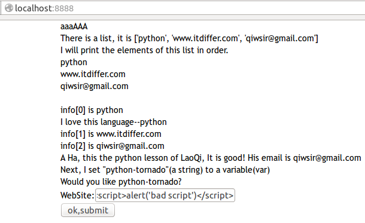
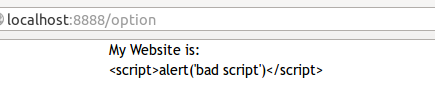
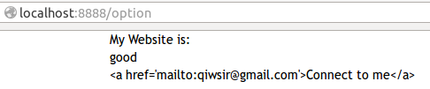
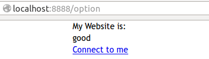

>"Pay attention to what you hear; the measure you give will be the measure you get, and still more will be given you. For to those who have, more will be given; and from those who have nothing, even what they have will be taken away."(MARK 4:24-25)

#模板转义

列位看官曾记否？在[《玩转字符串（1）》](https://github.com/qiwsir/ITArticles/blob/master/BasicPython/107.md)中，有专门讲到了有关“转义”问题，就是在python的字符串中，有的符号要想表达其本意，需要在前面加上`\`符号，例如单引号，如果要在字符串中表现它，必须写成`\'单引号里面\'`样式，才能实现一对单引号以及里面的内容，否则，它就表示字符串了。

在HTML代码中，也有类似的问题，比如`>`等，就是代码的一部分，如果直接写，就不会显示在网页里，要向显示，同样需要转义。另外，如果在网页中有表单，总会有别有用心的人向表单中写点包含`>`等字符的东西，目的就是要攻击你的网站，为了防治邪恶之辈，也需要将用户输入的字符进行转义，转化为字符实体，让它不具有HTML代码的含义。

>转义字符串（Escape Sequence）也称字符实体(Character Entity)。在HTML中，定义转义字符串的原因有两个：第一个原因是像“<”和“>”这类符号已经用来表示HTML标签，因此就不能直接当作文本中的符号来使用。为了在HTML文档中使用这些符号，就需要定义它的转义字符串。当解释程序遇到这类字符串时就把它解释为真实的字符。在输入转义字符串时，要严格遵守字母大小写的规则。第二个原因是，有些字符在ASCII字符集中没有定义，因此需要使用转义字符串来表示。

##模板自动转义

Tornado 2 开始的模板具有自动转义的功能，这让开发者省却了不少事情。看一个例子。就利用上一讲中建立的开发框架。要在首页模板中增加一个表单提交功能。

修改template/index.html文件，内容如下：
        
	<DOCTYPE html>
	<html>
	    <head>
	        <title>Loop in template</title>
	        <link rel="stylesheet" type="text/css" href="{{ static_url('css/style.css')}}">
	    </head>
	    <body>
	    <h1>aaaAAA</h1>
	    
There is a list, it is <b>{{info}}</b>

	    
I will print the elements of this list in order.

	    
	        
{{element}}

	    
	     
	    
	        
info[{{index}}] is {{element}}
	        
	            
 <b>I love this language--{{element}}</b>

	        
	    
	
	    
	        
<b>A Ha, this the python lesson of LaoQi, It is good! His email is {{info[2]}}</b>

	    
	    <h2>Next, I set "python-tornado"(a string) to a variable(var)</h2>
	    
	    
Would you like {{var}}?

        <!--增加表单-->
	    <form method="post" action="/option">
	        
WebSite:<input id="website" name="website" type="text">

	        
<input type="submit" value="ok,submit">

	    </form>
	    </body>
	</html>

在增加的表单中，要将内容以`post`方法提交到`"/option"`，所以，要在url.py中设置路径，并且要建立相应的类。

然后就在handler目录中建立一个新的文件，命名为optform.py，其内容就是一个类，用来接收index.html中`post`过来的表单内容。

    #!/usr/bin/env python
    #coding:utf-8

    import tornado.web

    import sys
    reload(sys)
    sys.setdefaultencoding('utf-8')

    class OptionForm(tornado.web.RequestHandler):   
        def post(self):
            website = self.get_argument("website")      #接收名称为'website'的表单内容
            self.render("info.html",web=website)

为了达到接收表单post到上述类中内容的目的，还需要对url.py进行如下改写：

    #!/usr/bin/env python
    #coding:utf-8

    import sys
    reload(sys)
    sys.setdefaultencoding('utf-8')

    from handler.index import IndexHandler
    from handler.optform import OptionForm
    url=[
        (r'/', IndexHandler),
        (r'/option', OptionForm),

        ]

看官还要注意，我在新建立的optform.py中，当接收到来自表单内容之后，就用另外一个模板`info.html`显示所接收到的内容。这个文件放在template目录中，代码是：

    <DOCTYPE html>
    <html>
        <head>
            <title>Loop in template</title>
            <link rel="stylesheet" type="text/css" href="{{ static_url('css/style.css')}}">
        </head>
        <body>
        <h1>My Website is:</h1>
        
{{web}}

        </body>
    </html>

这样我们就完成表单内容的提交和显示过程。

从上面的流程中，看官是否体验到这个框架的优势了？不用重复敲代码，只需要在框架内的不同地方增加内容，即可完成网站。

演示运行效果：

我在表单中输入了``，这是多么阴险毒辣呀。

然而我们的tornado是不惧怕这种攻击的，因为它的模板自动转义了。当点击按钮提交内容的时候，就将那些阴险的符号实体化，成为转义之后的符号了。于是就这样了：

输入什么，就显示什么，不会因为输入的内容含有阴险毒辣的符号而网站无法正常工作。这就是转义的功劳。

##不转义的办法

在tornado中，模板实现了自动转义，省却了开发者很多事，但是，事情往往没有十全十美的，这里省事了，一定要在别的地方费事。例如在上面那个info.html文件中，我打算在里面加入我的电子信箱，但是要像下面代码这样，设置一个变量，主要是为了以后修改方便和在其它地方也可以随意使用。

    <DOCTYPE html>
    <html>
        ...（省略）
        <body>
        <h1>My Website is:</h1>
        
{{web}}

        
        
{{email}}

        </body>
    </html>

本来希望在页面中出现的是`Connect to me`，点击它之后，就直接连接到发送电子邮件。结果，由于转义，出现的是下面的显示结果：

实现电子邮件超链接未遂。

这时候，就需要不让模板转义。tornado提供的方法是：

- 在Application函数实例化的时候，设置参数：autoescape=None。这种方法不推荐适应，因为这样就让全站模板都不转意了，看官愿意尝试，不妨进行修改试一试，我这里就不展示了。
- 在每个页面中设置，表示这个页面不转义。也不推荐。理由，自己琢磨。
- 以上都不推荐，我推荐的是：,想让哪里不转义，就在那里用这种方式，比如要在email超级链接那里不转移，就写成这样好了。于是修改上面的代码，看结果为：

如此，实现了不转义。

以上都实现了模板的转义和不转义。

##url转义

本来模板转义和不转义问题已经交代清楚了。怎奈上周六一个朋友问了一个问题，那个问题涉及到url转义问题，于是在这里再补上一段，专门谈谈url转义的问题。

有些符号在URL中是不能直接传递的，如果要在URL中传递这些特殊符号，那么就要使用它们的编码了。编码的格式为：%加字符的ASCII码，即一个百分号%，后面跟对应字符的ASCII（16进制）码值。例如 空格的编码值是"%20"。

在python中，如果用utf-8写了一段地址，如何转义成url能够接收的字符呢？

在python中有一个urllib模块：

    >>> import urllib

    >>> #假设下面的url，是utf-8编码
    >>> url_mail='http://www.itdiffer.com/email?=qiwsir@gmail.com'
    
    >>> #转义为url能够接受的
    >>> urllib.quote(url_mail)
    'http%3A//www.itdiffer.com/email%3F%3Dqiwsir%40gmail.com'

反过来，一个url也能转移为utf-8编码格式,请用urllib.unquote()

下面抄录帮助文档中的内容，供用到的朋友参考：

    quote(s, safe='/')
        quote('abc def') -> 'abc%20def'
            
        Each part of a URL, e.g. the path info, the query, etc., has a
        different set of reserved characters that must be quoted.
                        
        RFC 2396 Uniform Resource Identifiers (URI): Generic Syntax lists
        the following reserved characters.
                                   
        reserved    = ";" | "/" | "?" | ":" | "@" | "&" | "=" | "+" |
                      "$" | ","
                                                              
        Each of these characters is reserved in some component of a URL,
        but not necessarily in all of them.
                                                               
        By default, the quote function is intended for quoting the path
        section of a URL.  Thus, it will not encode '/'.  This character
        is reserved, but in typical usage the quote function is being
        called on a path where the existing slash characters are used as
        reserved characters.

    unquote(s)
        unquote('abc%20def') -> 'abc def'.

    quote_plus(s, safe='')
        Quote the query fragment of a URL; replacing ' ' with '+'

    unquote_plus(s)
        unquote('%7e/abc+def') -> '~/abc def'

转义是网站开发中要特别注意的地方，不小心或者忘记了，就会纠结。

[首页](./index.md)&nbsp;&nbsp;&nbsp;|&nbsp;&nbsp;&nbsp;[上一讲：静态文件以及一个项目框架](./313.md)
