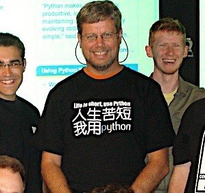
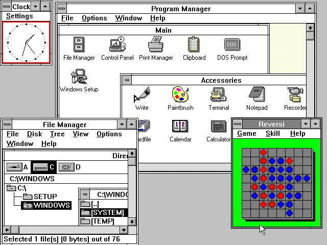

#人生苦短，我用Python
###一门编程语言的发展简史

Python是我喜欢的语言，简洁，优美，容易使用。前两天，我很激昂的向朋友宣传Python的好处。

>“好吧，我承认Python不错，但它为什么叫Python呢？”

>“呃，似乎是一个电视剧的名字。”

>“那你说的Guido是美国人么？”

>“他从Google换到Dropbox工作，但他的名字像是荷兰人的。”

>“你确定你很熟悉Python吗？”

所以为了雪耻，我花时间调查了Python的历史。我看到了Python中许多功能的来源和Python的设计理念，看到了一门编程语言的演化历史，看到了Python与开源运动的奇妙联系。从Python的历史中，我们可以一窥开源开发的理念和成就。

这也可以作为我写的Python快速教程的序篇。

##起源

Python的作者，Guido von Rossum，确实是荷兰人。1982年，Guido从阿姆斯特丹大学获得了数学和计算机硕士学位。然而，尽管他算得上是一位数学家，但他更加享受计算机带来的乐趣。用他的话说，尽管拥有数学和计算机双料资质，他总趋向于做计算机相关的工作，并热衷于做任何和编程相关的活儿。

在那个时候，Guido接触并使用过诸如Pascal、C、 Fortran等语言。这些语言的基本设计原则是让机器能更快运行。在80年代，虽然IBM和苹果已经掀起了个人电脑浪潮，但这些个人电脑的配置很低。比如早期的Macintosh，只有8MHz的CPU主频和128KB的RAM，一个大的数组就能占满内存。所有的编译器的核心是做优化，以便让程序能够运行。为了增进效率，语言也迫使程序员像计算机一样思考，以便能写出更符合机器口味的程序。在那个时代，程序员恨不得用手榨取计算机每一寸的能力。有人甚至认为C语言的指针是在浪费内存。至于动态类型，内存自动管理，面向对象…… 别想了，那会让你的电脑陷入瘫痪。

这种编程方式让Guido感到苦恼。Guido知道如何用C语言写出一个功能，但整个编写过程需要耗费大量的时间，即使他已经准确的知道了如何实现。他的另一个选择是shell。Bourne Shell作为UNIX系统的解释器已经长期存在。UNIX的管理员们常常用shell去写一些简单的脚本，以进行一些系统维护的工作，比如定期备份、文件系统管理等等。shell可以像胶水一样，将UNIX下的许多功能连接在一起。许多C语言下上百行的程序，在shell下只用几行就可以完成。然而，shell的本质是调用命令。它并不是一个真正的语言。比如说，shell没有数值型的数据类型，加法运算都很复杂。总之，shell不能全面的调动计算机的功能。

Guido希望有一种语言，这种语言能够像C语言那样，能够全面调用计算机的功能接口，又可以像shell那样，可以轻松的编程。ABC语言让Guido看到希望。ABC是由荷兰的数学和计算机研究所开发的。Guido在该研究所工作，并参与到ABC语言的开发。ABC语言以教学为目的。与当时的大部分语言不同，ABC语言的目标是“让用户感觉更好”。ABC语言希望让语言变得容易阅读，容易使用，容易记忆，容易学习，并以此来激发人们学习编程的兴趣。比如下面是一段来自Wikipedia的ABC程序，这个程序用于统计文本中出现的词的总数：

    HOW TO RETURN words document:

        PUT {} IN collection

        FOR line IN document:

            FOR word IN split line:

            IF word not.in collection:

                INSERT word IN collection

        RETURN collection

HOW TO用于定义一个函数。一个Python程序员应该很容易理解这段程序。ABC语言使用冒号和缩进来表示程序块。行尾没有分号。for和if结构中也没有括号()。赋值采用的是PUT，而不是更常见的等号。这些改动让ABC程序读起来像一段文字。

尽管已经具备了良好的可读性和易用性，ABC语言最终没有流行起来。在当时，ABC语言编译器需要比较高配置的电脑才能运行。而这些电脑的使用者通常精通计算机，他们更多考虑程序的效率，而非它的学习难度。除了硬件上的困难外，ABC语言的设计也存在一些致命的问题：

- 可拓展性差。ABC语言不是模块化语言。如果想在ABC语言中增加功能，比如对图形化的支持，就必须改动很多地方。

- 不能直接进行IO。ABC语言不能直接操作文件系统。尽管你可以通过诸如文本流的方式导入数据，但ABC无法直接读写文件。输入输出的困难对于计算机语言来说是致命的。你能想像一个打不开车门的跑车么？

- 过度革新。ABC用自然语言的方式来表达程序的意义，比如上面程序中的HOW TO 。然而对于程序员来说，他们更习惯用function或者define来定义一个函数。同样，程序员更习惯用等号来分配变量。尽管ABC语言很特别，但学习难度也很大。

- 传播困难。ABC编译器很大，必须被保存在磁带上。当时Guido在访问的时候，就必须有一个大磁带来给别人安装ABC编译器。 这样，ABC语言就很难快速传播。

1989年，为了打发圣诞节假期，Guido开始写Python语言的编译器。Python这个名字，来自Guido所挚爱的电视剧Monty Python's Flying Circus。他希望这个新的叫做Python的语言，能符合他的理想：创造一种C和shell之间，功能全面，易学易用，可拓展的语言。Guido作为一个语言设计爱好者，已经有过设计语言的尝试。这一次，也不过是一次纯粹的hacking行为。

##一门语言的诞生

1991年，第一个Python编译器诞生。它是用C语言实现的，并能够调用C语言的库文件。从一出生，Python已经具有了：类，函数，异常处理，包含表和词典在内的核心数据类型，以及模块为基础的拓展系统。

Python语法很多来自C，但又受到ABC语言的强烈影响。来自ABC语言的一些规定直到今天还富有争议，比如强制缩进。但这些语法规定让Python容易读。另一方面，Python聪明的选择服从一些惯例，特别是C语言的惯例。比如使用等号赋值，使用def来定义函数。Guido认为，如果“常识”上确立的东西，没有必要过度纠结。

Python从一开始就特别在意可拓展性。Python可以在多个层次上拓展。从高层上，你可以直接引入.py文件。在底层，你可以引用C语言的库。Python程序员可以快速的使用Python写.py文件作为拓展模块。但当性能是考虑的重要因素时，Python程序员可以深入底层，写C程序，编译为.so文件引入到Python中使用。Python就好像是使用钢构建房一样，先规定好大的框架。而程序员可以在此框架下相当自由的拓展或更改。

最初的Python完全由Guido本人开发。Python得到Guido同事的欢迎。他们迅速的反馈使用意见，并参与到Python的改进。Guido和一些同事构成Python的核心团队。他们将自己大部分的业余时间用于hack Python。随后，Python拓展到研究所之外。Python将许多机器层面上的细节隐藏，交给编译器处理，并凸显出逻辑层面的编程思考。Python程序员可以花更多的时间用于思考程序的逻辑，而不是具体的实现细节。这一特征吸引了广大的程序员。Python开始流行。
人生苦短，我用python

##时势造英雄

我们不得不暂停我们的Python时间，转而看一看瞬息万变的计算机行业。1990年代初，个人计算机开始进入普通家庭。Intel发布了486处理器，windows发布window 3.0开始的一系列视窗系统。计算机的性能大大提高。程序员开始关注计算机的易用性  ，比如图形化界面。

由于计算机性能的提高，软件的世界也开始随之改变。硬件足以满足许多个人电脑的需要。硬件厂商甚至渴望高需求软件的出现，以带动硬件的更新换代。C++和Java相继流行。C++和Java提供了面向对象的编程范式，以及丰富的对象库。在牺牲了一定的性能的代价下，C++和Java大大提高了程序的产量。语言的易用性被提到一个新的高度。我们还记得，ABC失败的一个重要原因是硬件的性能限制。从这方面说，Python要比ABC幸运许多。

另一个悄然发生的改变是Internet。1990年代还是个人电脑的时代，windows和Intel挟PC以令天下，盛极一时。尽管Internet为主体的信息革命尚未到来，但许多程序员以及资深计算机用户已经在频繁使用Internet进行交流，比如使用email和newsgroup。Internet让信息交流成本大大下降。一种新的软件开发模式开始流行：开源。程序员利用业余时间进行软件开发，并开放源代码。1991年，Linus在comp.os.minix新闻组上发布了Linux内核源代码，吸引大批hacker的加入。Linux和GNU相互合作，最终构成了一个充满活力的开源平台。

硬件性能不是瓶颈，Python又容易使用，所以许多人开始转向Python。Guido维护了一个maillist，Python用户就通过邮件进行交流。Python用户来自许多领域，有不同的背景，对Python也有不同的需求。Python相当的开放，又容易拓展，所以当用户不满足于现有功能，很容易对Python进行拓展或改造。随后，这些用户将改动发给Guido，并由Guido决定是否将新的特征加入到Python或者标准库中。如果代码能被纳入Python自身或者标准库，这将极大的荣誉。由于Guido至高无上的决定权，他因此被称为“终身的仁慈独裁者”。

Python被称为“Battery Included”，是说它以及其标准库的功能强大。这些是整个社区的贡献。Python的开发者来自不同领域，他们将不同领域的优点带给Python。比如Python标准库中的正则表达是参考Perl，而lambda, map, filter, reduce等函数参考了Lisp。Python本身的一些功能以及大部分的标准库来自于社区。Python的社区不断扩大，进而拥有了自己的newsgroup，网站，以及基金。从Python 2.0开始，Python也从maillist的开发方式，转为完全开源的开发方式。社区气氛已经形成，工作被整个社区分担，Python也获得了更加高速的发展。

到今天，Python的框架已经确立。Python语言以对象为核心组织代码，支持多种编程范式，采用动态类型，自动进行内存回收。Python支持解释运行，并能调用C库进行拓展。Python有强大的标准库。由于标准库的体系已经稳定，所以Python的生态系统开始拓展到第三方包。这些包，如Django、web.py、wxpython、numpy、matplotlib、PIL，将Python升级成了物种丰富的热带雨林。

##启示录

Python崇尚优美、清晰、简单，是一个优秀并广泛使用的语言。Python在TIOBE排行榜中排行第八，它是Google的第三大开发语言，Dropbox的基础语言，豆瓣的服务器语言。Python的发展史可以作为一个代表，带给我许多启示。

在Python的开发过程中，社区起到了重要的作用。Guido自认为自己不是全能型的程序员，所以他只负责制订框架。如果问题太复杂，他会选择绕过去，也就是cut the corner。这些问题最终由社区中的其他人解决。社区中的人才是异常丰富的，就连创建网站，筹集基金这样与开发稍远的事情，也有人乐意于处理。如今的项目开发越来越复杂，越来越庞大，合作以及开放的心态成为项目最终成功的关键。

Python从其他语言中学到了很多，无论是已经进入历史的ABC，还是依然在使用的C和Perl，以及许多没有列出的其他语言。可以说，Python的成功代表了它所有借鉴的语言的成功。同样，Ruby借鉴了Python，它的成功也代表了Python某些方面的成功。每个语言都是混合体，都有它优秀的地方，但也有各种各样的缺陷。同时，一个语言“好与不好”的评判，往往受制于平台、硬件、时代等等外部原因。程序员经历过许多语言之争。其实，以开放的心态来接受各个语言，说不定哪一天，程序员也可以如Guido那样，混合出自己的语言。

无论Python未来的命运如何，Python的历史已经是本很有趣的小说。

var:[Python快速教程 - Vamei - 博客园](http://www.15yan.com/story/1JKTBQvVk5e/?f=wx)
