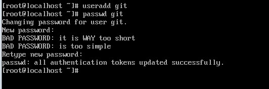
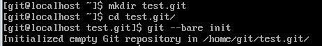
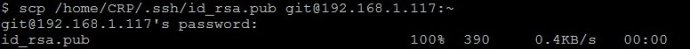
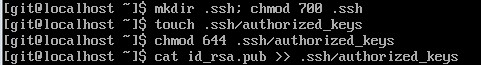

#git服务器搭建（局域网）

##第一步：

在服务器上创建一个用户（最好的做法是一个项目组的一个项目，创建一个用户，这里以git项目组为例）

##第二步：

切换用户，创建仓库

##第三步：

把项目组里所有人的公钥都收集（这里只是其中一个）

##第四步：

把所有人的公钥都写入到.ssh/authorized_keys里。一行一个

##第五步：

把用户设置为不可登录的shell（保证安全）

改为

##第六步：

项目成员在自己的电脑里尝试获取仓库

**到这里结束，**

服务器用的是CentOS6.5

成员用的是windows系统，装cywin

