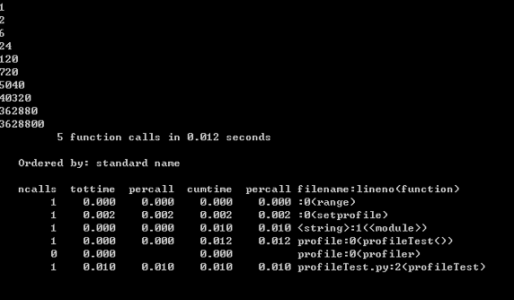

#Python 代码性能优化技巧

选择了脚本语言就要忍受其速度，这句话在某种程度上说明了 python 作为脚本的一个不足之处，那就是执行效率和性能不够理想，特别是在 performance 较差的机器上，因此有必要进行一定的代码优化来提高程序的执行效率。如何进行 Python 性能优化，是本文探讨的主要问题。本文会涉及常见的代码优化方法，性能优化工具的使用以及如何诊断代码的性能瓶颈等内容，希望可以给 Python 开发人员一定的参考。

##Python 代码优化常见技巧

代码优化能够让程序运行更快，它是在不改变程序运行结果的情况下使得程序的运行效率更高，根据 80/20 原则，实现程序的重构、优化、扩展以及文档相关的事情通常需要消耗 80% 的工作量。优化通常包含两方面的内容：减小代码的体积，提高代码的运行效率。
改进算法，选择合适的数据结构

一个良好的算法能够对性能起到关键作用，因此性能改进的首要点是对算法的改进。在算法的时间复杂度排序上依次是：

    O(1) -> O(lg n) -> O(n lg n) -> O(n^2) -> O(n^3) -> O(n^k) -> O(k^n) -> O(n!)

因此如果能够在时间复杂度上对算法进行一定的改进，对性能的提高不言而喻。但对具体算法的改进不属于本文讨论的范围，读者可以自行参考这方面资料。下面的内容将集中讨论数据结构的选择。

###字典 (dictionary) 与列表 (list)

Python 字典中使用了 hash table，因此查找操作的复杂度为 O(1)，而 list 实际是个数组，在 list 中，查找需要遍历整个 list，其复杂度为 O(n)，因此对成员的查找访问等操作字典要比 list 更快。

    from time import time
    t = time()
    list = ['a','b','is','python','jason','hello','hill','with','phone','test','dfdf','apple','pddf','ind','basic','none','baecr','var','bana','dd','wrd']
    #list = dict.fromkeys(list,True)
    print list
    filter = []
    for i in range (1000000):
        for find in ['is','hat','new','list','old','.']:
            if find not in list:
                filter.append(find)
    print "total run time:"
    print time()-t

上述代码运行大概需要 16.09seconds。如果去掉行 #list = dict.fromkeys(list,True) 的注释，将 list 转换为字典之后再运行，时间大约为 8.375 seconds，效率大概提高了一半。因此在需要多数据成员进行频繁的查找或者访问的时候，使用 dict 而不是 list 是一个较好的选择。

###集合 (set) 与列表 (list)

set 的 union， intersection，difference 操作要比 list 的迭代要快。因此如果涉及到求 list 交集，并集或者差的问题可以转换为 set 来操作。

清单 2. 求 list 的交集：
	
    from time import time
    t = time()
    lista=[1,2,3,4,5,6,7,8,9,13,34,53,42,44]
    listb=[2,4,6,9,23]
    intersection=[]
    for i in range (1000000):
        for a in lista:
            for b in listb:
                if a == b:
                    intersection.append(a)
 
    print "total run time:"
    print time()-t

上述程序的运行时间大概为：
	
    total run time:
    38.4070000648

清单 3. 使用 set 求交集
	
    from time import time
    t = time()
    lista=[1,2,3,4,5,6,7,8,9,13,34,53,42,44]
    listb=[2,4,6,9,23]
    intersection=[]
    for i in range (1000000):
        list(set(lista)&set(listb))
    print "total run time:"
    print time()-t

改为 set 后程序的运行时间缩减为 8.75，提高了 4 倍多，运行时间大大缩短。读者可以自行使用表 1 其他的操作进行测试。

表 1. set 常见用法

|语法| 	操作 	|说明|
|----|----------|----|
|set(list1) | set(list2) |	union |	包含 list1 和 list2 所有数据的新集合|
|set(list1) & set(list2) |	intersection |	包含 list1 和 list2 中共同元素的新集合|
|set(list1) – set(list2) |	difference |	在 list1 中出现但不在 list2 中出现的元素的集合|

###对循环的优化

对循环的优化所遵循的原则是尽量减少循环过程中的计算量，有多重循环的尽量将内层的计算提到上一层。 下面通过实例来对比循环优化后所带来的性能的提高。程序清单 4 中，如果不进行循环优化，其大概的运行时间约为 132.375。

清单 4. 为进行循环优化前
	
    from time import time
    t = time()
    lista = [1,2,3,4,5,6,7,8,9,10]
    listb =[0.1,0.2,0.3,0.4,0.5,0.6,0.7,0.8,0.9,0.01]
    for i in range (1000000):
        for a in range(len(lista)):
            for b in range(len(listb)):
                x=lista[a]+listb[b]
    print "total run time:"
    print time()-t

现在进行如下优化，将长度计算提到循环外，range 用 xrange 代替，同时将第三层的计算 lista[a] 提到循环的第二层。

清单 5. 循环优化后
	
    from time import time
    t = time()
    lista = [1,2,3,4,5,6,7,8,9,10]
    listb =[0.1,0.2,0.3,0.4,0.5,0.6,0.7,0.8,0.9,0.01]
    len1=len(lista)
    len2=len(listb)
    for i in xrange (1000000):
        for a in xrange(len1):
            temp=lista[a]
            for b in xrange(len2):
                x=temp+listb[b]
    print "total run time:"
    print time()-t

上述优化后的程序其运行时间缩短为 102.171999931。在清单 4 中 lista[a] 被计算的次数为 1000000*10*10，而在优化后的代码中被计算的次数为 1000000*10，计算次数大幅度缩短，因此性能有所提升。

充分利用 Lazy if-evaluation 的特性

python 中条件表达式是 lazy evaluation 的，也就是说如果存在条件表达式 if x and y，在 x 为 false 的情况下 y 表达式的值将不再计算。因此可以利用该特性在一定程度上提高程序效率。

清单 6. 利用 Lazy if-evaluation 的特性
	
    from time import time
    t = time()
    abbreviations = ['cf.', 'e.g.', 'ex.', 'etc.', 'fig.', 'i.e.', 'Mr.', 'vs.']
    for i in range (1000000):
        for w in ('Mr.', 'Hat', 'is', 'chasing', 'the', 'black', 'cat', '.'):
            if w in abbreviations:
            #if w[-1] == '.' and w in abbreviations:
                pass
    print "total run time:"
    print time()-t

在未进行优化之前程序的运行时间大概为 8.84，如果使用注释行代替第一个 if，运行的时间大概为 6.17。

###字符串的优化

python 中的字符串对象是不可改变的，因此对任何字符串的操作如拼接，修改等都将产生一个新的字符串对象，而不是基于原字符串，因此这种持续的 copy 会在一定程度上影响 python 的性能。对字符串的优化也是改善性能的一个重要的方面，特别是在处理文本较多的情况下。字符串的优化主要集中在以下几个方面：

- 在字符串连接的使用尽量使用 join() 而不是 +：在代码清单 7 中使用 + 进行字符串连接大概需要 0.125 s，而使用 join 缩短为 0.016s。因此在字符的操作上 join 比 + 要快，因此要尽量使用 join 而不是 +。

清单 7. 使用 join 而不是 + 连接字符串
	
    from time import time
 
    t = time()
    s = ""
    list = ['a','b','b','d','e','f','g','h','i','j','k','l','m','n']
    for i in range (10000):
        for substr in list:
            s+= substr    
    print "total run time:"
    print time()-t

同时要避免：
	
    s = ""
    for x in list:
        s += func(x)

而是要使用：
	
    slist = [func(elt) for elt in somelist]
    s = "".join(slist)

2. 当对字符串可以使用正则表达式或者内置函数来处理的时候，选择内置函数。如 str.isalpha()，str.isdigit()，str.startswith((‘x’, ‘yz’))，str.endswith((‘x’, ‘yz’))

3. 对字符进行格式化比直接串联读取要快，因此要使用
	
    out = "<html>%s%s%s%s</html>" % (head, prologue, query, tail)

而避免
	
    out = "<html>" + head + prologue + query + tail + "</html>"

###使用列表解析（list comprehension）和生成器表达式（generator expression）

列表解析要比在循环中重新构建一个新的 list 更为高效，因此我们可以利用这一特性来提高运行的效率。
	
    from time import time
    t = time()
    list = ['a','b','is','python','jason','hello','hill','with','phone','test','dfdf','apple','pddf','ind','basic','none','baecr','var','bana','dd','wrd']
    total=[]
    for i in range (1000000):
        for w in list:
            total.append(w)
    print "total run time:"
    print time()-t

使用列表解析：
	
    for i in range (1000000):
        a = [w for w in list]

上述代码直接运行大概需要 17s，而改为使用列表解析后 ，运行时间缩短为 9.29s。将近提高了一半。生成器表达式则是在 2.4 中引入的新内容，语法和列表解析类似，但是在大数据量处理时，生成器表达式的优势较为明显，它并不创建一个列表，只是返回一个生成器，因此效率较高。在上述例子上中代码 a = [w for w in list] 修改为 a = (w for w in list)，运行时间进一步减少，缩短约为 2.98s。

其他优化技巧

- 如果需要交换两个变量的值使用 a,b=b,a 而不是借助中间变量 t=a;a=b;b=t；

如：

    >>> from timeit import Timer
    >>> Timer("t=a;a=b;b=t","a=1;b=2").timeit()
    0.25154118749729365
    >>> Timer("a,b=b,a","a=1;b=2").timeit()
    0.17156677734181258

- 在循环的时候使用 xrange 而不是 range；使用 xrange 可以节省大量的系统内存，因为 xrange() 在序列中每次调用只产生一个整数元素。而 range() 將直接返回完整的元素列表，用于循环时会有不必要的开销。在 python3 中 xrange 不再存在，里面 range 提供一个可以遍历任意长度的范围的 iterator。
- 使用局部变量，避免”global” 关键字。python 访问局部变量会比全局变量要快得多，因 此可以利用这一特性提升性能。
- if done is not None 比语句 if done != None 更快，读者可以自行验证；
- 在耗时较多的循环中，可以把函数的调用改为内联的方式；
- 使用级联比较 “x < y < z” 而不是 “x < y and y < z”；
- while 1 要比 while True 更快（当然后者的可读性更好）；
- build in 函数通常较快，add(a,b) 要优于 a+b。

##定位程序性能瓶颈

对代码优化的前提是需要了解性能瓶颈在什么地方，程序运行的主要时间是消耗在哪里，对于比较复杂的代码可以借助一些工具来定位，python 内置了丰富的性能分析工具，如 profile,cProfile 与 hotshot 等。其中 Profiler 是 python 自带的一组程序，能够描述程序运行时候的性能，并提供各种统计帮助用户定位程序的性能瓶颈。Python 标准模块提供三种 profilers:cProfile,profile 以及 hotshot。

profile 的使用非常简单，只需要在使用之前进行 import 即可。具体实例如下：

清单 8. 使用 profile 进行性能分析
	
    import profile
    def profileTest():
        Total =1;
        for i in range(10):
            Total=Total*(i+1)
            print Total
        return Total
    if __name__ == "__main__":
        profile.run("profileTest()")

程序的运行结果如下：

图 1. 性能分析结果

 
其中输出每列的具体解释如下：

- ncalls：表示函数调用的次数；
- tottime：表示指定函数的总的运行时间，除掉函数中调用子函数的运行时间；
- percall：（第一个 percall）等于 tottime/ncalls；
- cumtime：表示该函数及其所有子函数的调用运行的时间，即函数开始调用到返回的时间；
- percall：（第二个 percall）即函数运行一次的平均时间，等于 cumtime/ncalls；
- filename:lineno(function)：每个函数调用的具体信息；

如果需要将输出以日志的形式保存，只需要在调用的时候加入另外一个参数。如 profile.run(“profileTest()”,”testprof”)。

对于 profile 的剖析数据，如果以二进制文件的时候保存结果的时候，可以通过 pstats 模块进行文本报表分析，它支持多种形式的报表输出，是文本界面下一个较为实用的工具。使用非常简单：
	
    import pstats
    p = pstats.Stats('testprof')
    p.sort_stats("name").print_stats()

其中 sort_stats() 方法能够对剖分数据进行排序， 可以接受多个排序字段，如 sort_stats(‘name’, ‘file’) 将首先按照函数名称进行排序，然后再按照文件名进行排序。常见的排序字段有 calls( 被调用的次数 )，time（函数内部运行时间），cumulative（运行的总时间）等。此外 pstats 也提供了命令行交互工具，执行 python – m pstats 后可以通过 help 了解更多使用方式。

对于大型应用程序，如果能够将性能分析的结果以图形的方式呈现，将会非常实用和直观，常见的可视化工具有 Gprof2Dot，visualpytune，KCacheGrind 等，读者可以自行查阅相关官网，本文不做详细讨论。

##Python 性能优化工具

Python 性能优化除了改进算法，选用合适的数据结构之外，还有几种关键的技术，比如将关键 python 代码部分重写成 C 扩展模块，或者选用在性能上更为优化的解释器等，这些在本文中统称为优化工具。python 有很多自带的优化工具，如 Psyco，Pypy，Cython，Pyrex 等，这些优化工具各有千秋，本节选择几种进行介绍。

###Psyco

psyco 是一个 just-in-time 的编译器，它能够在不改变源代码的情况下提高一定的性能，Psyco 将操作编译成有点优化的机器码，其操作分成三个不同的级别，有”运行时”、”编译时”和”虚拟时”变量。并根据需要提高和降低变量的级别。运行时变量只是常规 Python 解释器处理的原始字节码和对象结构。一旦 Psyco 将操作编译成机器码，那么编译时变量就会在机器寄存器和可直接访问的内存位置中表示。同时 python 能高速缓存已编译的机器码以备今后重用，这样能节省一点时间。但 Psyco 也有其缺点，其本身运行所占内存较大。目前 psyco 已经不在 python2.7 中支持，而且不再提供维护和更新了，对其感兴趣的可以参考 http://psyco.sourceforge.net/

###Pypy

PyPy 表示 “用 Python 实现的 Python”，但实际上它是使用一个称为 RPython 的 Python 子集实现的，能够将 Python 代码转成 C， .NET， Java 等语言和平台的代码。PyPy 集成了一种即时 (JIT) 编译器。和许多编译器，解释器不同，它不关心 Python 代码的词法分析和语法树。 因为它是用 Python 语言写的，所以它直接利用 Python 语言的 Code Object.。 Code Object 是 Python 字节码的表示，也就是说， PyPy 直接分析 Python 代码所对应的字节码 ,，这些字节码即不是以字符形式也不是以某种二进制格式保存在文件中， 而在 Python 运行环境中。目前版本是 1.8. 支持不同的平台安装，windows 上安装 Pypy 需要先下载 https://bitbucket.org/pypy/pypy/downloads/pypy-1.8-win32.zip，然后解压到相关的目录，并将解压后的路径添加到环境变量 path 中即可。在命令行运行 pypy，如果出现如下错误：”没有找到 MSVCR100.dll, 因此这个应用程序未能启动，重新安装应用程序可能会修复此问题”，则还需要在微软的官网上下载 VS 2010 runtime libraries 解决该问题。具体地址为http://www.microsoft.com/download/en/details.aspx?displaylang=en&id=5555

###Cython

Cython 是用 python 实现的一种语言，可以用来写 python 扩展，用它写出来的库都可以通过 import 来载入，性能上比 python 的快。cython 里可以载入 python 扩展 ( 比如 import math)，也可以载入 c 的库的头文件 ( 比如 :cdef extern from “math.h”)，另外也可以用它来写 python 代码。将关键部分重写成 C 扩展模块

Cython 代码与 python 不同，必须先编译，编译一般需要经过两个阶段，将 pyx 文件编译为 .c 文件，再将 .c 文件编译为 .so 文件。编译有多种方法：

本文初步探讨了 python 常见的性能优化技巧以及如何借助工具来定位和分析程序的性能瓶颈，并提供了相关可以进行性能优化的工具或语言，希望能够更相关人员一些参考。

