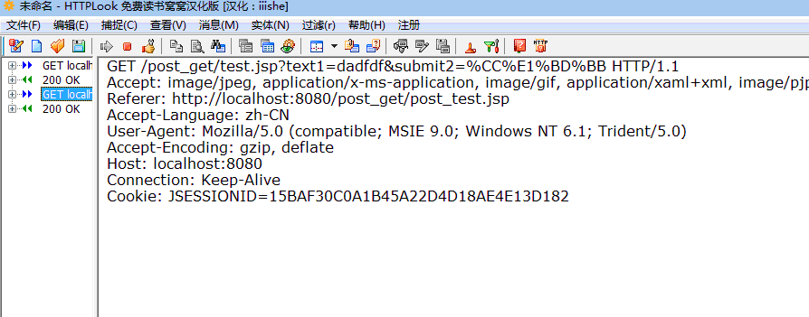

#post和get请求方式以及区别

##枯燥的概念编辑本段回目录

Http定义了与服务器交互的不同方法，最基本的方法有4种，分别是GET，POST，PUT，DELETE。

URL全称是资源描述符，我们可以这样认为：一个URL地址，它用于描述一个网络上的资源，而HTTP中的GET，POST，PUT，DELETE就对应着对这个资源的查 ，改 ，增 ，删 4个操作。

- GET一般用于获取/查询资源信息，而POST一般用于更新资源信息。

- GET是幂等的,POST是要修改更新的    

通过上面概念的理解，我们很容易发现，GET是用于信息获取或查询的，这就意味着它是幂等的（对幂等的解释参见http://www.yining.org/2010/05/04/http-get-vs-post-and-thoughts/），POST可能会改变服务器上的资源请求。    

这样一说有点抽象了，网上有一个我认为比较合理的例子就是新闻站点的例子：

例子如下：

get方式---新闻站点的头版不断更新。虽然第二次请求会返回不同的一批新闻，该操作仍然被认为是幂等的，因为它总是返回当前的新闻。从根本上说，如果目标是当用户打开一个链接时，他可以确信从自身的角度来看没有改变资源即可；

post方式--读者对新闻发表自己的评论应该通过POST实现，因为在评论提交后站点的资源已经不同了，或者说资源被修改了。仔细考虑一下这个例子就能明白GET是幂等的而POST是要修改更新的了。

##通过实例了解post和get的http请求过程

通过上面的分析，已经对GET和POST有所了解，也能感觉到他俩有着本质上的区别就是一个是拿来，一个是要更新修改。    

下面就通过HTTP LOOK软件来看看他们是怎样进行HTPP请求的，它们到底是怎样进行传输的。    

首先建立两个jsp页面用来测试：        

第一个页面是post_get_jsp（代码如下）：

    <%@pagelanguage="java"contentType="text/html;charset=GB18030"
    pageEncoding="GB18030"%>
    <!DOCTYPEhtmlPUBLIC"-//W3C//DTDHTML4.01Transitional//EN""http://www.w3.org/TR/html4/loose.dtd">
    <html>
    <head>
    <meta http-equiv="Content-Type" content="text/html;charset=GB18030">
    <title>Inserttitlehere</title>
    </head>
     
    <body>
    <formname="aaForm" action="http://localhost:8080/post_get/test.jsp" method="get">
    <input type="text" id="text1" name="text1" value="dadfdf">
    <input type="submit" id="submit1" name="submit2" value="提交">
    </form>
    </body>
    </html>

第二个页面是test.jsp（代码如下）：

    <%@pagelanguage="java"contentType="text/html;charset=GB18030"
    pageEncoding="GB18030"%>
    <!DOCTYPEhtmlPUBLIC"-//W3C//DTDHTML4.01Transitional//EN""http://www.w3.org/TR/html4/loose.dtd">
     
    <%
    Stringa=request.getParameter("text1");
    out.println(a);
    %>
     
     
    <html>
    <head>
    <meta http-equiv="Content-Type" content="text/html;charset=GB18030">
    <title>Inserttitlehere</title>
    </head>
    <body>
     
    <h1>ddfdgdg</h1>
     
    </body>
    </html>

简单说一下http请求：    

    <request line>    
    <headers>    
    <blank line>    
    <request-body>    

在HTTP请求中，第一行必须是一个请求行（request line），用来说明请求类型、要访问的资源以及使用的HTTP版本。紧接着是一个首部（header）小节，用来说明服务器要使用的附加信息。在首部之后是一个空行，再此之后可以添加任意的其他数据。

开始测试post提交     http请求如下：

 

开始测试get提交    http请求如下：

##POST与GET区别

①.GET一般用于获取/查询资源信息，而POST一般用于更新资源信息。    

②.从上面的http请求中就能看出，GET提交是将请求的数据附加到URL之后，用？分割、参数用&连接。并且字符串已经被加密。而post的提交是放到了http包中。从这点看来GET请求的地址栏会改变，RUL附加上了请求的数据，而POST地址栏不会改变，UTL没有变化。更加深一层看GET的安全性不高，很容易暴露信息。    

③.另外虽然http协议没有对传输数据大小进行限制也没有对url长度进行限制，但是实际情况中浏览器对url进行限制，这样GET的传输数据大小随着URL长度被限制而受到限制。反观POST由于不是通过URL传值，所以没有限制。

来源于酷勤网   http://www.kuqin.com/web/20120205/317843.html 

