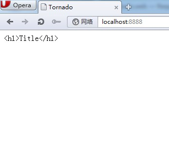
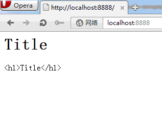
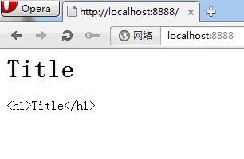

#tornado模板转义处理

tornado默认是转义所有字符，比较安全，但有时候我们的确需要把字符当做html来解析处理，因此我们需要做些处理。

示例：

main.py 代码：

    import tornado.ioloop

    import tornado.web

    class MainHandler(tornado.web.RequestHandler):

        def get(self):

            self.render('main.html',title = '<h1>Title</h1>')  

            application = tornado.web.Application([     (r"/", MainHandler), ])

    if __name__ == "__main__":

        application.listen(8888)

         tornado.ioloop.IOLoop.instance().start()

main.html 代码：

{{ title }}

执行结果：

默认把h1标签给转义，我们可以这么干使它不要转义

main.html 代码：

    
    {{ title }}

raw 是不要转义

执行：

或者在头部这么定义

main.html
	
    
    {{ title }}
    {{ escape(title) }}

 是整个文件都生效，但可以使用escape转义某一处

执行：

Tornado在所有模板中默认提供了一些便利的函数。它们包括：

**escape(s)**

替换字符串s中的&、<、>为他们对应的HTML字符。

**url_escape(s)**

使用urllib.quote_plus替换字符串s中的字符为URL编码形式。

**json_encode(val)**

将val编码成JSON格式。（在系统底层，这是一个对json库的dumps函数的调用。查阅相关的文档以获得更多关于该函数接收和返回参数的信息。）

**squeeze(s)**

过滤字符串s，把连续的多个空白字符替换成一个空格

